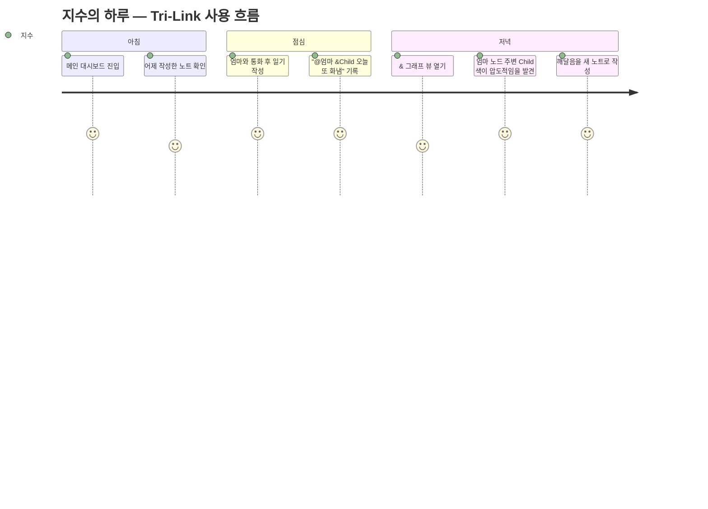

# 📘 프로젝트 기획서

> **프로젝트명**: 다차원 지식 그래프 노트 (가칭 **"Tri-Link"**)
> **팀명**: Five Guys
> **소속**: 가천대학교 웹프로그래밍 팀 프로젝트
> **작성일**: 2026-05-19
> **버전**: v1.0

---

## 0. 한눈에 보기 (Executive Summary)

| 항목 | 내용 |
|---|---|
| **한 줄 정의** | 개인의 생각·인물·관계를 **@/#/&** 세 가지 링크로 연결하고 **3D 그래프**로 시각화하는 지식 관리 웹 서비스 |
| **카테고리** | 생산성 / 지식 관리 (PKM, Personal Knowledge Management) |
| **벤치마킹** | Obsidian, Roam Research, Notion (다만 PAC 관계 분석은 우리가 유일) |
| **핵심 차별점** | ① 3가지 의미별 링크(@언급 · #해시태그 · &PAC관계) <br> ② 링크 타입별 **분리된 3D 그래프 뷰** <br> ③ **PAC(Parent/Adult/Child) 관계 분석** 프레임워크 내장 |
| **타겟 사용자** | 자기 성찰·관계 분석에 관심 있는 학습자/연구자/지식 노동자 (1차: 대학생) |
| **타겟 디바이스** | 웹 브라우저 (데스크톱 우선) |
| **기술 스택** | Frontend: Next.js + TypeScript / Backend: Node.js + Express + MongoDB |
| **개발 기간** | 2026-05-20 ~ 2026-06-16 (약 4주, 4명 개발) |

---

## 1. 왜 이 프로젝트를 하는가? (Why)

### 1.1 문제 정의

> **"내 머릿속 정보들은 서로 연결되어 있는데, 노트 앱은 그 연결을 보여주지 못한다."**

- 기존 메모 앱(Notion, Apple Notes)은 **폴더와 태그**만 제공 → 정보 간 관계가 1차원적
- 발전형 도구(Obsidian, Roam)는 위키 링크를 제공하지만, **모든 링크가 동일한 의미**로 취급됨
- 사람과의 대화·심리 상태·개념·주제가 모두 똑같은 "링크"로 묶이면, 통찰을 얻기 어렵다
- 특히 **"이 사건에서 나는 어떤 상태였지?"** 같은 자기 성찰 질문에 답할 수 있는 도구가 없다

### 1.2 우리의 가설

링크에 **의미(Type)** 를 부여하면, 같은 데이터에서 **세 가지 다른 통찰**이 나온다.

| 링크 | 의미 | 분석 가능한 질문 |
|---|---|---|
| `@이름` | **언급 (Mention)** | "최근 누구와 가장 많이 상호작용했는가?" |
| `#주제` | **분류 (Topic)** | "내가 가장 집중하는 주제는?" |
| `&관계` | **심리/관계 (PAC)** | "이 사건에서 나는 어떤 자아 상태였는가?" |

### 1.3 시장 기회 & 차별점

| 기능 | Notion | Obsidian | Roam | **Tri-Link (우리)** |
|---|:---:|:---:|:---:|:---:|
| Markdown 노트 | ✅ | ✅ | ✅ | ✅ |
| 위키 링크 | ✅ | ✅ | ✅ | ✅ |
| 그래프 뷰 | ❌ | ✅ (2D) | ✅ (2D) | ✅ **(3D, 타입별 분리)** |
| 의미별 링크 타입 | ❌ | ❌ | ❌ | ✅ |
| PAC 관계 분석 | ❌ | ❌ | ❌ | ✅ |

---

## 2. 무엇을 만드는가? (What)

### 2.1 핵심 솔루션

세 가지 기둥 위에 서비스를 만든다.

```
┌────────────────────────────────────────────────────┐
│              Tri-Link 핵심 가치                     │
├──────────────┬──────────────┬──────────────────────┤
│ ① 3가지 링크  │ ② 3개 3D 뷰  │ ③ PAC 자기 성찰      │
│ (@/#/&)      │ (분리·색상)   │ (Parent/Adult/Child) │
└──────────────┴──────────────┴──────────────────────┘
```

### 2.2 주요 기능 (MoSCoW 우선순위)

#### 🔴 Must Have (MVP 필수, 4주 내 반드시 구현)

| # | 기능 | 설명 |
|---|---|---|
| 1 | **회원가입 / 로그인** | 이메일 + 비밀번호 기반 인증, JWT 세션 |
| 2 | **Markdown 노트 CRUD** | 노트 생성·편집·삭제·자동저장 |
| 3 | **3가지 링크 파싱** | `@언급`, `#해시태그`, `&Parent/Adult/Child` 자동 감지 |
| 4 | **링크 자동완성** | 입력 시 기존 노트/태그 드롭다운 |
| 5 | **3D 그래프 뷰 (3개)** | @ 그래프, # 그래프, & 그래프 분리 + 탭 전환 |
| 6 | **노드 클릭 → 노트 이동** | 그래프에서 노트로 즉시 이동 |
| 7 | **폴더 기반 노트 관리** | 좌측 사이드바 트리 뷰 |

#### 🟡 Should Have (시간 남으면 추가)

| # | 기능 | 설명 |
|---|---|---|
| 8 | **그래프 검색·필터** | 키워드 검색, 링크 타입 토글 |
| 9 | **노드 강조 표시** | 선택 노드와 연결된 노드만 하이라이트 |
| 10 | **다크/라이트 테마** | 사용자 선호 저장 |
| 11 | **PAC 관계 가이드** | 인앱 도움말 페이지 |

#### 🟢 Could Have (보너스 / 발표용 데모)

| # | 기능 | 설명 |
|---|---|---|
| 12 | **"문제 PAC 관계" 빨간색 표시** | 부정적 패턴 자동 감지 |
| 13 | **노트 드래그 앤 드롭** | 폴더 간 이동 |
| 14 | **노트 공유 (Public URL)** | is_public 토글 |

---

## 3. 누가 사용하는가? (Who)

### 3.1 핵심 페르소나

#### 페르소나 ①: "성찰하는 대학생, 지수"
- **나이/직업**: 22세, 심리학과 3학년
- **상황**: 일기를 꾸준히 쓰지만 같은 패턴의 고민이 반복됨
- **니즈**: "왜 나는 특정 사람만 만나면 어린아이처럼 반응할까?"
- **Tri-Link 사용법**: 일기에 `@엄마 &Child` 형태로 기록 → '& 관계' 그래프에서 자기 패턴 발견

#### 페르소나 ②: "지식 정리광, 민호"
- **나이/직업**: 28세, IT 직장인 / 사이드 프로젝트 운영
- **상황**: Obsidian 사용 중. 노트 1,000개 넘으니 관계 파악 불가
- **니즈**: "주제별 / 인물별 / 프로젝트별로 따로 보고 싶다"
- **Tri-Link 사용법**: `#프로젝트A @동료B` 분리 그래프로 컨텍스트별 시각화

### 3.2 사용 시나리오 (Day in the Life)



---

## 4. 어떻게 성공을 측정하는가? (KPI)

### 4.1 1차 KPI (학기말 시연용 목표)

| 지표 | 목표 | 측정 방법 |
|---|---|---|
| **MVP 완성도** | Must Have 7개 기능 100% 동작 | 시연 영상 + GitHub README |
| **테스트 사용자 수** | 팀원 외 **10명 이상** 사용 | 회원가입 DB 카운트 |
| **사용자당 노트 수** | 평균 **5개 이상** | `documents` 컬렉션 집계 |
| **그래프 뷰 진입률** | 노트 작성자 중 **70% 이상** | 페이지 이벤트 로깅 |
| **3가지 링크 모두 사용한 사용자** | **30% 이상** | 노트 파싱 결과 집계 |

### 4.2 2차 KPI (서비스화될 경우)

- MAU (월간 활성 사용자) / WAU (주간 활성 사용자)
- 세션당 평균 체류 시간
- 링크 타입별 사용 빈도 분포
- 사용자 만족도 (NPS)

---

## 5. 어떤 리스크가 있는가? (Risk)

| # | 리스크 | 영향도 | 발생 확률 | 대응 방안 |
|---|---|:---:|:---:|---|
| R1 | **3D 그래프 라이브러리 학습 시간 부족** | 🔴 높음 | 🟡 중 | 1주차에 PoC 우선 / `react-force-graph-3d` 채택 |
| R2 | **대규모 노드(100+) 성능 저하** | 🟡 중 | 🟡 중 | 노드 수 제한 + LOD(Level of Detail) 적용 |
| R3 | **Markdown 파서와 커스텀 링크 충돌** | 🟡 중 | 🟡 중 | `remark` 플러그인으로 토큰 단계에서 처리 |
| R4 | **MongoDB 관계 데이터 모델링 미숙** | 🟡 중 | 🔴 높음 | DB 설계서 사전 합의 + 1주차 스파이크 |
| R5 | **4명 협업 충돌 (Git, 일정)** | 🟡 중 | 🟡 중 | Git 가이드 + 주 2회 정기 회의 |
| R6 | **PAC 관계 개념 사용자 학습 곡선** | 🟢 낮음 | 🔴 높음 | 인앱 가이드 + 첫 사용 튜토리얼 |

➡️ 상세한 리스크 추적은 [05_관리/리스크_관리.md](../05_관리/리스크_관리.md) 참고

---

## 6. 팀 소개

| 역할 | 이름 | 주요 책임 |
|---|---|---|
| **PM / 기획** | 강두현 | 기획서·일정·회의·이해관계자 커뮤니케이션 |
| **Frontend Lead** | 김진서 | Next.js 페이지·라우팅·전역 상태·3D 그래프 |
| **Frontend** | 최윤석 | 에디터·컴포넌트·디자인 시스템·반응형 |
| **Backend Lead** | 김인현 | API 설계·인증·DB 스키마 |
| **Backend** | 김유신 | 링크 파서·집계 쿼리·테스트 |

> 상세 R&R은 [02_일정/WBS_및_역할분담.md](../02_일정/WBS_및_역할분담.md) 참고

---

## 7. 평가 항목 자가 점검 (For 교수님)

> 본 프로젝트가 웹프로그래밍 수업의 학습 목표를 어떻게 달성하는지 정리합니다.

| 학습 항목 | 본 프로젝트 적용 사례 |
|---|---|
| **HTML/CSS** | 디자인 시스템 + 반응형 레이아웃 (`05_관리/디자인시스템 참고`) |
| **JavaScript/TypeScript** | TypeScript 100% (타입 안정성) + 일부 JS 모듈 |
| **프레임워크** | Next.js (App Router, SSR) — 모던 웹 패러다임 |
| **백엔드 서버** | Node.js + Express — REST API 11개 엔드포인트 |
| **데이터베이스** | MongoDB — 임베디드 도큐먼트 + 별도 nodes 컬렉션 |
| **CRUD 구현** | Notes, Folders, Users, Links 4개 도메인 전체 CRUD |
| **외부 라이브러리 활용** | `react-force-graph-3d`, `remark`, `bcrypt`, `jsonwebtoken` |
| **협업 (Git)** | feature 브랜치 + PR 리뷰 + 컨벤셔널 커밋 |
| **문서화** | 본 문서 패키지 13개 (기획·설계·가이드·관리) |

---

## 8. 참고 자료

- 기존 PRD 원본: [`99_기존자료/prd.md`](../99_기존자료/prd.md)
- 정보 구조도: [`99_기존자료/정보구조도_문서용.md`](../99_기존자료/정보구조도_문서용.md)
- MongoDB 샘플 코드: [`99_기존자료/backend_mongodb.js`](../99_기존자료/backend_mongodb.js)

---

> 📌 **다음 단계**: [02_일정/WBS_및_역할분담.md](../02_일정/WBS_및_역할분담.md) → [03_설계/시스템_아키텍처.md](../03_설계/시스템_아키텍처.md)
