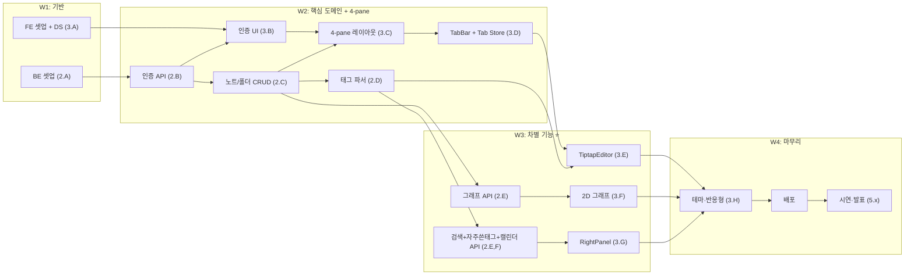

# 📋 WBS & 역할 분담표 (v2)

> **대상 독자**: 팀 전원 + 신규 멤버
> **선행 문서**: [`01_기획/프로젝트_기획서.md`](../01_기획/프로젝트_기획서.md)
> **버전**: v2.0 (2026-05-23)
> **이전 버전과 차이**: 휴지통 작업 제거, Tiptap/우측바/캘린더 신규, 그래프 2D로 단순화

---

## 0. 1분 요약 (학생용)

> 누가 / 무엇을 / 언제까지 하는지 한눈에:

- **5명 (PM 1 + FE 2 + BE 2)** — 각자 작업일 12-20일
- **5개 워크 패키지**: WP1 기획·관리 / WP2 백엔드 / WP3 프론트엔드 / WP4 통합·테스트 / WP5 마무리·발표
- **WBS 원칙**: 작업 단위는 ① **3일 이내**에 끝나고 ② **검증 가능한 산출물**이 있어야 함
- **책임 분배 도구**: **RACI 매트릭스** (Responsible / Accountable / Consulted / Informed)

---

## 1. 팀 구성 (RACI 매트릭스)

### 1.1 멤버

| 코드 | 이름 | 역할 | 주력 (v2 반영) |
|---|---|---|---|
| **PM** | 강두현 | Project Manager | 기획·일정·문서·이해관계자 |
| **FE1** | 김진서 | Frontend Lead | **Tiptap 에디터 + 멀티탭 + 2D 그래프** (핵심) |
| **FE2** | 최윤석 | Frontend | **4-pane 레이아웃 + 우측바 (검색+태그+캘린더) + 디자인** |
| **BE1** | 김인현 | Backend Lead | API 설계 + 인증 + 그래프/통합검색/자주쓴태그 |
| **BE2** | 김유신 | Backend | 노트/폴더 CRUD + 태그 파서 + 캘린더 API |

### 1.2 RACI 정의

- **R** (Responsible): 실제 작업하는 사람
- **A** (Accountable): 최종 책임자 (반드시 1명만)
- **C** (Consulted): 의견을 구해야 하는 사람
- **I** (Informed): 결과를 통보받는 사람

### 1.3 RACI 매트릭스 (v2)

| 작업 영역 | PM | FE1 | FE2 | BE1 | BE2 |
|---|:---:|:---:|:---:|:---:|:---:|
| 기획서 / 일정 관리 | **A·R** | I | I | I | I |
| API 명세 작성 | C | C | I | **A·R** | C |
| DB 스키마 설계 | C | I | I | **A·R** | C |
| 인증 (Auth) | I | C | C | **A·R** | I |
| 노트 CRUD API | I | I | I | A | **R** |
| 폴더 CRUD API | I | I | I | A | **R** |
| **태그 파서 (#@&)** | I | C | I | A | **R** |
| **통합 검색 API** (v2 신규) | I | C | I | **A·R** | C |
| **자주 쓴 태그 API** (v2 신규) | I | C | I | **A·R** | C |
| **캘린더 API** (v2 신규) | I | I | C | A | **R** |
| 그래프 데이터 쿼리 (옵션 A) | I | C | I | **A·R** | C |
| **4-pane 레이아웃** (v2 신규) | I | C | **A·R** | I | I |
| **MenuBar / Sidebar / FolderTree** | I | C | **A·R** | I | I |
| 디자인 시스템 (UI Primitives) | I | C | **A·R** | I | I |
| 로그인/회원가입 UI | I | C | **A·R** | C | I |
| **TabBar + Tab Store (멀티탭)** ⭐ | I | **A·R** | C | I | I |
| **TiptapEditor + TokenBadge + 표** ⭐ | I | **A·R** | C | C | C |
| **2D 그래프 뷰 (옵션 A)** ⭐ | I | **A·R** | C | C | I |
| **RightPanel (검색+자주쓴태그+캘린더)** ⭐ | I | C | **A·R** | C | C |
| 다크/라이트 테마 | I | I | **A·R** | I | I |
| 반응형 점검 (1280·1440) | I | C | **A·R** | I | I |
| 코딩 컨벤션 / Git 룰 | **A·R** | C | C | C | C |
| 회의 진행 / 회의록 | **A·R** | I | I | I | I |
| 시연 영상 / 발표 자료 | **A·R** | R | R | R | R |
| 최종 보고서 정리 | **A·R** | C | C | C | C |

> ✅ 각 행에 **A(Accountable)는 반드시 1명**. 책임 분산 금지.

---

## 2. WBS (Work Breakdown Structure)

### Level 1: 5개 워크 패키지

```
프로젝트 (Tri-Link v2)
├── WP1. 기획·관리
├── WP2. 백엔드 개발
├── WP3. 프론트엔드 개발
├── WP4. 통합·테스트
└── WP5. 마무리·발표
```

---

### WP1. 기획·관리 (PM 주도)

| ID | 작업 | 산출물 | 담당 | 기간 |
|---|---|---|:---:|:---:|
| 1.1 | 프로젝트 기획서 v2 | `docs/01_기획/프로젝트_기획서.md` | PM | 완료 |
| 1.2 | 일정·역할 분담 v2 | `docs/02_일정/*` | PM | 완료 |
| 1.3 | 설계 문서 v2 (Arch/DB/API/UI/Component) | `docs/03_설계/*` | PM | 완료 |
| 1.4 | 개발 가이드 (Git/컨벤션) | `docs/04_개발가이드/*` | PM | 완료 |
| 1.5 | 주간 회의 (주 2회, 화·금) | 회의록 6회+ | PM | 4주 |
| 1.6 | 리스크 트래킹 v2 | `docs/05_관리/리스크_관리.md` | PM | 4주 |
| 1.7 | 데모 시나리오 작성 | 시연 스크립트 | PM | W3-4 |
| 1.8 | 발표 자료 (PPT) | 슬라이드 15장 | PM + 전원 | W4 |
| 1.9 | 최종 보고서 정리 | 통합 문서 PDF | PM | W4 |

---

### WP2. 백엔드 개발 (v2 업데이트)

#### 2.A 초기 셋업 (BE1 · 3일)

| ID | 작업 | 산출물 | 담당 | 기간 |
|---|---|---|:---:|:---:|
| 2.A.1 | Node.js + TS + Express 보일러플레이트 | `Backend/src/app.ts`, `server.ts` | BE1 | 0.5일 |
| 2.A.2 | MongoDB Atlas 클러스터 + `.env` | 접속 URI | BE1 | 0.5일 |
| 2.A.3 | Mongoose 연결 + 헬스체크 | `GET /health` 200 | BE1 | 0.5일 |
| 2.A.4 | 폴더 구조 (routes/controllers/services/repos) | 빈 골격 | BE1 | 0.5일 |
| 2.A.5 | 에러 핸들러 + zod 검증 미들웨어 | `middlewares/*` | BE1 | 1일 |

#### 2.B 인증 (BE1 · 3일)

| ID | 작업 | 산출물 | 담당 | 기간 |
|---|---|---|:---:|:---:|
| 2.B.1 | `User` 모델 + 비밀번호 해시 | `models/User.ts`, `utils/hash.ts` | BE1 | 0.5일 |
| 2.B.2 | `POST /auth/signup` | 통합 테스트 | BE1 | 0.5일 |
| 2.B.3 | `POST /auth/login` (JWT) | 통합 테스트 | BE1 | 0.5일 |
| 2.B.4 | `authGuard` 미들웨어 | `middlewares/authGuard.ts` | BE1 | 0.5일 |
| 2.B.5 | `/auth/me`, `/users/me` (PATCH/DELETE) | 5개 API | BE1 | 1일 |

#### 2.C 노트·폴더 CRUD (BE2 · 5일)

| ID | 작업 | 산출물 | 담당 | 기간 |
|---|---|---|:---:|:---:|
| 2.C.1 | `Folder` 모델 + 트리 조회 | API 1개 | BE2 | 1일 |
| 2.C.2 | 폴더 CRUD + 순환 참조 방지 + **하드 삭제 정책** | API 3개 | BE2 | 1일 |
| 2.C.3 | `Document` 모델 (임베드 nodes/relationships) — **`deleted_at` 제거** | `models/Document.ts` | BE2 | 0.5일 |
| 2.C.4 | 노트 CRUD — **하드 삭제 정책** | API 5개 | BE2 | 1.5일 |
| 2.C.5 | 노트 검색 (기본 — `/notes?date=` 등 필터) | API 동작 | BE2 | 1일 |

#### 2.D 태그 파서 (BE2 · 2일) — v2 변경

| ID | 작업 | 산출물 | 담당 | 기간 |
|---|---|---|:---:|:---:|
| 2.D.1 | `tagParserService` 구현 (`#@&` 정규식 — **공백 다음만 트리거**) | `services/tagParserService.ts` | BE2 | 1일 |
| 2.D.2 | Jest 단위 테스트 10케이스+ (이메일 false-positive 포함) | `tests/tagParser.test.ts` | BE2 | 0.5일 |
| 2.D.3 | 노트 저장 시 파서 통합 + `nodes` 동기화 (트랜잭션) | PUT API 통합 | BE2 + BE1 | 0.5일 |

#### 2.E 그래프 + v2 신규 API (BE1 · 4일)

| ID | 작업 | 산출물 | 담당 | 기간 |
|---|---|---|:---:|:---:|
| 2.E.1 | `Node` 모델 + 인덱스 (v2: `token_type` 명명) | `models/Node.ts` | BE1 | 0.5일 |
| 2.E.2 | **그래프 API (옵션 A) — 파일 중심 + 공통토큰 엣지** | `GET /graph?types=` | BE1 | 1.5일 |
| 2.E.3 | `GET /graph/node/:label` (관련 노트 집계) | API 1개 | BE1 | 0.5일 |
| 2.E.4 | **통합 검색 `GET /search` (엔티티+노트)** ⭐ v2 | API 1개 | BE1 | 1일 |
| 2.E.5 | **자주 쓴 태그 `GET /stats/top-tokens`** ⭐ v2 | API 1개 | BE1 | 0.5일 |

#### 2.F 캘린더 + 마무리 (BE2 + BE1 · 2일)

| ID | 작업 | 산출물 | 담당 | 기간 |
|---|---|---|:---:|:---:|
| 2.F.1 | **캘린더 `GET /calendar`** ⭐ v2 | API 1개 | BE2 | 1일 |
| 2.F.2 | OpenAPI 명세 자동 생성 | `Backend/openapi.yaml` | BE1 | 0.5일 |
| 2.F.3 | Postman Collection v2 | `docs/postman/*.json` | BE1 | 0.5일 |
| 2.F.4 | 시드 데이터 (v2 스키마 반영) | `scripts/seed.ts` | BE2 | 0.5일 |
| 2.F.5 | 백엔드 배포 (Railway) | 운영 URL | BE1 | 0.5일 |

---

### WP3. 프론트엔드 개발 (v2 대폭 업데이트)

#### 3.A 초기 셋업 + 디자인 시스템 (FE2 · 4일)

| ID | 작업 | 산출물 | 담당 | 기간 |
|---|---|---|:---:|:---:|
| 3.A.1 | Next.js 14 + TS + Tailwind 보일러플레이트 | 빌드 성공 | FE2 | 0.5일 |
| 3.A.2 | 디자인 토큰 → `tailwind.config.ts` | 토큰 적용 | FE2 | 0.5일 |
| 3.A.3 | UI Primitives 11개 + `<ConfirmDialog/>` (v2 신규) | `components/ui/*` | FE2 | 2일 |
| 3.A.4 | 글로벌 Provider (Theme, Auth, SWRConfig) | `app/layout.tsx` | FE2 | 1일 |

#### 3.B 인증 화면 (FE2 · 2일)

| ID | 작업 | 산출물 | 담당 | 기간 |
|---|---|---|:---:|:---:|
| 3.B.1 | `/login` 페이지 + 폼 | 동작 | FE2 | 0.5일 |
| 3.B.2 | `/signup` 페이지 + 실시간 검증 | 동작 | FE2 | 1일 |
| 3.B.3 | 라우트 가드 + 인증 후 리다이렉트 | 동작 | FE2 | 0.5일 |

#### 3.C **4-pane 레이아웃** (FE2 · 3일) ⭐ v2 신규

| ID | 작업 | 산출물 | 담당 | 기간 |
|---|---|---|:---:|:---:|
| 3.C.1 | `MainLayout` 4-pane 골격 (60/240/가변/300) | 레이아웃 동작 | FE2 | 1일 |
| 3.C.2 | `<MenuBar/>` (모드 전환) | 컴포넌트 | FE2 | 0.5일 |
| 3.C.3 | `<Sidebar/>` + `<FolderTree/>` (재귀) | 컴포넌트 | FE2 | 1일 |
| 3.C.4 | `+ 새 폴더/파일` 인라인 입력 + API 연동 | 동작 | FE2 | 0.5일 |

#### 3.D **TabBar + Tab Store** (FE1 · 2일) ⭐ v2 신규

| ID | 작업 | 산출물 | 담당 | 기간 |
|---|---|---|:---:|:---:|
| 3.D.1 | `tabStore` (Zustand) + localStorage 동기화 | store 동작 | FE1 | 1일 |
| 3.D.2 | `<TabBar/>` UI + open/close/activate | 동작 | FE1 | 1일 |

#### 3.E **TiptapEditor** (FE1 · 5일) ⭐ v2 핵심

| ID | 작업 | 산출물 | 담당 | 기간 |
|---|---|---|:---:|:---:|
| 3.E.1 | Tiptap 설치 + StarterKit + Markdown 입출력 PoC | 빈 에디터 | FE1 | 0.5일 |
| 3.E.2 | `Table`, `TableRow`, `TableCell` 확장 (Obsidian 스타일) | 표 GUI | FE1 | 1일 |
| 3.E.3 | `TokenBadge` inline node (#@& 배지) | 색깔 배지 | FE1 | 1일 |
| 3.E.4 | `useAutocomplete` 훅 + suggestion 드롭다운 | 드롭다운 | FE1 | 1.5일 |
| 3.E.5 | `useAutosave` 훅 (실시간 + 페이지 종료 flush) | 자동저장 | FE1 | 0.5일 |
| 3.E.6 | 노트 삭제 (`ConfirmDialog`) + 폴더 이동 + 공개 토글 | 동작 | FE1 | 0.5일 |

#### 3.F **2D 그래프 뷰** (FE1 · 4일) ⭐ v2 핵심

| ID | 작업 | 산출물 | 담당 | 기간 |
|---|---|---|:---:|:---:|
| 3.F.1 | `react-force-graph-2d` 설치 + PoC (10노드) | 동작 | FE1 | 0.5일 |
| 3.F.2 | `<GraphCanvas/>` 실제 데이터 연결 (옵션 A) | 동작 | FE1 | 1.5일 |
| 3.F.3 | `<GraphToolbar/>` 토글 3개 (#@&) | 동작 | FE1 | 0.5일 |
| 3.F.4 | `<NodeHoverCard/>` + 더블클릭 → 새 탭 | 동작 | FE1 | 1일 |
| 3.F.5 | `<Legend/>` + `<GraphStats/>` | 표시 | FE1 | 0.5일 |

#### 3.G **RightPanel** (FE2 · 4일) ⭐ v2 핵심

| ID | 작업 | 산출물 | 담당 | 기간 |
|---|---|---|:---:|:---:|
| 3.G.1 | `<RightPanel/>` 골격 + 스크롤 영역 분리 | 레이아웃 | FE2 | 0.5일 |
| 3.G.2 | `<SearchBox/>` + `<SearchResults/>` (debounce 300ms) | 동작 | FE2 | 1.5일 |
| 3.G.3 | `<TopTokens/>` 자주 쓴 태그 9개 (3타입 × 3개) | 동작 | FE2 | 1일 |
| 3.G.4 | `<CalendarWidget/>` 월간 + 작성일 dot + 날짜 클릭 모달 | 동작 | FE2 | 1일 |

#### 3.H 마무리 (FE2 · 2일)

| ID | 작업 | 산출물 | 담당 | 기간 |
|---|---|---|:---:|:---:|
| 3.H.1 | 다크/라이트 테마 토글 (모든 페이지 점검) | 동작 | FE2 | 1일 |
| 3.H.2 | 4가지 상태(Loading/Empty/Error/Success) 일관화 | 점검 | FE2 | 0.5일 |
| 3.H.3 | 반응형 점검 (1280·1440) | 깨짐 없음 | FE2 | 0.25일 |
| 3.H.4 | 프론트 배포 (Vercel) | 운영 URL | FE2 | 0.25일 |

---

### WP4. 통합·테스트

| ID | 작업 | 산출물 | 담당 | 기간 |
|---|---|---|:---:|:---:|
| 4.1 | FE ↔ BE 연결 (CORS, 환경변수) | 로컬 통합 | 전원 | W2 (1일) |
| 4.2 | 핵심 시나리오 수동 테스트 (회원가입→일기→그래프) | 체크리스트 | PM + 전원 | W3 (0.5일) |
| 4.3 | 버그 트래킹 (GitHub Issues) | 이슈 라벨 | PM | 상시 |
| 4.4 | 사용성 테스트 (외부 사용자 5명) | 피드백 정리 | PM | W4 (1일) |

---

### WP5. 마무리·발표

| ID | 작업 | 산출물 | 담당 | 기간 |
|---|---|---|:---:|:---:|
| 5.1 | README.md 최종화 | 메인 README | PM | W4 |
| 5.2 | 시연 영상 (3-5분) | mp4 파일 | FE1 + PM | W4 |
| 5.3 | 발표 PPT (15장) | pptx | PM + 전원 | W4 |
| 5.4 | 최종 보고서 (docs 통합 PDF) | PDF | PM | W4 |
| 5.5 | 발표 리허설 (2회) | 피드백 반영 | 전원 | W4 |

---

## 3. 인당 작업량 요약 (Days, v2)

| 멤버 | 작업일 | 비고 |
|---|:---:|---|
| **PM (강두현)** | 20일 (전 기간 / 회의·문서·관리) | |
| **FE1 (김진서)** | 18일 (멀티탭 + Tiptap + 2D 그래프) | 가장 무거운 기술 부담 |
| **FE2 (최윤석)** | 18일 (셋업 + 4-pane + 인증 + **우측바** + 마무리) | v2에서 +2일 (우측바·캘린더 신규) |
| **BE1 (김인현)** | 17일 (셋업 + 인증 + 그래프 + **검색+자주쓴태그** + 배포) | v2에서 +2일 (신규 API 2개) |
| **BE2 (김유신)** | 13일 (노트·폴더 CRUD + 태그 파서 + **캘린더 API**) | v2에서 +1일 (캘린더) |

> ⚖️ FE1·BE1 무게 유지. FE2·BE2도 v2에서 작업 약간 추가됨.

---

## 4. 작업 우선순위 (MoSCoW × 일정)

| 우선 | 작업 | 마감 | 누락 시 영향 |
|:---:|---|:---:|---|
| 🔴 P0 | 인증, 노트/폴더 CRUD, 태그 파서 | W2 | MVP 자체 불가 |
| 🔴 P0 | 4-pane 레이아웃 + TabBar | W2 | 모든 화면 기반 |
| 🔴 P0 | TiptapEditor (자동저장 + 배지) | W3 초 | 핵심 UX |
| 🔴 P0 | 2D 그래프 (1개 토글이라도) | W3 말 | 차별점 |
| 🔴 P0 | 우측바 통합 검색 + 자주 쓴 태그 + 캘린더 | W3 | v2 핵심 차별 |
| 🟡 P1 | 폴더 드래그앤드롭, 태그 가이드 페이지 | W4 | UX |
| 🟡 P1 | 다크 테마, 반응형 | W4 | 완성도 |
| 🟢 P2 | 연간 히트맵, 노트 공개 (Public URL) | W4 | 보너스 |

---

## 5. 의존성 그래프 (v2)



---

## 6. 협업 약속 (Working Agreement)

1. **회의**: 주 2회 (화·금 19:00, 30분), Discord 음성
2. **데일리 스탠드업**: 매일 21:00, Discord 텍스트 (어제·오늘·블로커 3줄)
3. **PR 리뷰**: 24시간 내 응답, 같은 트랙 멤버가 우선 리뷰
4. **블로커**: 2시간 이상 막히면 즉시 팀에 공유 (혼자 끙끙 X)
5. **휴식·결석**: 24시간 전 사전 공지
6. **문서 갱신**: 코드 변경이 명세에 영향 주면 같은 PR에 문서 수정 포함
7. **커밋 컨벤션**: 컨벤셔널 커밋 (`feat:`, `fix:`, `docs:` 등) — [Git 가이드](../04_개발가이드/Git_협업_가이드.md)

---

## 7. 자가 점검 체크리스트 (PM)

매 주말마다 PM 확인:

- [ ] 이번 주 P0 작업이 모두 마감 안에 끝났는가?
- [ ] 블로커 이슈가 GitHub에 라벨링되어 있는가?
- [ ] 모든 PR이 리뷰 거쳤는가? (자기 PR 자기 머지 금지)
- [ ] 문서가 코드 변경을 반영하고 있는가?
- [ ] 리스크 대장에 새 항목이 있는가?
- [ ] 다음 주 작업이 모든 멤버에게 할당되어 있는가?

---

## 8. v1 → v2 변경 요약

| 변경 | v1 | v2 |
|---|---|---|
| **WBS 작업 항목 수** | 36개 | **42개** (+6) |
| 신규 작업 | — | 4-pane 레이아웃, TabBar+Tab Store, TiptapEditor 마이그레이션, RightPanel, 캘린더 API, 통합 검색 API, 자주 쓴 태그 API |
| 제거 작업 | 휴지통 UI | (없음 — 휴지통 폐기로 컴포넌트 1개 제거) |
| FE1 부담 | 18일 | 18일 (동일, 3D→2D ↔ Tiptap·멀티탭 ↔ 상쇄) |
| FE2 부담 | 16일 | **18일** (+2일 — 4-pane + 우측바) |
| BE1 부담 | 15일 | **17일** (+2일 — 검색+자주쓴태그 신규) |
| BE2 부담 | 12일 | **13일** (+1일 — 캘린더) |

---

> 📌 **다음**: [개발 일정표](./개발_일정표.md) — 위 작업을 달력에 매핑
