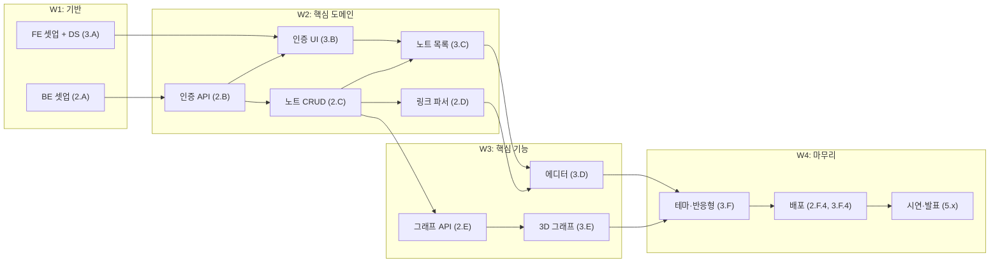

# 📋 WBS & 역할 분담표

> **대상 독자**: 팀 전원
> **선행 문서**: [`01_기획/프로젝트_기획서.md`](../01_기획/프로젝트_기획서.md)
> **버전**: v1.0 (2026-05-19)

---

## 1. 팀 구성 (RACI 매트릭스)

### 1.1 멤버

| 코드 | 이름 | 역할 | 주력 |
|---|---|---|---|
| **PM** | 강두현 | Project Manager | 기획·일정·문서·이해관계자 |
| **FE1** | 김진서 | Frontend Lead | 3D 그래프 + 에디터 (핵심 페이지) |
| **FE2** | 최윤석 | Frontend | 디자인 시스템 + 인증·목록 |
| **BE1** | 김인현 | Backend Lead | API 설계 + 인증 + 그래프 쿼리 |
| **BE2** | 김유신 | Backend | 노트/폴더 CRUD + 링크 파서 |

### 1.2 RACI 정의

- **R** (Responsible): 실제 작업하는 사람
- **A** (Accountable): 최종 책임자 (1명만)
- **C** (Consulted): 의견을 구해야 하는 사람
- **I** (Informed): 결과를 통보받는 사람

### 1.3 RACI 매트릭스

| 작업 영역 | PM | FE1 | FE2 | BE1 | BE2 |
|---|:---:|:---:|:---:|:---:|:---:|
| 기획서 / 일정 관리 | **A·R** | I | I | I | I |
| API 명세 작성 | C | C | I | **A·R** | C |
| DB 스키마 설계 | C | I | I | **A·R** | C |
| 인증 (Auth) | I | C | C | **A·R** | I |
| 노트 CRUD API | I | I | I | A | **R** |
| 링크 파서 | I | C | I | A | **R** |
| 그래프 데이터 쿼리 | I | C | I | **A·R** | C |
| 디자인 시스템 (UI Primitives) | I | C | **A·R** | I | I |
| 로그인/회원가입 UI | I | C | **A·R** | C | I |
| 노트 목록 / 사이드바 | I | R | **A·R** | I | I |
| **노트 에디터** (자동완성·자동저장) | I | **A·R** | C | C | C |
| **3D 그래프 뷰** | I | **A·R** | C | C | I |
| 테마 (다크/라이트) | I | I | **A·R** | I | I |
| 반응형 점검 | I | C | **A·R** | I | I |
| 코딩 컨벤션 / Git 룰 | **A·R** | C | C | C | C |
| 회의 진행 / 회의록 | **A·R** | I | I | I | I |
| 시연 영상 / 발표 자료 | **A·R** | R | R | R | R |
| 최종 보고서 정리 | **A·R** | C | C | C | C |

> ✅ 각 행에 **A(Accountable)는 반드시 1명**. 책임 분산 금지.

---

## 2. WBS (Work Breakdown Structure)

> 작업 단위는 ① **3일 이내**에 끝낼 수 있는 크기로 쪼개고, ② **검증 가능한 산출물**이 있어야 합니다.

### Level 1: 5개 워크 패키지

```
프로젝트 (Tri-Link)
├── WP1. 기획·관리
├── WP2. 백엔드 개발
├── WP3. 프론트엔드 개발
├── WP4. 통합·테스트
└── WP5. 마무리·발표
```

---

### WP1. 기획·관리 (PM 주도, 전 기간)

| ID | 작업 | 산출물 | 담당 | 기간 | 의존 |
|---|---|---|:---:|:---:|---|
| 1.1 | 프로젝트 기획서 작성 | `docs/01_기획/프로젝트_기획서.md` | PM | 완료 | — |
| 1.2 | 일정·역할 분담 확정 | `docs/02_일정/*` | PM | 완료 | 1.1 |
| 1.3 | 설계 문서 작성 (Arch/DB/API/UI/Component) | `docs/03_설계/*` | PM + 각 리드 | 완료 | 1.2 |
| 1.4 | 개발 가이드 (Git/컨벤션) | `docs/04_개발가이드/*` | PM | 완료 | 1.2 |
| 1.5 | 주간 회의 (주 2회, 화·금) | 회의록 6회+ | PM | 4주 | — |
| 1.6 | 리스크 트래킹 | `docs/05_관리/리스크_관리.md` | PM | 4주 | — |
| 1.7 | 데모 시나리오 작성 | 시연 스크립트 | PM | W3-4 | — |
| 1.8 | 발표 자료 (PPT) | 슬라이드 15장 | PM + 전원 | W4 | 1.7 |
| 1.9 | 최종 보고서 정리 | 통합 문서 PDF | PM | W4 | All |

---

### WP2. 백엔드 개발

#### 2.A 초기 셋업 (BE1 · 3일)

| ID | 작업 | 산출물 | 담당 | 기간 |
|---|---|---|:---:|:---:|
| 2.A.1 | Node.js + TS + Express 보일러플레이트 | `Backend/src/app.ts`, `server.ts` | BE1 | 0.5일 |
| 2.A.2 | MongoDB Atlas 클러스터 생성 + `.env` 분리 | 접속 가능한 URI | BE1 | 0.5일 |
| 2.A.3 | Mongoose 연결 + 헬스체크 엔드포인트 | `GET /health` 200 | BE1 | 0.5일 |
| 2.A.4 | 폴더 구조 (routes/controllers/services/repos/models) | 빈 골격 폴더 | BE1 | 0.5일 |
| 2.A.5 | 에러 핸들러 미들웨어 + zod 검증 미들웨어 | `middlewares/*` | BE1 | 1일 |

#### 2.B 인증 (BE1 · 3일)

| ID | 작업 | 산출물 | 담당 | 기간 |
|---|---|---|:---:|:---:|
| 2.B.1 | `User` 모델 + 비밀번호 해시 유틸 | `models/User.ts`, `utils/hash.ts` | BE1 | 0.5일 |
| 2.B.2 | `POST /auth/signup` | 통합 테스트 통과 | BE1 | 0.5일 |
| 2.B.3 | `POST /auth/login` (JWT 발급) | 통합 테스트 통과 | BE1 | 0.5일 |
| 2.B.4 | `authGuard` 미들웨어 | `middlewares/authGuard.ts` | BE1 | 0.5일 |
| 2.B.5 | `GET /auth/me`, `PATCH /users/me`, `DELETE /users/me` | 5개 API 동작 | BE1 | 1일 |

#### 2.C 노트·폴더 CRUD (BE2 · 5일)

| ID | 작업 | 산출물 | 담당 | 기간 |
|---|---|---|:---:|:---:|
| 2.C.1 | `Folder` 모델 + 트리 조회 (`GET /folders`) | API 1개 | BE2 | 1일 |
| 2.C.2 | 폴더 CRUD (`POST/PATCH/DELETE`) + 순환 참조 방지 | API 3개 | BE2 | 1일 |
| 2.C.3 | `Document` 모델 (임베드 nodes/relationships 포함) | `models/Document.ts` | BE2 | 0.5일 |
| 2.C.4 | 노트 CRUD (`GET/POST/PUT/PATCH/DELETE`) | API 5개 | BE2 | 1.5일 |
| 2.C.5 | 노트 검색 (`GET /notes/search`) | API 1개 | BE2 | 1일 |

#### 2.D 링크 파서 (BE2 · 2일)

| ID | 작업 | 산출물 | 담당 | 기간 |
|---|---|---|:---:|:---:|
| 2.D.1 | `linkParserService` 구현 (정규식 + 관계 추출) | `services/linkParserService.ts` | BE2 | 1일 |
| 2.D.2 | Jest 단위 테스트 10케이스 이상 | `tests/linkParser.test.ts` | BE2 | 0.5일 |
| 2.D.3 | 노트 저장 시 파서 통합 + `nodes` 컬렉션 동기화 (트랜잭션) | PUT API 통합 | BE2 + BE1 | 0.5일 |

#### 2.E 그래프 API (BE1 · 3일)

| ID | 작업 | 산출물 | 담당 | 기간 |
|---|---|---|:---:|:---:|
| 2.E.1 | `Node` 모델 + 인덱스 정의 | `models/Node.ts` | BE1 | 0.5일 |
| 2.E.2 | `GET /graph?type=...` aggregation 쿼리 | API 1개 | BE1 | 1.5일 |
| 2.E.3 | `GET /graph/node/:label` (관련 노트 집계) | API 1개 | BE1 | 1일 |

#### 2.F 마무리 (BE1+BE2 · 2일)

| ID | 작업 | 산출물 | 담당 | 기간 |
|---|---|---|:---:|:---:|
| 2.F.1 | OpenAPI 명세 자동 생성 | `Backend/openapi.yaml` | BE1 | 0.5일 |
| 2.F.2 | Postman Collection | `docs/postman/*.json` | BE1 | 0.5일 |
| 2.F.3 | 시드 데이터 스크립트 | `scripts/seed.ts` | BE2 | 0.5일 |
| 2.F.4 | 백엔드 배포 (Railway/Render) | 운영 URL | BE1 | 0.5일 |

---

### WP3. 프론트엔드 개발

#### 3.A 초기 셋업 + 디자인 시스템 (FE2 · 4일)

| ID | 작업 | 산출물 | 담당 | 기간 |
|---|---|---|:---:|:---:|
| 3.A.1 | Next.js 14 + TS + Tailwind 보일러플레이트 | 빈 프로젝트 빌드 성공 | FE2 | 0.5일 |
| 3.A.2 | 디자인 토큰 (`tailwind.config.ts`) + 글로벌 CSS | 토큰 적용 | FE2 | 0.5일 |
| 3.A.3 | UI Primitives (Button, Input, Modal, Card, Badge, Dropdown, Tabs, Toast, Skeleton, EmptyState, Spinner) | `components/ui/*` 11개 | FE2 | 2일 |
| 3.A.4 | 글로벌 Provider (Theme, Auth, SWRConfig) | `app/layout.tsx` | FE2 | 1일 |

#### 3.B 인증 화면 (FE2 · 2일)

| ID | 작업 | 산출물 | 담당 | 기간 |
|---|---|---|:---:|:---:|
| 3.B.1 | `/login` 페이지 + 폼 (`react-hook-form` + zod) | 로그인 동작 | FE2 | 0.5일 |
| 3.B.2 | `/signup` 페이지 + 실시간 검증 | 회원가입 동작 | FE2 | 1일 |
| 3.B.3 | 인증 후 라우트 가드 (`/notes` 리다이렉트) | 보호 동작 | FE2 | 0.5일 |

#### 3.C 메인 레이아웃 + 노트 목록 (FE1 + FE2 · 4일)

| ID | 작업 | 산출물 | 담당 | 기간 |
|---|---|---|:---:|:---:|
| 3.C.1 | `TopNav` + `Sidebar` (폴더 트리) | 컴포넌트 동작 | FE2 | 1.5일 |
| 3.C.2 | `/notes` 페이지 + `NoteList` + `NoteCard` | 목록 렌더링 | FE1 | 1.5일 |
| 3.C.3 | 새 노트 생성 + 폴더 필터링 | 동작 | FE1 | 1일 |

#### 3.D 노트 에디터 (FE1 · 5일) — 핵심

| ID | 작업 | 산출물 | 담당 | 기간 |
|---|---|---|:---:|:---:|
| 3.D.1 | `/notes/:id` 라우팅 + 초기 데이터 페칭 | 페이지 진입 | FE1 | 0.5일 |
| 3.D.2 | `MarkdownEditor` + `MarkdownPreview` (좌우 분할) | 입력·미리보기 | FE1 | 1일 |
| 3.D.3 | 자동저장 (debounce 2초) + 저장 상태 UI | 동작 확인 | FE1 | 1일 |
| 3.D.4 | `useAutocomplete` 훅 + `AutocompleteDropdown` | 드롭다운 동작 | FE1 | 1.5일 |
| 3.D.5 | 링크 렌더링 (배지 형태) + 클릭 이동 | 동작 | FE1 | 0.5일 |
| 3.D.6 | 노트 삭제 / 폴더 이동 / 공개 토글 메뉴 | 동작 | FE1 | 0.5일 |

#### 3.E 3D 그래프 뷰 (FE1 · 5일) — 핵심

| ID | 작업 | 산출물 | 담당 | 기간 |
|---|---|---|:---:|:---:|
| 3.E.1 | `react-force-graph-3d` PoC (별도 페이지) | 노드 10개 렌더링 | FE1 | 1일 |
| 3.E.2 | `/graph` 페이지 + `GraphTabs` (3개 탭) | 탭 전환 | FE1 | 1일 |
| 3.E.3 | `GraphCanvas` (실제 데이터 연결) | 그래프 표시 | FE1 | 1.5일 |
| 3.E.4 | `NodePreviewPopup` + 노드 더블클릭 이동 | 동작 | FE1 | 1일 |
| 3.E.5 | `GraphFilters` (타입 토글, 최소 등장 슬라이더) + `Legend` + `GraphStats` | 동작 | FE1 | 0.5일 |

#### 3.F 마무리 (FE2 · 3일)

| ID | 작업 | 산출물 | 담당 | 기간 |
|---|---|---|:---:|:---:|
| 3.F.1 | 다크/라이트 테마 토글 (모든 페이지 점검) | 동작 | FE2 | 1일 |
| 3.F.2 | 4가지 상태(Loading/Empty/Error/Success) 일관화 | 점검 완료 | FE2 | 1일 |
| 3.F.3 | 반응형 점검 (1280·1920) | 깨짐 없음 | FE2 | 0.5일 |
| 3.F.4 | 프론트 배포 (Vercel) | 운영 URL | FE2 | 0.5일 |

---

### WP4. 통합·테스트

| ID | 작업 | 산출물 | 담당 | 기간 |
|---|---|---|:---:|:---:|
| 4.1 | FE ↔ BE 연결 (CORS, 환경변수) | 로컬 통합 | 전원 | W2 (1일) |
| 4.2 | 핵심 시나리오 수동 테스트 (회원가입→노트→그래프) | 체크리스트 | PM + 전원 | W3 (0.5일) |
| 4.3 | 버그 트래킹 (GitHub Issues) | 이슈 라벨 | PM | 상시 |
| 4.4 | 사용성 테스트 (외부 사용자 5명) | 피드백 정리 | PM | W4 (1일) |

---

### WP5. 마무리·발표

| ID | 작업 | 산출물 | 담당 | 기간 |
|---|---|---|:---:|:---:|
| 5.1 | README.md 최종화 | 메인 README | PM | W4 |
| 5.2 | 시연 영상 (3-5분) | mp4 파일 | FE1 + PM | W4 |
| 5.3 | 발표 PPT (15장) | pptx | PM + 전원 | W4 |
| 5.4 | 최종 보고서 (docs/ 통합 PDF) | PDF | PM | W4 |
| 5.5 | 발표 리허설 (2회) | 피드백 반영 | 전원 | W4 |

---

## 3. 인당 작업량 요약 (Days)

| 멤버 | 작업일 | 비고 |
|---|:---:|---|
| **PM (강두현)** | 20일 (전 기간 / 회의·문서·관리) | |
| **FE1** | 18일 (셋업 보조 + 에디터 + 그래프) | 가장 무거운 기술 부담 |
| **FE2** | 16일 (셋업 + 디자인 + 인증·목록 + 마무리) | |
| **BE1** | 15일 (셋업 + 인증 + 그래프 + 배포) | API·DB 책임 |
| **BE2** | 12일 (노트·폴더 CRUD + 링크 파서) | |

> ⚖️ 의도적으로 FE1·BE1에 무게가 실립니다. 학기말 평가에서 가장 차별화되는 기능이 그래프 + 에디터이기 때문.

---

## 4. 작업 우선순위 (MoSCoW × 일정)

| 우선 | 작업 | 마감 | 누락 시 영향 |
|:---:|---|:---:|---|
| 🔴 P0 | 인증, 노트 CRUD, 링크 파서 | W2 | MVP 자체 불가 |
| 🔴 P0 | 노트 에디터 (자동저장) | W3 초 | 핵심 사용자 경험 |
| 🔴 P0 | 3D 그래프 (1개 타입이라도) | W3 말 | 차별점 사라짐 |
| 🟡 P1 | 폴더, 검색, 자동완성 | W3 | 사용성 저하 |
| 🟡 P1 | 다크 테마, 반응형 | W4 초 | 완성도 |
| 🟢 P2 | PAC 가이드, 공개 노트, 드래그 앤 드롭 | W4 | 보너스 (있으면 좋음) |

---

## 5. 의존성 그래프



---

## 6. 협업 약속 (Working Agreement)

1. **회의**: 주 2회 (화·금 19:00, 30분), Discord 음성 + 화면 공유
2. **데일리 스탠드업**: 매일 21:00, Discord 텍스트 채널에 3줄 (어제·오늘·블로커)
3. **PR 리뷰**: 24시간 내 응답, 같은 트랙(FE/BE) 멤버가 우선 리뷰
4. **블로커**: 2시간 이상 막히면 즉시 팀에 공유 (혼자 끙끙 X)
5. **휴식·결석**: 24시간 전 사전 공지
6. **문서 갱신**: 코드 변경이 명세에 영향 주면 같은 PR에 문서 수정 포함
7. **커밋 컨벤션**: 컨벤셔널 커밋 (`feat:`, `fix:`, `docs:` 등) — 상세는 [Git 가이드](../04_개발가이드/Git_협업_가이드.md)

---

## 7. 자가 점검 체크리스트 (PM)

매 주말마다 PM이 확인:

- [ ] 이번 주 P0 작업이 모두 마감 안에 끝났는가?
- [ ] 블로커 이슈가 GitHub에 라벨링되어 있는가?
- [ ] 모든 PR이 리뷰 거쳤는가? (자기 PR 자기 머지 금지)
- [ ] 문서가 코드 변경을 반영하고 있는가?
- [ ] 리스크 대장에 새로 발견된 항목이 있는가?
- [ ] 다음 주 작업이 모든 멤버에게 할당되어 있는가?

---

> 📌 **다음**: [개발 일정표](./개발_일정표.md) — 위 작업을 달력에 매핑
