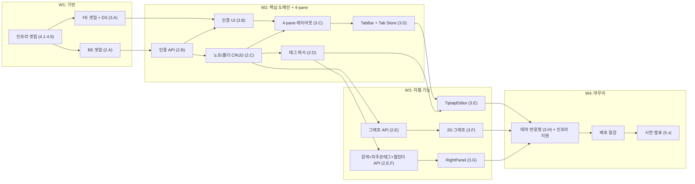

# 📋 WBS & 역할 분담표 (v2.1)

> **대상 독자**: 팀 전원 + 신규 멤버
> **선행 문서**: [`01_기획/프로젝트_기획서.md`](../01_기획/프로젝트_기획서.md)
> **버전**: v2.1 (2026-05-23 — 역할 재정의)

---

## 0. 1분 요약 (학생용)

> 누가 / 무엇을 / 언제까지 하는지 한눈에:

- **5명 (PM 1 + FE 2 + BE 1 + 인프라 1)** — 역할 재정의
- **5개 워크 패키지**: WP1 기획·관리 / WP2 백엔드 / WP3 프론트엔드 / WP4 인프라 / WP5 통합·테스트·발표
- **WBS 원칙**: 작업 단위는 ① **3일 이내**에 끝나고 ② **검증 가능한 산출물**이 있어야 함
- **책임 분배 도구**: **RACI 매트릭스** (Responsible / Accountable / Consulted / Informed)

---

## 1. 팀 구성 (RACI 매트릭스)

### 1.1 멤버

| 코드 | 이름 | 역할 | 주력 |
|---|---|---|---|
| **PM** | 강두현 | **전체 총괄 관리 PM** | 기획·일정·문서·이해관계자·의사결정 |
| **FE팀** | 김진서 + 최윤석 | **프론트엔드 전체** (둘이 자율 분담) | 4-pane 레이아웃·Tiptap 에디터·멀티탭·2D 그래프·우측바·디자인 시스템 |
| **BE** | 김인현 | **백엔드 전체 + API 전체** | 인증·노트/폴더 CRUD·태그 파서·그래프·통합검색·자주쓴태그·캘린더 API |
| **인프라** | 김유신 | **인프라 설계** (W1-W2 초) → **FE 지원** (W2 중반~) | Atlas·Vercel·Railway 셋업, CI/CD, 환경변수, 모니터링, 이후 FE 보강 |

### 1.2 RACI 정의

- **R** (Responsible): 실제 작업하는 사람
- **A** (Accountable): 최종 책임자 (반드시 1명만)
- **C** (Consulted): 의견을 구해야 하는 사람
- **I** (Informed): 결과를 통보받는 사람

### 1.3 RACI 매트릭스 (v2.1)

| 작업 영역 | PM (강두현) | FE팀 (진서+윤석) | BE (인현) | 인프라 (유신) |
|---|:---:|:---:|:---:|:---:|
| 기획서 / 일정 관리 | **A·R** | I | I | I |
| API 명세 작성 | C | C | **A·R** | I |
| DB 스키마 설계 | C | I | **A·R** | C |
| 인증 (Auth) | I | C | **A·R** | C |
| 노트/폴더 CRUD API | I | I | **A·R** | I |
| **태그 파서 (#@&)** | I | C | **A·R** | I |
| **통합 검색 API** | I | C | **A·R** | I |
| **자주 쓴 태그 API** | I | C | **A·R** | I |
| **캘린더 API** | I | C | **A·R** | I |
| 그래프 데이터 쿼리 (옵션 A) | I | C | **A·R** | I |
| **4-pane 레이아웃** | I | **A·R** | I | C |
| **MenuBar / Sidebar / FolderTree** | I | **A·R** | I | I |
| 디자인 시스템 (UI Primitives) | I | **A·R** | I | I |
| 로그인/회원가입 UI | I | **A·R** | C | I |
| **TabBar + Tab Store (멀티탭)** | I | **A·R** | I | I |
| **TiptapEditor + TokenBadge + 표** | I | **A·R** | C | I |
| **2D 그래프 뷰 (옵션 A)** | I | **A·R** | C | I |
| **RightPanel (검색+자주쓴태그+캘린더)** | I | **A·R** | C | C |
| 다크/라이트 테마 | I | **A·R** | I | I |
| 반응형 점검 (1280·1440) | I | **A·R** | I | I |
| **MongoDB Atlas 클러스터 셋업** | I | I | C | **A·R** |
| **Vercel 배포 (Frontend)** | I | C | I | **A·R** |
| **Railway / Render 배포 (Backend)** | I | I | C | **A·R** |
| **GitHub Actions CI (lint + test)** | I | C | C | **A·R** |
| **환경변수 관리 (.env, .env.example)** | I | C | C | **A·R** |
| **운영 모니터링 (로그, 헬스체크)** | I | I | C | **A·R** |
| 코딩 컨벤션 / Git 룰 | **A·R** | C | C | C |
| 회의 진행 / 회의록 | **A·R** | I | I | I |
| 시연 영상 / 발표 자료 | **A·R** | R | R | R |
| 최종 보고서 정리 | **A·R** | C | C | C |

> ✅ 각 행에 **A(Accountable)는 반드시 1명**. 책임 분산 금지.

---

## 2. WBS (Work Breakdown Structure)

### Level 1: 5개 워크 패키지

```
프로젝트 (Tri-Link v2.1)
├── WP1. 기획·관리 (PM)
├── WP2. 백엔드 개발 (BE)
├── WP3. 프론트엔드 개발 (FE팀)
├── WP4. 인프라 (인프라 → FE 지원)
└── WP5. 통합·테스트·발표 (전원)
```

---

### WP1. 기획·관리 (PM 주도)

| ID | 작업 | 산출물 | 담당 | 기간 |
|---|---|---|:---:|:---:|
| 1.1 | 프로젝트 기획서 v2 | `docs/01_기획/프로젝트_기획서.md` | PM | 완료 |
| 1.2 | 일정·역할 분담 v2.1 | `docs/02_일정/*` | PM | 완료 |
| 1.3 | 설계 문서 v2 (Arch/DB/API/UI/Component) | `docs/03_설계/*` | PM | 완료 |
| 1.4 | 개발 가이드 (Git/컨벤션) | `docs/04_개발가이드/*` | PM | 완료 |
| 1.5 | 주간 회의 (주 2회, 화·금) | 회의록 누적 | PM | 2주 |
| 1.6 | 데모 시나리오 작성 | 시연 스크립트 | PM | W2 |
| 1.7 | 발표 자료 (PPT) | 슬라이드 15장 | PM + 전원 | W2 |
| 1.8 | 최종 보고서 정리 | 통합 문서 PDF | PM | W2 |

---

### WP2. 백엔드 개발 (BE — 김인현 전담)

> ⚠️ **주의**: BE 혼자 모든 백엔드 담당. 일정 압박 시 인프라(유신)가 단순 CRUD 일부 분담 가능 (R21 비상 계획)

#### 2.A 초기 셋업 (3일)

| ID | 작업 | 산출물 | 담당 | 기간 |
|---|---|---|:---:|:---:|
| 2.A.1 | Node.js + TS + Express 보일러플레이트 | `Backend/src/app.ts`, `server.ts` | BE | 0.5일 |
| 2.A.2 | Mongoose 연결 (Atlas URI는 인프라 제공) | DB 연결 OK | BE | 0.5일 |
| 2.A.3 | 헬스체크 + 폴더 구조 골격 | `GET /health` 200 | BE | 0.5일 |
| 2.A.4 | 에러 핸들러 + zod 검증 미들웨어 | `middlewares/*` | BE | 1.5일 |

#### 2.B 인증 (3일)

| ID | 작업 | 산출물 | 담당 | 기간 |
|---|---|---|:---:|:---:|
| 2.B.1 | `User` 모델 + bcrypt 해시 | `models/User.ts` | BE | 0.5일 |
| 2.B.2 | `POST /auth/signup` + `POST /auth/login` | JWT 발급 | BE | 1일 |
| 2.B.3 | `authGuard` 미들웨어 | `middlewares/authGuard.ts` | BE | 0.5일 |
| 2.B.4 | `/auth/me`, `/users/me` (PATCH/DELETE) | 5개 API | BE | 1일 |

#### 2.C 노트·폴더 CRUD (5일)

| ID | 작업 | 산출물 | 담당 | 기간 |
|---|---|---|:---:|:---:|
| 2.C.1 | `Folder` 모델 + 트리 조회 | API 1개 | BE | 1일 |
| 2.C.2 | 폴더 CRUD + 순환 참조 방지 + 하드 삭제 | API 3개 | BE | 1일 |
| 2.C.3 | `Document` 모델 (임베드 nodes/relationships) | `models/Document.ts` | BE | 0.5일 |
| 2.C.4 | 노트 CRUD (하드 삭제) | API 5개 | BE | 1.5일 |
| 2.C.5 | 노트 검색 (기본 필터) | API 동작 | BE | 1일 |

#### 2.D 태그 파서 (2일)

| ID | 작업 | 산출물 | 담당 | 기간 |
|---|---|---|:---:|:---:|
| 2.D.1 | `tagParserService` (`#@&` 정규식 — 공백 다음만) | `services/tagParserService.ts` | BE | 1일 |
| 2.D.2 | Jest 단위 테스트 10케이스+ | `tests/tagParser.test.ts` | BE | 0.5일 |
| 2.D.3 | 노트 저장 시 파서 통합 + `nodes` 동기화 (트랜잭션) | PUT API 통합 | BE | 0.5일 |

#### 2.E 그래프 + v2 신규 API (4일)

| ID | 작업 | 산출물 | 담당 | 기간 |
|---|---|---|:---:|:---:|
| 2.E.1 | `Node` 모델 + 인덱스 (`token_type` 명명) | `models/Node.ts` | BE | 0.5일 |
| 2.E.2 | **그래프 API (옵션 A) — 파일 중심 + 공통토큰 엣지** | `GET /graph?types=` | BE | 1.5일 |
| 2.E.3 | `GET /graph/node/:label` (관련 노트 집계) | API 1개 | BE | 0.5일 |
| 2.E.4 | **통합 검색 `GET /search` (엔티티+노트)** | API 1개 | BE | 1일 |
| 2.E.5 | **자주 쓴 태그 `GET /stats/top-tokens`** | API 1개 | BE | 0.5일 |

#### 2.F 캘린더 + 마무리 (2일)

| ID | 작업 | 산출물 | 담당 | 기간 |
|---|---|---|:---:|:---:|
| 2.F.1 | **캘린더 `GET /calendar`** | API 1개 | BE | 1일 |
| 2.F.2 | OpenAPI 명세 자동 생성 | `Backend/openapi.yaml` | BE | 0.5일 |
| 2.F.3 | Postman Collection v2 | `docs/postman/*.json` | BE | 0.5일 |
| 2.F.4 | 시드 데이터 (v2 스키마 반영) | `scripts/seed.ts` | BE | 0.5일 |

> 📌 **BE 총합 19일** — 4주에 빠듯. 일정 위험 시 인프라(유신)가 2.C 노트/폴더 CRUD 일부 지원 가능.

---

### WP3. 프론트엔드 개발 (FE팀 — 진서·윤석 자율 분담)

> 💡 작업 단위로 둘이 자율 분담. 매주 회의에서 다음 주 작업 분담 합의. 후반에 인프라(유신)가 합류해 마무리 지원.

#### 3.A 초기 셋업 + 디자인 시스템 (4일)

| ID | 작업 | 산출물 | 담당 | 기간 |
|---|---|---|:---:|:---:|
| 3.A.1 | Next.js 14 + TS + Tailwind 보일러플레이트 | 빌드 성공 | FE팀 | 0.5일 |
| 3.A.2 | 디자인 토큰 → `tailwind.config.ts` | 토큰 적용 | FE팀 | 0.5일 |
| 3.A.3 | UI Primitives 11개 + `<ConfirmDialog/>` | `components/ui/*` | FE팀 | 2일 |
| 3.A.4 | 글로벌 Provider (Theme, Auth, SWRConfig) | `app/layout.tsx` | FE팀 | 1일 |

#### 3.B 인증 화면 (2일)

| ID | 작업 | 산출물 | 담당 | 기간 |
|---|---|---|:---:|:---:|
| 3.B.1 | `/login` 페이지 + 폼 | 동작 | FE팀 | 0.5일 |
| 3.B.2 | `/signup` 페이지 + 실시간 검증 | 동작 | FE팀 | 1일 |
| 3.B.3 | 라우트 가드 + 인증 후 리다이렉트 | 동작 | FE팀 | 0.5일 |

#### 3.C 4-pane 레이아웃 (3일)

| ID | 작업 | 산출물 | 담당 | 기간 |
|---|---|---|:---:|:---:|
| 3.C.1 | `MainLayout` 4-pane 골격 (60/240/가변/300) | 레이아웃 동작 | FE팀 | 1일 |
| 3.C.2 | `<MenuBar/>` (모드 전환) | 컴포넌트 | FE팀 | 0.5일 |
| 3.C.3 | `<Sidebar/>` + `<FolderTree/>` (재귀) | 컴포넌트 | FE팀 | 1일 |
| 3.C.4 | `+ 새 폴더/파일` 인라인 입력 + API 연동 | 동작 | FE팀 | 0.5일 |

#### 3.D TabBar + Tab Store (2일)

| ID | 작업 | 산출물 | 담당 | 기간 |
|---|---|---|:---:|:---:|
| 3.D.1 | `tabStore` (Zustand) + localStorage 동기화 | store 동작 | FE팀 | 1일 |
| 3.D.2 | `<TabBar/>` UI + open/close/activate | 동작 | FE팀 | 1일 |

#### 3.E TiptapEditor (5일) ⭐

| ID | 작업 | 산출물 | 담당 | 기간 |
|---|---|---|:---:|:---:|
| 3.E.1 | Tiptap + StarterKit + Markdown 입출력 PoC | 빈 에디터 | FE팀 | 0.5일 |
| 3.E.2 | `Table`, `TableRow`, `TableCell` 확장 (Obsidian 스타일) | 표 GUI | FE팀 | 1일 |
| 3.E.3 | `TokenBadge` inline node (#@& 배지) | 색깔 배지 | FE팀 | 1일 |
| 3.E.4 | `useAutocomplete` 훅 + suggestion 드롭다운 | 드롭다운 | FE팀 | 1.5일 |
| 3.E.5 | `useAutosave` 훅 (실시간 + 페이지 종료 flush) | 자동저장 | FE팀 | 0.5일 |
| 3.E.6 | 노트 삭제 (`ConfirmDialog`) + 폴더 이동 + 공개 토글 | 동작 | FE팀 | 0.5일 |

#### 3.F 2D 그래프 뷰 (4일) ⭐

| ID | 작업 | 산출물 | 담당 | 기간 |
|---|---|---|:---:|:---:|
| 3.F.1 | `react-force-graph-2d` 설치 + PoC | 동작 | FE팀 | 0.5일 |
| 3.F.2 | `<GraphCanvas/>` 실제 데이터 연결 (옵션 A) | 동작 | FE팀 | 1.5일 |
| 3.F.3 | `<GraphToolbar/>` 토글 3개 (#@&) | 동작 | FE팀 | 0.5일 |
| 3.F.4 | `<NodeHoverCard/>` + 더블클릭 → 새 탭 | 동작 | FE팀 | 1일 |
| 3.F.5 | `<Legend/>` + `<GraphStats/>` | 표시 | FE팀 | 0.5일 |

#### 3.G RightPanel (4일) ⭐

| ID | 작업 | 산출물 | 담당 | 기간 |
|---|---|---|:---:|:---:|
| 3.G.1 | `<RightPanel/>` 골격 + 스크롤 영역 분리 | 레이아웃 | FE팀 | 0.5일 |
| 3.G.2 | `<SearchBox/>` + `<SearchResults/>` (debounce 300ms) | 동작 | FE팀 | 1.5일 |
| 3.G.3 | `<TopTokens/>` 자주 쓴 태그 9개 | 동작 | FE팀 | 1일 |
| 3.G.4 | `<CalendarWidget/>` 월간 + 작성일 dot + 날짜 클릭 모달 | 동작 | FE팀 | 1일 |

#### 3.H 마무리 (2일) — 인프라(유신) 합류 가능

| ID | 작업 | 산출물 | 담당 | 기간 |
|---|---|---|:---:|:---:|
| 3.H.1 | 다크/라이트 테마 토글 (모든 페이지 점검) | 동작 | FE팀 + 인프라 | 1일 |
| 3.H.2 | 4가지 상태(Loading/Empty/Error/Success) 일관화 | 점검 | FE팀 + 인프라 | 0.5일 |
| 3.H.3 | 반응형 점검 (1280·1440) | 깨짐 없음 | FE팀 + 인프라 | 0.25일 |
| 3.H.4 | 버그 픽스 + UX 보강 | 동작 | FE팀 + 인프라 | 0.25일 |

> 📌 **FE팀 총합 약 26일** — 2명이 분담하므로 인당 13일

---

### WP4. 인프라 (유신 — W1-W2 초 집중)

| ID | 작업 | 산출물 | 담당 | 기간 |
|---|---|---|:---:|:---:|
| 4.1 | MongoDB Atlas 클러스터 생성 + IP 화이트리스트 | 접속 URI 공유 | 인프라 | 0.5일 |
| 4.2 | Vercel 프로젝트 생성 + GitHub 연동 (FE 자동 배포) | 운영 URL | 인프라 | 0.5일 |
| 4.3 | Railway 프로젝트 생성 + GitHub 연동 (BE 자동 배포) | 운영 URL | 인프라 | 0.5일 |
| 4.4 | `.env.example` 작성 (FE/BE 양쪽) + 시크릿 가이드 | 파일 | 인프라 | 0.5일 |
| 4.5 | GitHub Actions CI (lint + test on PR) | `.github/workflows/*.yml` | 인프라 | 1일 |
| 4.6 | CORS 정책 + helmet 미들웨어 셋업 (BE와 협의) | 설정 적용 | 인프라 | 0.5일 |
| 4.7 | Husky pre-commit hook (`.env` 차단) | `.husky/pre-commit` | 인프라 | 0.5일 |
| 4.8 | 운영 환경 헬스체크 + 로그 확인 (winston) | 점검 | 인프라 | 0.5일 |
| 4.9 | 배포 가이드 문서 작성 | `docs/04_개발가이드/배포_가이드.md` (선택) | 인프라 | 0.5일 |

> 📌 **인프라 총합 약 5일** — W1-W2 초 집중. 이후 FE 지원 또는 BE 비상 지원

#### 4.X — 비상 지원 (R21 트리거 시)

| ID | 시나리오 | 행동 | 담당 |
|---|---|---|:---:|
| 4.X.1 | BE 일정 압박 시 (BE 작업 W2 종료까지 60% 미만) | 인프라가 노트/폴더 CRUD API 일부 분담 | 인프라 |
| 4.X.2 | FE 마무리 시 (W3 종료부터) | 인프라가 FE 마무리 작업 합류 (3.H) | 인프라 |

---

### WP5. 통합·테스트·발표 (전원)

| ID | 작업 | 산출물 | 담당 | 기간 |
|---|---|---|:---:|:---:|
| 5.1 | FE ↔ BE 연결 (CORS, 환경변수) | 로컬 통합 | 전원 | W2 (1일) |
| 5.2 | 핵심 시나리오 수동 테스트 (회원가입→일기→그래프) | 체크리스트 | PM + 전원 | W3 (0.5일) |
| 5.3 | 버그 트래킹 (GitHub Issues) | 이슈 라벨 | PM | 상시 |
| 5.4 | 사용성 테스트 (외부 사용자 5명) | 피드백 정리 | PM | W4 (1일) |
| 5.5 | README 최종화 | 메인 README | PM | W4 |
| 5.6 | 시연 영상 (3-5분) | mp4 | FE팀 + PM | W4 |
| 5.7 | 발표 PPT (15장) | pptx | PM + 전원 | W4 |
| 5.8 | 최종 보고서 (docs 통합 PDF) | PDF | PM | W4 |
| 5.9 | 발표 리허설 (2회) | 피드백 반영 | 전원 | W4 |

---

## 3. 인당 작업량 요약 (Days, v2.1)

| 멤버 | 작업일 | 비고 |
|---|:---:|---|
| **PM (강두현)** | 20일 (전 기간 / 회의·문서·관리·발표) | |
| **FE팀 (진서+윤석)** | 26일 ÷ 2 = **인당 13일** | 둘이 자율 분담, 후반 인프라 지원 받음 |
| **BE (인현)** | **19일** | 백엔드 전체 단독 책임 — 일정 압박 주의 (R21) |
| **인프라 (유신)** | **5일 (인프라) + 5일 (FE/BE 지원) = 10일** | W1-W2 초 인프라 집중, W2 중반~ FE/BE 지원 |

> ⚠️ BE 19일은 4주에 빠듯. 인프라가 W2 중반부터 노트/폴더 CRUD 일부 지원 시 안정 확보.

---

## 4. 작업 우선순위 (MoSCoW × 일정)

| 우선 | 작업 | 마감 | 누락 시 영향 |
|:---:|---|:---:|---|
| 🔴 P0 | 인프라 셋업 (Atlas/Vercel/Railway) | W1 종료 | 모든 개발 시작 불가 |
| 🔴 P0 | 인증, 노트/폴더 CRUD, 태그 파서 | W2 | MVP 자체 불가 |
| 🔴 P0 | 4-pane 레이아웃 + TabBar | W2 | 모든 화면 기반 |
| 🔴 P0 | TiptapEditor (자동저장 + 배지) | W3 초 | 핵심 UX |
| 🔴 P0 | 2D 그래프 (1개 토글이라도) | W3 말 | 차별점 |
| 🔴 P0 | 우측바 통합 검색 + 자주 쓴 태그 + 캘린더 | W3 | v2 핵심 차별 |
| 🟡 P1 | 폴더 드래그앤드롭, 태그 가이드 페이지 | W4 | UX |
| 🟡 P1 | 다크 테마, 반응형 | W4 | 완성도 |
| 🟢 P2 | 연간 히트맵, 노트 공개 (Public URL) | W4 | 보너스 |

---

## 5. 의존성 그래프 (v2.1)



---

> 📌 **다음**: [개발 일정표](./개발_일정표.md) — 위 작업을 달력에 매핑
