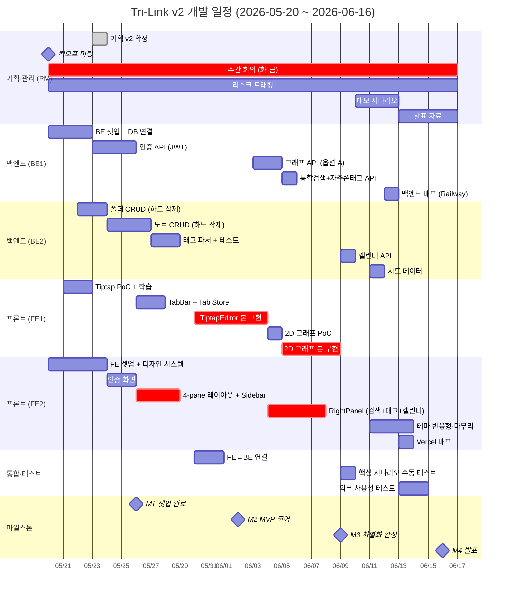

# 📅 개발 일정표 (4주 스프린트) — v2

> **대상 독자**: 팀 전원 + 신규 멤버
> **기간**: 2026-05-20 (화) ~ 2026-06-16 (화) — **4주**
> **선행 문서**: [`WBS_및_역할분담.md`](./WBS_및_역할분담.md)
> **버전**: v2.0 (2026-05-23 — 기획 v2 반영)

---

## 0. 1분 요약 (학생용)

- **4주 스프린트** (W1 기반 → W2 도메인 → W3 차별 → W4 마무리)
- **4개 마일스톤** (M1 셋업 → M2 MVP 코어 → M3 차별 기능 → M4 발표)
- **주 2회 회의** (화·금 19:00) + **데일리 스탠드업** (매일 21:00 텍스트)
- **v2 변경**: 우측바·캘린더·Tiptap 학습 일정 추가, 휴지통 작업 제거. 시작일/마감일은 그대로.

---

## 1. 마일스톤 (4개)

| # | 마일스톤 | 날짜 | 검증 기준 |
|---|---|---|---|
| **M1** | 🟢 **킥오프 + 기반 셋업 완료** | 2026-05-26 (월) | 양 끝 빈 페이지가 빌드되고 헬스체크 통과 + UI Primitives 8개 |
| **M2** | 🟡 **MVP 코어 + 4-pane** | 2026-06-02 (월) | 회원가입→로그인→**4-pane 진입**→노트 작성→목록 노출 동작 |
| **M3** | 🔴 **차별화 기능 완성** | 2026-06-09 (월) | Tiptap 에디터에서 #@& 배지 → 2D 그래프에 자동 클러스터 표시 + 우측바 동작 |
| **M4** | 🎯 **시연 가능한 MVP + 발표** | 2026-06-16 (화) | 외부 사용자 5명 테스트 + 발표 + 시연 영상 |

---

## 2. 간트 차트 (Mermaid)



> 💡 위 mermaid 차트는 GitHub·VSCode·Notion에서 자동 렌더링됩니다.

---

## 3. 주차별 상세 일정 (v2)

### 📅 Week 1 — 2026-05-20 (화) ~ 2026-05-26 (월) : "기반"

> **목표 (M1)**: 양 끝에서 빈 페이지 빌드 + 헬스체크 200 + UI Primitives 8개.
> **v2 추가**: FE1이 Tiptap 학습/PoC 미리 시작.

| 날짜 | PM | FE1 | FE2 | BE1 | BE2 |
|---|---|---|---|---|---|
| 5/20 화 (킥오프) | 회의 + 문서 공유 | 환경 셋업 | Next.js 보일러 | Express 보일러 | Atlas 가입 |
| 5/21 수 | 채널 정리 | **Tiptap 학습 (공식 문서)** | Tailwind + 토큰 | Mongo 연결 | Mongoose 학습 |
| 5/22 목 | — | **Tiptap PoC (마크다운 입출력)** | UI Primitives (Button, Input, Modal) | 헬스체크 + 폴더구조 | Folder 모델 |
| 5/23 금 (회의) | **v2 기획 확정** | (Tiptap PoC 마무리) | UI Primitives 계속 + ConfirmDialog | 에러 핸들러 + zod | Folder CRUD |
| 5/24 토 | — | — | — | — | — |
| 5/25 일 | — | — | — | — | — |
| 5/26 월 ✅ M1 | 점검 | TabBar + Tab Store 시작 | UI Primitives 마무리 | 인증 모델 시작 | Folder CRUD 마무리 |

**Week 1 산출물**:
- ✅ Next.js 14 + Tailwind 빌드 성공
- ✅ Express 서버 `GET /health` 200
- ✅ MongoDB Atlas 클러스터 연결
- ✅ UI Primitives 11개 (`ConfirmDialog` 포함)
- ✅ Folder 모델 + 트리 조회 API
- ✅ **Tiptap PoC 완성 (FE1 학습 완료)**

---

### 📅 Week 2 — 2026-05-27 (화) ~ 2026-06-02 (월) : "도메인 + 4-pane"

> **목표 (M2)**: 회원가입 → 로그인 → **4-pane 진입** → 노트 작성 → 목록 동작.

| 날짜 | PM | FE1 | FE2 | BE1 | BE2 |
|---|---|---|---|---|---|
| 5/27 화 (회의) | 회의 + 진척 점검 | TabBar UI | **4-pane MainLayout** | 회원가입 API | Document 모델 |
| 5/28 수 | 리스크 점검 | Tab Store + localStorage | MenuBar + Sidebar | 로그인 + JWT | 노트 CRUD 시작 |
| 5/29 목 | — | (탭 동작 정리) | FolderTree (재귀) | authGuard | 노트 CRUD |
| 5/30 금 (회의) | 회의 + 통합 1차 | TiptapEditor 시작 | 인증 폼 (재방문) | `/auth/me` 등 | 노트 CRUD 마무리 |
| 5/31 토 | — | — | — | — | — |
| 6/1 일 | — | — | — | — | — |
| 6/2 월 ✅ M2 | M2 검증 + 데모 | Tiptap 에디터 본 작업 | 라우트 가드 + 폴더/파일 생성 UI | 인증 마무리 | 태그 파서 시작 |

**Week 2 산출물**:
- ✅ 인증 API 5개 동작
- ✅ 노트/폴더 CRUD API 동작
- ✅ **4-pane 레이아웃** + MenuBar + Sidebar + FolderTree
- ✅ TabBar + Tab Store (localStorage 복원)
- ✅ FE-BE 통합 1차

---

### 📅 Week 3 — 2026-06-03 (화) ~ 2026-06-09 (월) : "차별 기능" 🔥

> **목표 (M3)**: Tiptap 에디터에서 #@& 입력 → 2D 그래프에 자동 클러스터 + 우측바 동작.
> **⚠️ 시험 기간 가정**: 6/3-6/5 작업량 50% 감소 가정.

| 날짜 | PM | FE1 | FE2 | BE1 | BE2 |
|---|---|---|---|---|---|
| 6/3 화 (회의) | 회의 + M3 시나리오 | TiptapEditor (배지 inline node) | 테마 일부 + RightPanel 골격 | 그래프 API 시작 | 태그 파서 마무리 + 테스트 |
| 6/4 수 | — | TokenBadge 마무리 | SearchBox + SearchResults | 그래프 aggregation | 노트 저장 시 파서 통합 |
| 6/5 목 | — | useAutocomplete + 드롭다운 | TopTokens 위젯 | `GET /search` 통합 검색 | (BE 통합 디버깅) |
| 6/6 금 (회의) | 회의 + 통합 점검 | useAutosave (실시간) | TopTokens 마무리 | `GET /stats/top-tokens` | 캘린더 API 시작 |
| 6/7 토 | — | 2D 그래프 PoC | CalendarWidget 시작 | (운영 디버깅) | (캘린더) |
| 6/8 일 | — | 2D 그래프 본 구현 | CalendarWidget 마무리 | (운영 디버깅) | — |
| 6/9 월 ✅ M3 | M3 검증 + 시연 영상 1차 | 2D 그래프 (호버 + 더블클릭) | 4가지 상태 일관화 | `/graph/node/:label` 마무리 | 시드 데이터 |

**Week 3 산출물**:
- ✅ TiptapEditor (배지 + 표 + 자동완성 + 실시간 자동저장)
- ✅ 2D 그래프 (옵션 A) + 토글 3개 + 호버 카드 + 더블클릭
- ✅ 통합 검색 API + 자주 쓴 태그 API + 캘린더 API
- ✅ RightPanel (검색 + 자주 쓴 태그 + 캘린더)
- ✅ E2E 시나리오 1회 완주

---

### 📅 Week 4 — 2026-06-10 (수) ~ 2026-06-16 (화) : "마무리·발표" 🎯

> **목표 (M4)**: 외부 사용자 5명 시연 + 발표 영상·자료 완성.

| 날짜 | PM | FE1 | FE2 | BE1 | BE2 |
|---|---|---|---|---|---|
| 6/10 수 (회의) | 회의 + 버그 분류 | 에디터/그래프 버그 픽스 | 테마 적용 (전 페이지) | 백엔드 안정화 | 버그 픽스 |
| 6/11 목 | 외부 테스터 모집 | (버그 픽스) | 반응형 점검 | 백엔드 배포 (Railway) | 시드 데이터 확장 |
| 6/12 금 (회의) | 사용성 테스트 1차 | 피드백 반영 | 피드백 반영 | (운영 디버깅) | (운영 디버깅) |
| 6/13 토 | 데모 스크립트 | 시연 영상 촬영 | Vercel 배포 | — | — |
| 6/14 일 | PPT 작성 | 발표 슬라이드 일부 | 발표 슬라이드 일부 | — | — |
| 6/15 월 | 발표 리허설 1회 | 리허설 | 리허설 | 리허설 | 리허설 |
| 6/16 화 ✅ M4 | **발표** | 발표 | 발표 | 발표 | 발표 |

**Week 4 산출물**:
- ✅ 운영 환경 배포 (Vercel + Railway + Atlas)
- ✅ 외부 사용자 5명 테스트
- ✅ 시연 영상 (3-5분, mp4)
- ✅ 발표 PPT (15장)
- ✅ 최종 보고서 PDF
- ✅ README v2 최종화

---

## 4. 회의 일정 (정기)

| 요일 | 시간 | 형식 | 주제 |
|---|---|---|---|
| 화요일 | 19:00-19:30 | Discord 음성 | 주차 시작 회의 (목표·블로커 공유) |
| 금요일 | 19:00-19:30 | Discord 음성 | 주차 마감 회의 (진척·다음 주 준비) |
| 매일 | 21:00 | Discord 텍스트 | 데일리 스탠드업 (어제·오늘·블로커 3줄) |

→ 회의록 템플릿: [`05_관리/회의록_템플릿.md`](../05_관리/회의록_템플릿.md)

---

## 5. 버퍼 & 비상 계획

### 5.1 일정 버퍼

각 주 마지막 날(월)은 **버퍼 시간**. 미완료 작업 정리·테스트·문서 보완.

### 5.2 우선순위 조정 트리거

| 상황 | 조정 방향 |
|---|---|
| Tiptap 학습이 W1 종료까지 PoC 미완 | `@uiw/react-md-editor` fallback 검토 (PM 승인) |
| 4-pane 레이아웃 W2 종료까지 미완 | 3-pane으로 임시 다운그레이드, 우측바는 모달로 |
| 핵심 작업이 마감 -2일에도 50% 미만 | P1/P2 작업 전부 컷, 인력 핵심 재배치 |
| 인증 API가 W2 중반까지 미완 | FE 인증 화면을 mock 데이터로 우회 |
| 팀원 장기 부재 (3일+) | 작업 재할당 + 마감 -2일 알림 |

### 5.3 컷오프 정책

W4 시작 시점(6/10)에 미완성된 P2 작업은 **컷**. 완성도 우선.

---

## 6. 의존성 차단 알람

다음은 **블로커 발생 가능성이 높은 의존성**입니다.

| 의존 | 블로커 영향 |
|---|---|
| BE 인증 → FE 인증 화면 | FE 인증이 mock 없이 동작 불가 |
| BE 노트 CRUD → FE 노트 목록·TabBar | 노트 데이터 못 가져옴 |
| BE 태그 파서 → FE TiptapEditor 자동저장 결과 표시 | 파싱 결과 받을 수 없음 |
| BE 그래프 API → FE 2D 그래프 | 그래프 페이지 빈 데이터 |
| BE 자주쓴태그/캘린더 API → FE RightPanel | 우측바 빈 영역 |

> 💡 **대응**: 각 BE 작업자는 `mock 응답` 먼저 만들어 FE에 제공 (FE 병행 가능)

---

## 7. 진척 추적 (Burndown)

GitHub Projects 또는 Notion 칸반:

```
[ Backlog ] → [ This Week ] → [ In Progress ] → [ Review ] → [ Done ]
```

- 매주 금요일 PM이 카드 수 집계 → Burndown 차트 업데이트
- 카드는 WBS 작업 ID와 1:1 매칭

---

## 8. 휴식·결석 정책

- **사전 공지**: 24시간 전 디스코드
- **대체 작업자**: 같은 트랙(FE/BE) 멤버가 임시 대응
- **시험 기간 (6/3-6/5 가정)**: 작업량 -50% 가정, 일정 반영 완료

---

## 9. 자가 점검 (매주 일요일)

PM이 일요일 밤 점검 후 월요일 아침 공지:

- [ ] 이번 주 마일스톤 달성 가능?
- [ ] 블로커 이슈 미해결 건수?
- [ ] 다음 주 시작 작업이 모두 할당되어 있는가?
- [ ] 문서가 코드를 따라가고 있는가?
- [ ] 리스크 대장 업데이트?

---

## 10. v1 → v2 변경 요약

| 변경 | v1 | v2 |
|---|---|---|
| W1 추가 작업 | — | **FE1 Tiptap 학습 + PoC** (2일) |
| W2 추가 작업 | — | **FE2 4-pane 레이아웃 + Sidebar** (3일) |
| W3 추가 작업 | — | **FE2 RightPanel + BE 신규 API 3개** (4-5일) |
| 제거 작업 | (없음) | 휴지통 UI 폐기 |
| 마일스톤 날짜 | 동일 | 동일 |
| 시험 기간 가정 | 6/3-6/5 | 동일 |
| 전체 일정 영향 | — | **상쇄** (3D 학습 -2일 ↔ Tiptap 학습 +2일) |

---

> 📌 **관련 문서**:
> - [WBS](./WBS_및_역할분담.md) — 작업 상세 분해
> - [Git 가이드](../04_개발가이드/Git_협업_가이드.md) — 협업 룰
> - [리스크 관리](../05_관리/리스크_관리.md) — 리스크 대장 v2
