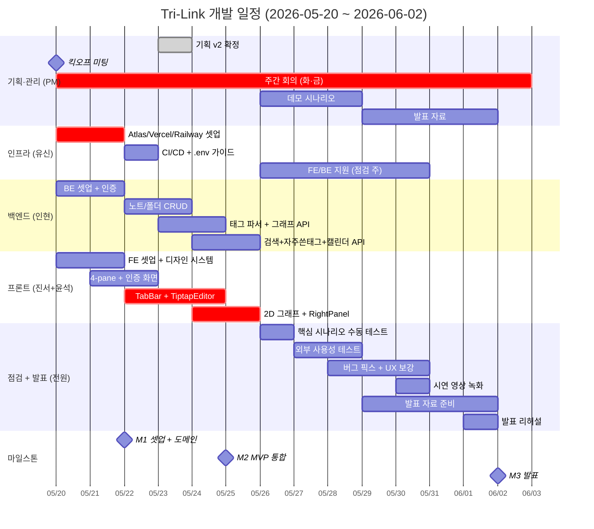

# 📅 개발 일정표

> **대상 독자**: 팀 전원
> **기간**: 2026-05-20 (화) ~ 2026-06-02 (화) — **약 2주 (개발 1주 + 점검 1주)**
> **선행 문서**: [`WBS_및_역할분담.md`](./WBS_및_역할분담.md)
> **버전**: v2.1 (2026-05-23 — 일정 압축 반영)

---

## 0. 1분 요약

- **2주 스프린트** (1주 개발 → 1주 점검·발표 준비)
- **3개 마일스톤** (M1 셋업 → M2 MVP 통합 → M3 발표)
- **주 2회 회의** (화·금 19:00) + 데일리 스탠드업 (매일 21:00 텍스트)
- **발표일**: 2026-06-02 (화)

---

## 1. 마일스톤 (3개)

| # | 마일스톤 | 날짜 | 검증 기준 |
|---|---|---|---|
| **M1** | 🟢 **셋업 + 핵심 도메인 완료** | 2026-05-22 (목) | 인프라 셋업 + 인증 + 노트/폴더 CRUD + 4-pane 레이아웃 동작 |
| **M2** | 🟡 **MVP 통합 완료** | 2026-05-25 (일) | Tiptap 에디터 + 2D 그래프 + 우측바까지 동작, FE-BE 통합 |
| **M3** | 🎯 **점검 + 발표** | 2026-06-02 (화) | 외부 테스트 + 시연 영상 + 발표 + 최종 보고서 |

---

## 2. 간트 차트 (Mermaid)



---

## 3. 주차별 상세 일정

### 📅 Week 1 — 2026-05-20 (화) ~ 2026-05-25 (일) : **개발**

> **목표**: M1 (5/22) + M2 (5/25) — MVP 통합까지 완료.

| 날짜 | PM | FE팀 (진서+윤석) | BE (인현) | 인프라 (유신) |
|---|---|---|---|---|
| 5/20 화 (킥오프) | 회의 + 문서 공유 | Next.js 보일러 + Tailwind | Express 보일러 | **Atlas 클러스터 생성 + URI 공유** |
| 5/21 수 | 채널 정리 | UI Primitives + 디자인 토큰 | 인증 (signup/login/JWT) | **Vercel + Railway 셋업** |
| 5/22 목 ✅ M1 | M1 점검 | 4-pane 레이아웃 + 인증 화면 | 노트/폴더 CRUD | **CI/CD + .env.example + Husky** |
| 5/23 금 (회의) | 회의 + 진척 점검 | TabBar + Tab Store + TiptapEditor 시작 | 태그 파서 + 그래프 API 시작 | (인프라 마무리) → FE 지원 합류 |
| 5/24 토 | — | TiptapEditor (배지/표/자동완성) | 그래프 API + 검색 API | FE 지원 (RightPanel 보조) |
| 5/25 일 ✅ M2 | M2 점검 + 시연 시나리오 | 2D 그래프 + RightPanel 완성 + FE↔BE 통합 | 자주쓴태그/캘린더 API + 시드 데이터 | (FE 마무리 지원) |

**Week 1 산출물**:
- ✅ 운영 환경 셋업 (Atlas + Vercel + Railway + CI/CD)
- ✅ 인증 API 5개 + 노트/폴더 CRUD + 태그 파서 + 그래프 API + v2 신규 API 3개
- ✅ 4-pane 레이아웃 + TiptapEditor + 2D 그래프 + RightPanel
- ✅ FE↔BE 통합 완료 — 회원가입→일기→그래프 1회 완주

---

### 📅 Week 2 — 2026-05-26 (월) ~ 2026-06-02 (화) : **점검 + 발표**

> **목표**: 외부 사용자 테스트 + 발표 자료 + 시연 영상 + 발표.

| 날짜 | PM | FE팀 (진서+윤석) | BE (인현) | 인프라 (유신) |
|---|---|---|---|---|
| 5/26 월 | 데모 시나리오 작성 + 외부 테스터 모집 | 핵심 시나리오 수동 테스트 + 버그 리스트 | 백엔드 안정화 | FE 마무리 지원 (테마/반응형) |
| 5/27 화 (회의) | 회의 + 외부 테스트 1차 | 버그 픽스 + UX 보강 | 운영 디버깅 | (지원 계속) |
| 5/28 수 | 외부 테스트 2차 | 버그 픽스 + 다크/라이트 테마 적용 | (지원) | (지원) |
| 5/29 목 | PPT 작성 시작 | 반응형 점검 (1280·1440) + 발표 슬라이드 일부 | (지원) | (지원) |
| 5/30 금 (회의) | 회의 + 시연 영상 녹화 | 시연 영상 촬영 보조 + 슬라이드 마무리 | (안정화) | (안정화) |
| 5/31 토 | PPT 완성 | (정리) | — | — |
| 6/1 일 | 발표 리허설 (2회) | 리허설 | 리허설 | 리허설 |
| 6/2 화 ✅ M3 | **발표** | 발표 | 발표 | 발표 |

**Week 2 산출물**:
- ✅ 외부 사용자 5명 사용성 테스트 + 피드백 반영
- ✅ 시연 영상 (3-5분, mp4)
- ✅ 발표 PPT (15장)
- ✅ 최종 보고서 PDF
- ✅ README 최종화

---

## 4. 회의 일정 (정기)

| 요일 | 시간 | 형식 | 주제 |
|---|---|---|---|
| 화요일 | 19:00-19:30 | Discord 음성 | 주차 시작 회의 (목표·블로커 공유) |
| 금요일 | 19:00-19:30 | Discord 음성 | 주차 마감 회의 (진척·다음 주 준비) |
| 매일 | 21:00 | Discord 텍스트 | 데일리 스탠드업 (어제·오늘·블로커 3줄) |

---

## 5. 일정 압박 대응 (Trigger & Plan)

| 트리거 | 발동 시점 | 행동 |
|---|---|---|
| BE 작업이 5/24 종료까지 60% 미만 | W1 후반 | 인프라(유신)가 노트/폴더 CRUD 일부 분담 |
| TiptapEditor가 5/24 종료까지 미완 | W1 후반 | `@uiw/react-md-editor` fallback 검토 (PM 승인) |
| 2D 그래프가 5/25까지 미완 | M2 시점 | 토글 3개 중 1개(#주제 권장)만 우선 완성 |
| 우측바 위젯 3개 모두 미완 | M2 시점 | 검색 1개만 우선 완성, 자주쓴태그·캘린더는 W2로 |
| 외부 테스트 미진행 | 5/28까지 | 팀원 가족·지인으로 대체 (3명 이상) |

---

## 6. 의존성 차단 알람

다음은 **블로커 발생 가능성이 높은 의존성**입니다.

| 의존 | 블로커 영향 |
|---|---|
| 인프라 Atlas URI → BE Mongo 연결 | BE 셋업 시작 불가 |
| BE 인증 API → FE 인증 화면 | FE 인증이 mock 없이 동작 불가 |
| BE 노트/폴더 CRUD → FE 파일목록·TabBar | 노트 데이터 못 가져옴 |
| BE 태그 파서 → FE TiptapEditor 저장 결과 표시 | 파싱 결과 받을 수 없음 |
| BE 그래프 API → FE 2D 그래프 | 그래프 페이지 빈 데이터 |
| BE 자주쓴태그/캘린더 API → FE RightPanel | 우측바 빈 영역 |

> 💡 **대응**: BE가 mock 응답 먼저 만들어 FE에 제공 → FE 병행 가능

---

## 7. 진척 추적

GitHub Projects 또는 Notion 칸반:

```
[ Backlog ] → [ This Week ] → [ In Progress ] → [ Review ] → [ Done ]
```

- 매일 21:00 스탠드업에서 카드 이동
- 매주 금요일 PM이 카드 수 집계

---

> 📌 **관련 문서**:
> - [WBS](./WBS_및_역할분담.md) — 작업 상세 분해
> - [Git 가이드](../04_개발가이드/Git_협업_가이드.md) — 협업 룰
