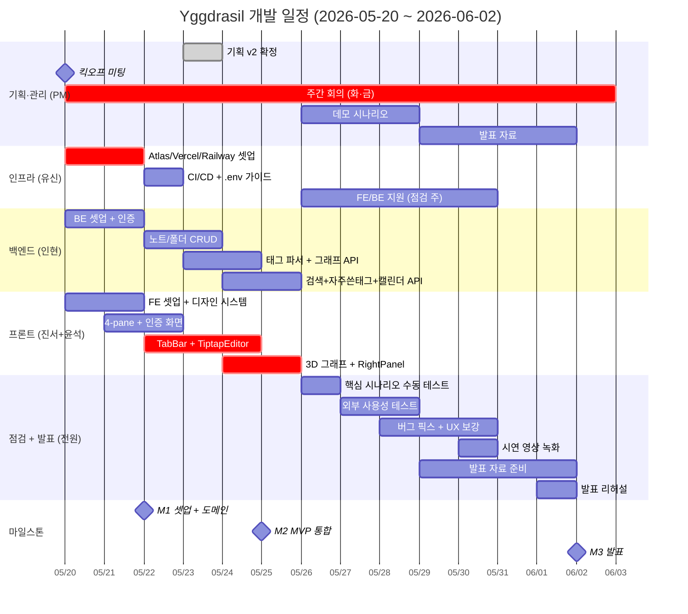

# 📅 개발 일정표

> **대상 독자**: 팀 전원
> **기간**: 2026-05-20 (화) ~ 2026-06-02 (화) — **약 2주 (개발 1주 + 점검 1주)**
> **선행 문서**: [`WBS_및_역할분담.md`](./WBS_및_역할분담.md)
> **버전**: v2.1 (2026-05-23 — 일정 압축 반영)

---

## 0. 1분 요약

- **2주 스프린트** (1주 개발 → 1주 점검·발표 준비)
- **3개 마일스톤** (M1 셋업 → M2 MVP 통합 → M3 발표)
- **주 2회 회의** (화·금 19:00) + 데일리 스탠드업 (매일 21:00 텍스트)
- **발표일**: 2026-06-02 (화)

**🇺🇸 English**

**1-Minute Summary**

- **2-week sprint** (Week 1: Development → Week 2: Review & Presentation Prep)
- **3 milestones** (M1 Setup → M2 MVP Integration → M3 Presentation)
- **2 meetings/week** (Tue & Fri 19:00) + Daily standup (21:00 text)
- **Presentation date**: 2026-06-02 (Tue)

---

## 1. 마일스톤 (3개)

| # | 마일스톤 | 날짜 | 검증 기준 |
|---|---|---|---|
| **M1** | 🟢 **셋업 + 핵심 도메인 완료** | 2026-05-22 (목) | 인프라 셋업 + 인증 + 노트/폴더 CRUD + 4-pane 레이아웃 동작 |
| **M2** | 🟡 **MVP 통합 완료** | 2026-05-25 (일) | Tiptap 에디터 + 3D 그래프 + 우측바까지 동작, FE-BE 통합 |
| **M3** | 🎯 **점검 + 발표** | 2026-06-02 (화) | 외부 테스트 + 시연 영상 + 발표 + 최종 보고서 |

**🇺🇸 English**

**Milestones (3)**

| # | Milestone | Date | Acceptance Criteria |
|---|---|---|---|
| **M1** | 🟢 **Setup + Core Domain Complete** | 2026-05-22 (Thu) | Infrastructure setup + Auth + Note/Folder CRUD + 4-pane layout working |
| **M2** | 🟡 **MVP Integration Complete** | 2026-05-25 (Sun) | Tiptap editor + 3D force-directed graph + Right panel working, FE-BE integrated |
| **M3** | 🎯 **Review + Presentation** | 2026-06-02 (Tue) | External user testing + Demo video + Presentation + Final report |

---

## 2. 간트 차트 (Mermaid)



> **🇺🇸 English — Gantt label translations**: 기획·관리 = Planning & Management | 인프라 = Infrastructure | 백엔드 = Backend | 프론트 = Frontend | 점검·발표 = Review & Presentation | 기획 v2 확정 = Plan v2 finalized | 킥오프 미팅 = Kickoff meeting | 주간 회의 = Weekly meeting | 데모 시나리오 = Demo scenario | 발표 자료 = Presentation slides | 셋업 = Setup | 노트/폴더 CRUD = Note/Folder CRUD | 태그 파서 + 그래프 API = Tag parser + Graph API | 검색+자주쓴태그+캘린더 API = Search + FrequentTag + Calendar API | 4-pane + 인증 화면 = 4-pane + Auth screens | 3D 그래프 + RightPanel = 3D force-directed graph + Right panel | 핵심 시나리오 수동 테스트 = Core scenario manual test | 외부 사용성 테스트 = External usability test | 버그 픽스 + UX 보강 = Bug fixes + UX polish | 시연 영상 녹화 = Demo video recording | 발표 리허설 = Presentation rehearsal

---

## 3. 주차별 상세 일정

### 📅 Week 1 — 2026-05-20 (화) ~ 2026-05-25 (일) : **개발**

> **목표**: M1 (5/22) + M2 (5/25) — MVP 통합까지 완료.

| 날짜 | PM | FE팀 (진서+윤석) | BE (인현) | 인프라 (유신) |
|---|---|---|---|---|
| 5/20 화 (킥오프) | 회의 + 문서 공유 | React+Vite 보일러 + 디자인 시스템 | Express 보일러 | **Atlas 클러스터 생성 + URI 공유** |
| 5/21 수 | 채널 정리 | UI Primitives + 디자인 토큰 | 인증 (signup/login/JWT) | **Vercel + Railway 셋업** |
| 5/22 목 ✅ M1 | M1 점검 | 4-pane 레이아웃 + 인증 화면 | 노트/폴더 CRUD | **CI/CD + .env.example + Husky** |
| 5/23 금 (회의) | 회의 + 진척 점검 | TabBar + TiptapEditor 시작 | 태그 파서 + 그래프 API 시작 | (인프라 마무리) → FE 지원 합류 |
| 5/24 토 | — | TiptapEditor (배지/표/자동완성) | 그래프 API + 검색 API | FE 지원 (RightPanel 보조) |
| 5/25 일 ✅ M2 | M2 점검 + 시연 시나리오 | 3D 그래프 (react-force-graph-3d) + RightPanel 완성 + FE↔BE 통합 | 자주쓴태그/캘린더 API + 시드 데이터 | (FE 마무리 지원) |

**Week 1 산출물**:
- ✅ 운영 환경 셋업 (Atlas + Vercel + Railway + CI/CD)
- ✅ 인증 API 5개 + 노트/폴더 CRUD + 태그 파서 + 그래프 API + v2 신규 API 3개
- ✅ 4-pane 레이아웃 + TiptapEditor + 3D 그래프 + RightPanel
- ✅ FE↔BE 통합 완료 — 회원가입→일기→그래프 1회 완주

**🇺🇸 English**

**Week 1 — 2026-05-20 (Tue) ~ 2026-05-25 (Sun): Development**

> **Goal**: M1 (5/22) + M2 (5/25) — Complete through MVP integration.

| Date | PM | FE Team (Jinseo Kim + Yunseok Choi) | BE (Inhyeon Kim) | Infra (Yushin Kim) |
|---|---|---|---|---|
| 5/20 Tue (Kickoff) | Meeting + doc sharing | React+Vite boilerplate + design system | Express boilerplate | **Atlas cluster creation + URI sharing** |
| 5/21 Wed | Channel setup | UI Primitives + design tokens | Auth (signup/login/JWT) | **Vercel + Railway setup** |
| 5/22 Thu ✅ M1 | M1 checkpoint | 4-pane layout + auth screens | Note/Folder CRUD | **CI/CD + .env.example + Husky** |
| 5/23 Fri (meeting) | Meeting + progress check | TabBar + TiptapEditor start | Tag parser + Graph API start | (Infra wrap-up) → join FE support |
| 5/24 Sat | — | TiptapEditor (badges/tables/autocomplete) | Graph API + Search API | FE support (RightPanel assist) |
| 5/25 Sun ✅ M2 | M2 checkpoint + demo scenario | 3D graph (react-force-graph-3d) + RightPanel complete + FE↔BE integration | FrequentTag/Calendar API + seed data | (FE wrap-up support) |

**Week 1 Deliverables**:
- ✅ Production environment setup (Atlas + Vercel + Railway + CI/CD)
- ✅ 5 Auth API endpoints + Note/Folder CRUD + Tag parser + Graph API + 3 new v2 APIs
- ✅ 4-pane layout + TiptapEditor + 3D force-directed graph + RightPanel
- ✅ FE↔BE integration complete — signup → diary → graph full round-trip

---

### 📅 Week 2 — 2026-05-26 (월) ~ 2026-06-02 (화) : **점검 + 발표**

> **목표**: 외부 사용자 테스트 + 발표 자료 + 시연 영상 + 발표.

| 날짜 | PM | FE팀 (진서+윤석) | BE (인현) | 인프라 (유신) |
|---|---|---|---|---|
| 5/26 월 | 데모 시나리오 작성 + 외부 테스터 모집 | 핵심 시나리오 수동 테스트 + 버그 리스트 | 백엔드 안정화 | FE 마무리 지원 (테마/반응형) |
| 5/27 화 (회의) | 회의 + 외부 테스트 1차 | 버그 픽스 + UX 보강 | 운영 디버깅 | (지원 계속) |
| 5/28 수 | 외부 테스트 2차 | 버그 픽스 + 다크/라이트 테마 적용 | (지원) | (지원) |
| 5/29 목 | PPT 작성 시작 | 반응형 점검 (1280·1440) + 발표 슬라이드 일부 | (지원) | (지원) |
| 5/30 금 (회의) | 회의 + 시연 영상 녹화 | 시연 영상 촬영 보조 + 슬라이드 마무리 | (안정화) | (안정화) |
| 5/31 토 | PPT 완성 | (정리) | — | — |
| 6/1 일 | 발표 리허설 (2회) | 리허설 | 리허설 | 리허설 |
| 6/2 화 ✅ M3 | **발표** | 발표 | 발표 | 발표 |

**Week 2 산출물**:
- ✅ 외부 사용자 5명 사용성 테스트 + 피드백 반영
- ✅ 시연 영상 (3-5분, mp4)
- ✅ 발표 PPT (15장)
- ✅ 최종 보고서 PDF
- ✅ README 최종화

**🇺🇸 English**

**Week 2 — 2026-05-26 (Mon) ~ 2026-06-02 (Tue): Review + Presentation**

> **Goal**: External user testing + Presentation slides + Demo video + Final presentation.

| Date | PM (Doohyun Kang) | FE Team (Jinseo Kim + Yunseok Choi) | BE (Inhyeon Kim) | Infra (Yushin Kim) |
|---|---|---|---|---|
| 5/26 Mon | Write demo scenario + recruit external testers | Core scenario manual test + bug list | Backend stabilization | FE wrap-up support (theme/responsiveness) |
| 5/27 Tue (meeting) | Meeting + external test round 1 | Bug fixes + UX polish | Production debugging | (Support continues) |
| 5/28 Wed | External test round 2 | Bug fixes + dark/light theme | (Support) | (Support) |
| 5/29 Thu | Start PPT | Responsiveness check (1280·1440) + partial slides | (Support) | (Support) |
| 5/30 Fri (meeting) | Meeting + demo video recording | Demo video assist + slides wrap-up | (Stabilization) | (Stabilization) |
| 5/31 Sat | PPT finalized | (Cleanup) | — | — |
| 6/1 Sun | Presentation rehearsal ×2 | Rehearsal | Rehearsal | Rehearsal |
| 6/2 Tue ✅ M3 | **Presentation** | Presentation | Presentation | Presentation |

**Week 2 Deliverables**:
- ✅ Usability test with 5 external users + feedback incorporated
- ✅ Demo video (3–5 min, mp4)
- ✅ Presentation slides (15 pages)
- ✅ Final report PDF
- ✅ README finalized

---

## 4. 회의 일정 (정기)

| 요일 | 시간 | 형식 | 주제 |
|---|---|---|---|
| 화요일 | 19:00-19:30 | Discord 음성 | 주차 시작 회의 (목표·블로커 공유) |
| 금요일 | 19:00-19:30 | Discord 음성 | 주차 마감 회의 (진척·다음 주 준비) |
| 매일 | 21:00 | Discord 텍스트 | 데일리 스탠드업 (어제·오늘·블로커 3줄) |

**🇺🇸 English**

**Regular Meeting Schedule**

| Day | Time | Format | Topic |
|---|---|---|---|
| Tuesday | 19:00–19:30 | Discord voice | Week-start meeting (goals & blockers) |
| Friday | 19:00–19:30 | Discord voice | Week-end meeting (progress & next-week prep) |
| Daily | 21:00 | Discord text | Daily standup (yesterday / today / blockers — 3 lines) |

---

## 5. 일정 압박 대응 (Trigger & Plan)

| 트리거 | 발동 시점 | 행동 |
|---|---|---|
| BE 작업이 5/24 종료까지 60% 미만 | W1 후반 | 인프라(유신)가 노트/폴더 CRUD 일부 분담 |
| TiptapEditor가 5/24 종료까지 미완 | W1 후반 | `@uiw/react-md-editor` fallback 검토 (PM 승인) |
| 3D 그래프가 5/25까지 미완 | M2 시점 | 토글 3개 중 1개(#주제 권장)만 우선 완성 |
| 우측바 위젯 3개 모두 미완 | M2 시점 | 검색 1개만 우선 완성, 자주쓴태그·캘린더는 W2로 |
| 외부 테스트 미진행 | 5/28까지 | 팀원 가족·지인으로 대체 (3명 이상) |

**🇺🇸 English**

**Schedule Pressure Response (Trigger & Plan)**

| Trigger | When | Action |
|---|---|---|
| BE work < 60% complete by end of 5/24 | W1 late | Yushin Kim (Infra) takes over part of Note/Folder CRUD |
| TiptapEditor incomplete by end of 5/24 | W1 late | Evaluate `@uiw/react-md-editor` fallback (PM approval required) |
| 3D graph incomplete by 5/25 | M2 point | Prioritize only 1 of 3 toggles (#topic recommended) |
| All 3 right-panel widgets incomplete | M2 point | Deliver search widget only; FrequentTag & Calendar pushed to W2 |
| External testing not conducted | By 5/28 | Replace with team members' family/acquaintances (min. 3 people) |

---

## 6. 의존성 차단 알람

다음은 **블로커 발생 가능성이 높은 의존성**입니다.

| 의존 | 블로커 영향 |
|---|---|
| 인프라 Atlas URI → BE Mongo 연결 | BE 셋업 시작 불가 |
| BE 인증 API → FE 인증 화면 | FE 인증이 mock 없이 동작 불가 |
| BE 노트/폴더 CRUD → FE 파일목록·TabBar | 노트 데이터 못 가져옴 |
| BE 태그 파서 → FE TiptapEditor 저장 결과 표시 | 파싱 결과 받을 수 없음 |
| BE 그래프 API → FE 3D 그래프 | 그래프 페이지 빈 데이터 |
| BE 자주쓴태그/캘린더 API → FE RightPanel | 우측바 빈 영역 |

> 💡 **대응**: BE가 mock 응답 먼저 만들어 FE에 제공 → FE 병행 가능

**🇺🇸 English**

**Dependency Blocker Alerts**

The following dependencies carry a high risk of blocking progress.

| Dependency | Blocker Impact |
|---|---|
| Infra Atlas URI → BE MongoDB connection | Cannot start BE setup |
| BE Auth API → FE Auth screens | FE auth cannot work without mock |
| BE Note/Folder CRUD → FE file list & TabBar | Cannot fetch note data |
| BE Tag parser → FE TiptapEditor save result display | Cannot receive parse results |
| BE Graph API → FE 3D force-directed graph | Graph page shows empty data |
| BE FrequentTag/Calendar API → FE RightPanel | Right panel renders empty |

> 💡 **Mitigation**: BE provides mock responses first so FE can develop in parallel.

---

## 7. 진척 추적

GitHub Projects 또는 Notion 칸반:

```
[ Backlog ] → [ This Week ] → [ In Progress ] → [ Review ] → [ Done ]
```

- 매일 21:00 스탠드업에서 카드 이동
- 매주 금요일 PM이 카드 수 집계

**🇺🇸 English**

**Progress Tracking**

GitHub Projects or Notion Kanban:

```
[ Backlog ] → [ This Week ] → [ In Progress ] → [ Review ] → [ Done ]
```

- Cards moved at the 21:00 daily standup
- PM tallies card counts every Friday

---

> 📌 **관련 문서**:
> - [WBS](./WBS_및_역할분담.md) — 작업 상세 분해
> - [Git 가이드](../04_개발가이드/Git_협업_가이드.md) — 협업 룰
