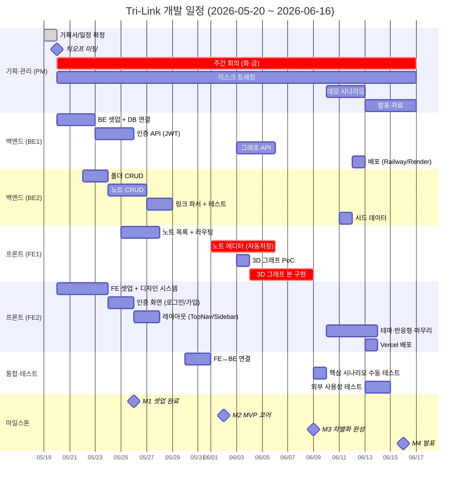

# 📅 개발 일정표 (4주 스프린트)

> **대상 독자**: 팀 전원
> **기간**: 2026-05-20 (화) ~ 2026-06-16 (화) — **4주**
> **선행 문서**: [`WBS_및_역할분담.md`](./WBS_및_역할분담.md)
> **버전**: v1.0 (2026-05-19)

---

## 1. 마일스톤 (4개)

| # | 마일스톤 | 날짜 | 검증 기준 |
|---|---|---|---|
| **M1** | 🟢 **킥오프 + 기반 셋업 완료** | 2026-05-26 (월) | 양 끝 빈 페이지가 빌드되고 헬스체크 통과 |
| **M2** | 🟡 **MVP 코어 완성** (인증·노트 CRUD) | 2026-06-02 (월) | 회원가입→로그인→노트 작성→목록 노출까지 동작 |
| **M3** | 🔴 **차별화 기능 완성** (에디터·3D 그래프) | 2026-06-09 (월) | 노트에서 @/#/& 파싱 후 3D 그래프 표시 |
| **M4** | 🎯 **시연 가능한 MVP + 발표** | 2026-06-16 (화) | 외부 사용자 5명 테스트 + 발표 + 영상 |

---

## 2. 간트 차트 (Mermaid)



> 💡 위 mermaid 차트는 GitHub·VSCode·Notion에서 자동 렌더링됩니다. 텍스트로도 읽을 수 있도록 아래에 주차별 표를 첨부합니다.

---

## 3. 주차별 상세 일정

### 📅 Week 1 — 2026-05-20 (화) ~ 2026-05-26 (월) : "기반"

> **목표 (M1)**: 양 끝에서 빈 페이지가 빌드되고 헬스체크가 200을 반환한다.

| 날짜 | PM | FE1 | FE2 | BE1 | BE2 |
|---|---|---|---|---|---|
| 5/20 화 (킥오프) | 회의 + 문서 공유 | 환경 셋업 | Next.js 보일러플레이트 | Express 보일러플레이트 | Atlas 가입 |
| 5/21 수 | 채널 정리 | (개인 학습: react-force-graph-3d) | Tailwind + 디자인 토큰 | Mongo 연결 | (개인 학습: Mongoose) |
| 5/22 목 | — | — | UI Primitives (Button, Input, Modal) | 헬스체크 + 폴더구조 | Folder 모델 |
| 5/23 금 (회의) | 회의 + 회의록 | — | UI Primitives 계속 | 에러 핸들러 + zod | Folder CRUD |
| 5/24 토 | (휴식) | | | | |
| 5/25 일 | (휴식) | | | | |
| 5/26 월 ✅ M1 | 점검 | 노트 목록 페이지 라우팅 | UI Primitives 마무리 | 인증 모델 시작 | Folder CRUD 마무리 |

**Week 1 산출물**:
- ✅ Next.js 14 + Tailwind 빌드 성공
- ✅ Express 서버 `GET /health` 200
- ✅ MongoDB Atlas 클러스터 연결
- ✅ UI Primitives 8개 이상
- ✅ Folder 모델 + 트리 조회 API

---

### 📅 Week 2 — 2026-05-27 (화) ~ 2026-06-02 (월) : "도메인"

> **목표 (M2)**: 회원가입 → 로그인 → 노트 작성 → 목록 확인까지 한 사이클 작동.

| 날짜 | PM | FE1 | FE2 | BE1 | BE2 |
|---|---|---|---|---|---|
| 5/27 화 (회의) | 회의 + 진척 점검 | 노트 목록 UI | TopNav + Sidebar | 회원가입 API | Document 모델 |
| 5/28 수 | 리스크 점검 | NoteCard 컴포넌트 | Sidebar (폴더 트리 연동) | 로그인 + JWT | 노트 CRUD 시작 |
| 5/29 목 | — | 새 노트 생성 플로우 | 로그인 폼 | authGuard 미들웨어 | 노트 CRUD 계속 |
| 5/30 금 (회의) | 회의 + 통합 1차 | (통합 디버깅) | 회원가입 폼 | `/auth/me`, `/users/me` | 노트 CRUD 마무리 |
| 5/31 토 | | | | | |
| 6/1 일 | | | | | |
| 6/2 월 ✅ M2 | M2 검증 + 데모 | 에디터 시작 (마크다운) | 라우트 가드 + 인증 후 리다이렉트 | 인증 마무리 | 노트 검색 API |

**Week 2 산출물**:
- ✅ 인증 API 5개 동작 (signup, login, me, patch, delete)
- ✅ 노트 CRUD API 5개 동작
- ✅ 로그인 → 노트 목록까지 FE에서 동작
- ✅ FE-BE 통합 1차 완료

---

### 📅 Week 3 — 2026-06-03 (화) ~ 2026-06-09 (월) : "차별화" 🔥

> **목표 (M3)**: 에디터에서 @/#/&를 입력하면 3D 그래프에 노드가 나타난다.

| 날짜 | PM | FE1 | FE2 | BE1 | BE2 |
|---|---|---|---|---|---|
| 6/3 화 (회의) | 회의 + M3 시나리오 확정 | 에디터: 좌우 분할 | (테마 작업 시작) | 그래프 API 시작 | 링크 파서 시작 |
| 6/4 수 | — | 자동저장 (debounce) | UI Primitives 보완 (Toast 등) | 그래프 aggregation | 링크 파서 + 테스트 |
| 6/5 목 | — | 자동완성 훅 + 드롭다운 | NodePreviewPopup 디자인 협업 | 그래프 API 마무리 | 노트 저장 시 파서 통합 |
| 6/6 금 (회의) | 회의 + 통합 점검 | 자동완성 마무리 | (테마 작업) | `GET /graph/node/:label` | (BE 통합 디버깅) |
| 6/7 토 | | 3D 그래프 PoC | | | |
| 6/8 일 | | 3D 그래프 본 구현 시작 | | | |
| 6/9 월 ✅ M3 | M3 검증 + 시연 영상 1차 | 3D 그래프 (필터·범례 포함) 완성 | 4가지 상태 일관화 | 시드 데이터 | 시드 데이터 |

**Week 3 산출물**:
- ✅ 노트 에디터 (자동저장 + 자동완성) 완성
- ✅ 3D 그래프 뷰 3개 탭 모두 동작
- ✅ 링크 파서 단위 테스트 통과 (10케이스+)
- ✅ 그래프 API 2개 동작
- ✅ E2E 시나리오 1회 완주

---

### 📅 Week 4 — 2026-06-10 (수) ~ 2026-06-16 (화) : "마무리·발표" 🎯

> **목표 (M4)**: 외부 사용자 5명이 가입·노트·그래프를 직접 시연. 발표 영상·자료 완성.

| 날짜 | PM | FE1 | FE2 | BE1 | BE2 |
|---|---|---|---|---|---|
| 6/10 수 (회의) | 회의 + 버그 분류 | 에디터/그래프 버그 픽스 | 테마 적용 (전 페이지) | 백엔드 안정화 | 버그 픽스 |
| 6/11 목 | 외부 테스터 모집 (10명) | (버그 픽스) | 반응형 점검 | 백엔드 배포 (Railway) | 시드 데이터 추가 |
| 6/12 금 (회의) | 사용성 테스트 1차 | 사용성 피드백 반영 | 사용성 피드백 반영 | (운영 디버깅) | (운영 디버깅) |
| 6/13 토 | 데모 스크립트 작성 | 시연 영상 촬영 보조 | Vercel 배포 | | |
| 6/14 일 | PPT 작성 | 발표 슬라이드 일부 | 발표 슬라이드 일부 | | |
| 6/15 월 | 발표 리허설 1회 | 리허설 | 리허설 | 리허설 | 리허설 |
| 6/16 화 ✅ M4 | **발표** | 발표 | 발표 | 발표 | 발표 |

**Week 4 산출물**:
- ✅ 운영 환경 배포 (Vercel + Railway + Atlas)
- ✅ 외부 사용자 5명 테스트 완료 (피드백 정리)
- ✅ 시연 영상 (3-5분, mp4)
- ✅ 발표 PPT (15장)
- ✅ 최종 보고서 PDF
- ✅ README.md 최종화

---

## 4. 회의 일정 (정기)

| 요일 | 시간 | 형식 | 주제 |
|---|---|---|---|
| 화요일 | 19:00-19:30 | Discord 음성 | 주차 시작 회의 (목표 설정, 블로커 공유) |
| 금요일 | 19:00-19:30 | Discord 음성 | 주차 마감 회의 (진척 점검, 다음 주 준비) |
| 매일 | 21:00 | Discord 텍스트 | 데일리 스탠드업 (어제·오늘·블로커, 3줄) |

→ 회의록 템플릿: [`05_관리/회의록_템플릿.md`](../05_관리/회의록_템플릿.md)

---

## 5. 버퍼 & 비상 계획

### 5.1 일정 버퍼

각 주 마지막 날(월)은 **버퍼 시간**으로 설정. 미완료 작업 정리·테스트·문서 보완.

### 5.2 우선순위 조정 트리거

다음 상황이 발생하면 즉시 PM이 우선순위 재조정:

| 상황 | 조정 방향 |
|---|---|
| 핵심 작업(에디터·그래프)이 마감일 -2일에도 50% 미만 | P1/P2 작업 전부 컷, 인력 핵심으로 재배치 |
| 인증 API가 W2 중반까지 미완 | FE 인증 화면을 mock 데이터로 우회 |
| 3D 그래프 라이브러리 학습 곡선 | 2D fallback (`react-force-graph-2d`) 검토 |
| 팀원 장기 부재 (3일+) | 작업 재할당 + 마감 -2일 알림 |

### 5.3 컷오프 정책

W4 시작 시점(6/10)에 미완성된 P2 작업은 **컷**. 완성도 우선.

---

## 6. 의존성 차단 알람

다음은 **블로커 발생 가능성이 높은 의존성**입니다. 매주 회의에서 진척 확인:

| 의존 | 블로커 영향 |
|---|---|
| BE 인증 → FE 인증 | FE 인증 화면이 mock 없이 동작 불가 |
| BE 노트 CRUD → FE 노트 목록 | FE에서 노트 데이터 못 가져옴 |
| BE 링크 파서 → FE 에디터 | 자동저장 후 파싱 결과 받을 수 없음 |
| BE 그래프 API → FE 3D 그래프 | 그래프 페이지가 빈 데이터 표시 |

> 💡 **대응**: 각 BE 작업자는 `mock 응답`을 먼저 만들어 FE에 제공. 실제 구현은 병렬 진행.

---

## 7. 진척 추적 (Burndown)

GitHub Projects 또는 Notion에 다음 컬럼으로 칸반 운영:

```
[ Backlog ] → [ This Week ] → [ In Progress ] → [ Review ] → [ Done ]
```

- 매주 금요일 PM이 카드 수 집계 → Burndown 차트 업데이트
- 카드는 WBS 작업 ID와 1:1 매칭

---

## 8. 휴식·결석 정책

- **사전 공지**: 24시간 전 디스코드 공지
- **대체 작업자**: 같은 트랙(FE/BE) 멤버가 임시 대응
- **시험 기간**: 6/3-6/5 (가정) → 작업량 -50%, 일정 반영 완료

---

## 9. 자가 점검 (매 주 일요일)

PM이 일요일 밤 점검 후 월요일 아침 공지:

- [ ] 이번 주 마일스톤 달성 가능?
- [ ] 블로커 이슈 미해결 건수?
- [ ] 다음 주 시작 작업이 모두 할당되어 있는가?
- [ ] 문서가 코드를 따라가고 있는가?
- [ ] 리스크 대장 업데이트?

---

> 📌 **관련 문서**:
> - [WBS](./WBS_및_역할분담.md) — 작업 상세 분해
> - [Git 가이드](../04_개발가이드/Git_협업_가이드.md) — 협업 룰
> - [리스크 관리](../05_관리/리스크_관리.md) — 리스크 대장
