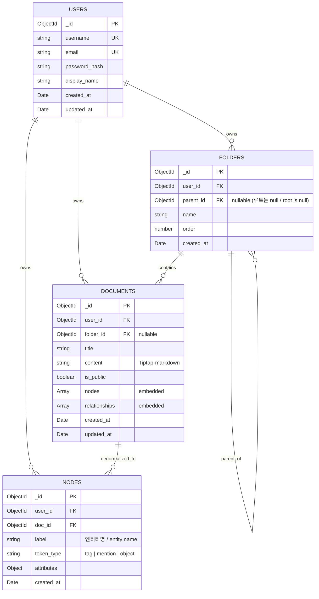

# 💾 DB 설계서 (MongoDB) — v2

> **대상 독자**: 백엔드 개발자 (BE1, BE2) + 백엔드 처음 보는 신규 멤버
> **선행 문서**: [`시스템_아키텍처.md`](./시스템_아키텍처.md)
> **참고 (기존 자료)**: [`99_기존자료/backend_mongodb.js`](../99_기존자료/backend_mongodb.js) — MongoDB CRUD 샘플 코드
> **버전**: v2.0 (2026-05-23)
> **프로젝트**: Yggdrasil

---

## 0. 1분 요약 (학생용)

> DB가 어떻게 생겼는지 핵심만:

- **4개 컬렉션**: `users`, `folders`, `documents` (= 노트), `nodes` (그래프 전용)
- **핵심 컨셉**: 노트(`documents`) 안에 노드/관계를 **임베드**(embedded) + 그래프용 별도 `nodes` 컬렉션도 동기화
- **왜 두 곳에?**: 노트 편집 시 = `documents`만 조회 / 그래프 페이지 진입 시 = `nodes`에서 한 번에 빠르게
- **삭제 정책**: **하드 삭제** (즉시 영구 삭제, 휴지통 없음) + UI에서 확인 모달

```
사용자 (users) ─ 1:N ─ 폴더 (folders) ─ 1:N ─ 노트 (documents)
                                                    │
                                          ┌─────────┴─────────┐
                                          │ 임베드: nodes[]    │
                                          │ 임베드: relations[]│
                                          └────────┬──────────┘
                                                    │
                                                    ▼ (저장 시 동기화)
                                          그래프용 nodes 컬렉션
```

**🇺🇸 English**

**0. 1-Minute Summary**

- **4 collections**: `users`, `folders`, `documents` (= notes), `nodes` (graph-only)
- **Core concept**: Node/relationship data is **embedded** inside each note (`documents`), and also synced to a dedicated `nodes` collection for graph rendering
- **Why two places?**: When editing a note → query `documents` only. When entering the graph view → fetch everything at once from `nodes`
- **Deletion policy**: **Hard delete** (immediate permanent removal, no recycle bin) + confirmation modal in UI

```
users ─ 1:N ─ folders ─ 1:N ─ documents (notes)
                                      │
                            ┌─────────┴─────────┐
                            │ embedded: nodes[]  │
                            │ embedded: relations[]│
                            └────────┬──────────┘
                                      │
                                      ▼ (synced on save)
                            nodes collection (graph)
```

---

## 1. 설계 원칙 — "임베드와 참조를 함께"

### 1.1 임베드 vs 참조 — 무엇을 어디에?

SQL과 달리 MongoDB는 **두 가지 선택지**가 있습니다.

| 패턴 | 언제 쓰나? | 우리 사례 |
|---|---|---|
| **임베드** (한 도큐먼트 안에 중첩) | 자주 함께 조회됨, 데이터 크기 작음 (16MB 한도) | 노트 안의 `nodes[]`, `relationships[]` |
| **참조** (다른 컬렉션 ID 저장) | 데이터 크기 큼, 따로 조회됨 | `documents.user_id`, `documents.folder_id` |

**🇺🇸 English**

**1.1 Embed vs. Reference — What Goes Where?**

Unlike SQL, MongoDB offers **two storage patterns**:

| Pattern | When to use | Our case |
|---|---|---|
| **Embed** (nested inside a document) | Frequently queried together; data size is small (16 MB limit) | `nodes[]`, `relationships[]` inside notes |
| **Reference** (store ID pointing to another collection) | Large data; queried independently | `documents.user_id`, `documents.folder_id` |

### 1.2 우리의 선택

| 데이터 관계 | 패턴 | 이유 |
|---|---|---|
| 노트 ↔ 노드/관계 | **임베드** | 노트와 함께 항상 조회됨 (편집·표시). 노트당 노드 평균 5-10개 |
| 사용자 ↔ 노트 | **참조** | 사용자 1명이 노트 수백 개. 임베드 시 16MB 초과 위험 |
| 노트 ↔ 폴더 | **참조** | 폴더 트리 별도 조회 빈도 높음 |
| **그래프 전용 노드** | **별도 컬렉션 (`nodes`)** | 사용자 전체 그래프 한 쿼리로 빠르게 |

**🇺🇸 English**

**1.2 Our Choices**

| Relationship | Pattern | Reason |
|---|---|---|
| Note ↔ Node/Relationship | **Embed** | Always fetched together (editing & display). ~5–10 nodes per note on average |
| User ↔ Notes | **Reference** | A single user may have hundreds of notes; embedding risks exceeding 16 MB |
| Note ↔ Folder | **Reference** | Folder tree is queried independently at high frequency |
| **Graph-only nodes** | **Separate collection (`nodes`)** | Enables loading the entire user graph in a single query |

### 1.3 왜 이중 저장? (학생 친화 설명)

```
사용자가 노트 편집:
   ↓ Tag Parser
   ↓ documents.nodes[] 업데이트 (UI 미리보기용)
   ↓
   ↓ nodes 컬렉션도 함께 upsert (그래프 전용)
```

**트레이드오프 (왜 이렇게 했는가)**:

| | 좋은 점 | 안 좋은 점 |
|---|---|---|
| 쓰기 | 1번이면 됐을 거 → 2번 작성 | 코드 약간 복잡 (트랜잭션 필요) |
| 읽기 | 그래프 페이지가 1번 쿼리로 끝남 | (없음) |
| **결론** | 학기 프로젝트는 **읽기 성능** 우선. 사용자는 한 명이 천천히 쓰지만, 그래프는 자주 진입 | 트랜잭션 1개 추가는 받아들임 |

**🇺🇸 English**

**1.3 Why Dual Storage?**

```
User edits a note:
   ↓ Tag Parser
   ↓ updates documents.nodes[] (for UI preview)
   ↓
   ↓ also upserts into the nodes collection (for graph)
```

**Trade-off rationale**:

| | Pros | Cons |
|---|---|---|
| Write | Could have been 1 write → now 2 | Slightly more complex code (transaction required) |
| Read | Graph page resolves in a single query | (none) |
| **Conclusion** | This semester's project prioritizes **read performance**. Users write slowly, but the graph view is opened frequently. The cost of one extra transaction is acceptable. |

---

## 2. ERD (Entity Relationship Diagram)



> ⚠️ **v1과 차이 (Changes from v1)**: `NODES.pac_role` 필드 삭제, `DOCUMENTS.deleted_at` 필드 삭제. `link_type` → `token_type`로 명칭 통일.
> `NODES.pac_role` field removed, `DOCUMENTS.deleted_at` field removed. `link_type` renamed to `token_type`.

**🇺🇸 English**

ERD above uses standard Mermaid notation. All field names and types are shown verbatim. Korean annotations in the diagram have been translated inline above.

---

## 3. 컬렉션 상세 스키마

**🇺🇸 English — Section 3 Overview**

Detailed schema definitions for all four collections: `users`, `folders`, `documents`, `nodes`. Each subsection includes a field table, Mongoose schema code, and index definitions.

### 3.1 `users`

| 필드 | 타입 | 필수 | 설명 | 예시 |
|---|---|:---:|---|---|
| `_id` | ObjectId | ✅ | PK (자동 생성) | `ObjectId("...")` |
| `username` | String | ✅ | 사용자명 (3-20자, 영숫자) | `"ocean1229"` |
| `email` | String | ✅ | 이메일 (RFC 5322) | `"kang@example.com"` |
| `password_hash` | String | ✅ | bcrypt 해시 (salt 10) | `"$2b$10$..."` |
| `display_name` | String | ✅ | 표시 이름 (1-30자) | `"강두현"` |
| `created_at` | Date | ✅ | 가입 시각 (UTC) | `ISODate("2026-05-23T...")` |
| `updated_at` | Date | ✅ | 마지막 수정 | 〃 |

**🇺🇸 English**

| Field | Type | Required | Description | Example |
|---|---|:---:|---|---|
| `_id` | ObjectId | ✅ | Primary key (auto-generated) | `ObjectId("...")` |
| `username` | String | ✅ | Username (3–20 chars, alphanumeric) | `"ocean1229"` |
| `email` | String | ✅ | Email address (RFC 5322) | `"kang@example.com"` |
| `password_hash` | String | ✅ | bcrypt hash (salt rounds: 10) | `"$2b$10$..."` |
| `display_name` | String | ✅ | Display name (1–30 chars) | `"강두현"` |
| `created_at` | Date | ✅ | Registration timestamp (UTC) | `ISODate("2026-05-23T...")` |
| `updated_at` | Date | ✅ | Last modified timestamp | 〃 |

**Mongoose 스키마**:

```typescript
// Backend/src/models/User.ts
import { Schema, model } from 'mongoose';

const userSchema = new Schema({
  username: {
    type: String,
    required: true,
    unique: true,
    trim: true,
    minlength: 3,
    maxlength: 20,
    match: /^[a-zA-Z0-9_]+$/,
  },
  email: {
    type: String,
    required: true,
    unique: true,
    lowercase: true,
    trim: true,
    match: /^[^\s@]+@[^\s@]+\.[^\s@]+$/,
  },
  password_hash: { type: String, required: true },
  display_name: { type: String, required: true, maxlength: 30 },
}, { timestamps: { createdAt: 'created_at', updatedAt: 'updated_at' } });

export const User = model('User', userSchema);
```

**인덱스**:
- `{ username: 1 }` — unique
- `{ email: 1 }` — unique

---

### 3.2 `folders`

| 필드 | 타입 | 필수 | 설명 |
|---|---|:---:|---|
| `_id` | ObjectId | ✅ | PK |
| `user_id` | ObjectId | ✅ | `users._id` 참조 |
| `parent_id` | ObjectId \| null | ❌ | 상위 폴더 (`null`이면 루트) |
| `name` | String | ✅ | 폴더명 (1-50자) |
| `order` | Number | ✅ | 같은 부모 안에서 정렬 순서 |
| `created_at` | Date | ✅ | — |

**🇺🇸 English**

| Field | Type | Required | Description |
|---|---|:---:|---|
| `_id` | ObjectId | ✅ | Primary key |
| `user_id` | ObjectId | ✅ | Reference to `users._id` |
| `parent_id` | ObjectId \| null | ❌ | Parent folder (`null` = root) |
| `name` | String | ✅ | Folder name (1–50 chars) |
| `order` | Number | ✅ | Sort order within the same parent |
| `created_at` | Date | ✅ | — |

**예시 트리 (Example tree)**:
```
📁 일기 / Diary  (parent_id: null)
  └ 📁 2026      (parent_id: 일기._id)
      └ 📁 5월 / May  (parent_id: 2026._id)
          └ 📄 5월 23일 / May 23rd  (folder_id: 5월._id)
📁 회의 / Meetings  (parent_id: null)
```

**인덱스**:
- `{ user_id: 1, parent_id: 1, order: 1 }` — 사용자별 트리 조회 (fetch folder tree per user)

---

### 3.3 `documents` (노트, 핵심 컬렉션)

| 필드 | 타입 | 필수 | 설명 |
|---|---|:---:|---|
| `_id` | ObjectId | ✅ | PK |
| `user_id` | ObjectId | ✅ | 소유자 |
| `folder_id` | ObjectId \| null | ❌ | 폴더 (`null`이면 루트) |
| `title` | String | ✅ | 제목 (1-200자) |
| `content` | String | ✅ | Tiptap이 직렬화한 마크다운 (최대 50,000자) |
| `is_public` | Boolean | ✅ | 공개 여부 (기본 false) |
| `nodes` | Array\<NoteNode\> | ✅ | 임베드 노드 (파싱 결과) |
| `relationships` | Array\<NoteRelationship\> | ✅ | 임베드 관계 |
| `created_at` | Date | ✅ | — |
| `updated_at` | Date | ✅ | — |

**🇺🇸 English**

| Field | Type | Required | Description |
|---|---|:---:|---|
| `_id` | ObjectId | ✅ | Primary key |
| `user_id` | ObjectId | ✅ | Owner |
| `folder_id` | ObjectId \| null | ❌ | Parent folder (`null` = root) |
| `title` | String | ✅ | Note title (1–200 chars) |
| `content` | String | ✅ | Tiptap-serialized markdown (max 50,000 chars) |
| `is_public` | Boolean | ✅ | Visibility flag (default: false) |
| `nodes` | Array\<NoteNode\> | ✅ | Embedded nodes (parse output) |
| `relationships` | Array\<NoteRelationship\> | ✅ | Embedded relationships |
| `created_at` | Date | ✅ | — |
| `updated_at` | Date | ✅ | — |


#### 임베드 서브 스키마

**NoteNode** (노트 내 등장한 엔티티 / entities found in the note):
```typescript
{
  label: string;                          // "엄마", "감정조절", "커피"
  token_type: 'mention' | 'tag' | 'object';  // @, #, &
  position?: { x: number; y: number; z: number };  // 3D coordinates (optional; computed by react-force-graph-3d / three.js)
  attributes: Record<string, any>;        // free metadata (extensible)
}
```

**NoteRelationship** (노드 간 연결 / connection between nodes):
```typescript
{
  source: string;       // node.label
  target: string;       // node.label
  type: 'co_occurrence';  // currently only one type (co-appear in the same note)
  weight?: number;      // co-occurrence count (aggregated)
}
```

#### 예시 도큐먼트

```json
{
  "_id": "664a...",
  "user_id": "664a...",
  "folder_id": "664b...",
  "title": "2026-05-23 일기",
  "content": "오늘 @엄마 와 통화함. #감정조절 또 실패. &에너지드링크 두 캔.",
  "is_public": false,
  "nodes": [
    { "label": "엄마", "token_type": "mention", "attributes": {} },
    { "label": "감정조절", "token_type": "tag", "attributes": {} },
    { "label": "에너지드링크", "token_type": "object", "attributes": {} }
  ],
  "relationships": [
    { "source": "엄마", "target": "감정조절", "type": "co_occurrence", "weight": 1 },
    { "source": "감정조절", "target": "에너지드링크", "type": "co_occurrence", "weight": 1 },
    { "source": "엄마", "target": "에너지드링크", "type": "co_occurrence", "weight": 1 }
  ],
  "created_at": "2026-05-23T10:00:00Z",
  "updated_at": "2026-05-23T10:05:00Z"
}
```

> Note: `title` `"2026-05-23 일기"` = diary entry for May 23 2026. `content` reads: "Called @mom today. #emotion-regulation failed again. &energy-drink two cans."

**인덱스**:
- `{ user_id: 1, updated_at: -1 }` — 최근 노트 목록 (recent notes list)
- `{ user_id: 1, folder_id: 1 }` — 폴더 내 노트 (notes within a folder)
- `{ user_id: 1, "nodes.label": 1 }` — 특정 엔티티 언급 노트 검색 (search notes mentioning a specific entity)
- `{ user_id: 1, "nodes.token_type": 1 }` — 타입별 필터 (filter by token type)
- `{ is_public: 1, updated_at: -1 }` — 공개 노트 피드 (public note feed, bonus)

---

### 3.4 `nodes` (그래프 전용 비정규화 컬렉션)

> 🎯 **목적**: 사용자의 전체 그래프를 한 쿼리로 빠르게 조회

| 필드 | 타입 | 필수 | 설명 |
|---|---|:---:|---|
| `_id` | ObjectId | ✅ | PK |
| `user_id` | ObjectId | ✅ | 소유자 |
| `doc_id` | ObjectId | ✅ | 원본 노트 |
| `label` | String | ✅ | 엔티티명 |
| `token_type` | String | ✅ | `mention` \| `tag` \| `object` |
| `attributes` | Object | ❌ | 자유 메타 |
| `created_at` | Date | ✅ | — |

**🇺🇸 English**

> 🎯 **Purpose**: Load the user's entire graph in a single query.

| Field | Type | Required | Description |
|---|---|:---:|---|
| `_id` | ObjectId | ✅ | Primary key |
| `user_id` | ObjectId | ✅ | Owner |
| `doc_id` | ObjectId | ✅ | Source note |
| `label` | String | ✅ | Entity name |
| `token_type` | String | ✅ | `mention` \| `tag` \| `object` |
| `attributes` | Object | ❌ | Free metadata |
| `created_at` | Date | ✅ | — |

**동기화 정책 (Sync Policy)**:
- 노트 저장(Create/Update) 시 → `documents.nodes` 갱신 + `nodes` 컬렉션도 함께 upsert
- 노트 삭제 시 → `nodes`에서 `doc_id` 매칭 도큐먼트 모두 삭제
- 트랜잭션 사용 (Mongoose `session`)

On note Create/Update → update `documents.nodes` AND upsert into `nodes` collection.
On note Delete → delete all `nodes` documents matching `doc_id`.
Uses Mongoose session transactions.

**인덱스**:
- `{ user_id: 1, token_type: 1 }` — 타입별 그래프 (graph by token type)
- `{ user_id: 1, label: 1 }` — 라벨 검색 (label search)
- `{ doc_id: 1 }` — 노트별 노드 (nodes per note, used on delete)

---

## 4. 주요 쿼리 패턴

### 4.1 사용자 노트 목록 (최근순, 10개)

```javascript
db.documents.find(
  { user_id: ObjectId("...") },
  { content: 0, nodes: 0, relationships: 0 }   // 목록에선 본문 제외
)
.sort({ updated_at: -1 })
.limit(10);
```

### 4.2 특정 노트 상세

```javascript
db.documents.findOne({ _id: ObjectId("..."), user_id: ObjectId("...") });
```

### 4.3 그래프 데이터 — 파일 중심 (Option A)

```javascript
// 1) 노드: 사용자의 모든 노트
const fileNodes = await db.documents.find(
  { user_id: ObjectId("...") },
  { _id: 1, title: 1, folder_id: 1, content: 1 }
).toArray();

// 2) 엣지: 같은 토큰을 공유하는 노트 쌍 (자동 클러스터링)
const edges = await db.nodes.aggregate([
  { $match: { user_id: ObjectId("...") } },
  { $group: { _id: "$label", docs: { $addToSet: "$doc_id" } } },
  { $match: { "docs.1": { $exists: true } } },  // 2개 이상 노트에서 등장
  // 자바스크립트 측에서 쌍으로 풀어내기
]).toArray();
```

### 4.4 자주 쓴 태그 Top 3 (타입별)

```javascript
db.nodes.aggregate([
  { $match: { user_id: ObjectId("...") } },
  { $group: { _id: { type: "$token_type", label: "$label" }, count: { $sum: 1 } } },
  { $sort: { count: -1 } },
  // 자바스크립트 측에서 타입별 Top 3 추출
]);
```

### 4.5 캘린더 — 작성일 마커 (월간)

```javascript
db.documents.aggregate([
  { $match: {
    user_id: ObjectId("..."),
    created_at: { $gte: ISODate("2026-05-01"), $lt: ISODate("2026-06-01") }
  }},
  { $group: { _id: { $dateToString: { format: "%Y-%m-%d", date: "$created_at" } }, count: { $sum: 1 } } }
]);
// 결과: [{ _id: "2026-05-23", count: 2 }, ...]
```

### 4.6 통합 검색 (엔티티 + 노트)

```javascript
// 엔티티 결과
const entityResults = await db.nodes.aggregate([
  { $match: { user_id: ObjectId("..."), label: { $regex: keyword, $options: "i" } } },
  { $group: { _id: { label: "$label", type: "$token_type" }, count: { $sum: 1 } } }
]);

// 노트 결과 (제목 + 본문)
const noteResults = await db.documents.find({
  user_id: ObjectId("..."),
  $or: [
    { title: { $regex: keyword, $options: "i" } },
    { content: { $regex: keyword, $options: "i" } }
  ]
}, { content: 0, nodes: 0, relationships: 0 }).limit(20);
```

> 💡 본격 검색을 원하면 MongoDB Atlas Search 또는 텍스트 인덱스 검토 (학기 이후).

**🇺🇸 English — Section 4: Key Query Patterns**

**4.1** — Fetch a user's 10 most recently updated notes (body/node fields projected out for list view).

**4.2** — Fetch a single note in full by `_id` + `user_id` ownership check.

**4.3** — Graph data (file-centric): (1) load all note nodes; (2) aggregate shared tokens across notes to derive edges for the 3D force-directed graph (react-force-graph-3d / three.js). Pair expansion is done client-side.

**4.4** — Top-3 most frequently used tags per token type; final grouping is done client-side.

**4.5** — Monthly calendar markers: groups notes by date string for a given month. Sample result: `[{ _id: "2026-05-23", count: 2 }, ...]`

**4.6** — Unified search across entities (`nodes` collection) and notes (`documents` title + content). For full-text search beyond regex, MongoDB Atlas Search or a text index can be added post-semester.

---

## 5. 트랜잭션이 필요한 작업

| 작업 | 트랜잭션 범위 |
|---|---|
| 노트 저장 | `documents` 업데이트 + `nodes` upsert/delete |
| 노트 삭제 (하드) | `documents` 삭제 + `nodes` 삭제 |
| 회원 탈퇴 | 사용자의 모든 `documents`, `folders`, `nodes` 삭제 |

**🇺🇸 English**

**5. Operations Requiring Transactions**

| Operation | Transaction Scope |
|---|---|
| Save note | Update `documents` + upsert/delete in `nodes` |
| Delete note (hard) | Delete from `documents` + delete from `nodes` |
| Account deletion | Delete all user `documents`, `folders`, `nodes` |

**Mongoose 예시**:

```typescript
const session = await mongoose.startSession();
session.startTransaction();
try {
  await Document.updateOne({ _id }, { $set: { ... } }).session(session);
  await Node.deleteMany({ doc_id: _id }).session(session);
  await Node.insertMany(newNodes, { session });
  await session.commitTransaction();
} catch (err) {
  await session.abortTransaction();
  throw err;
} finally {
  session.endSession();
}
```

> ⚠️ MongoDB Atlas Free Tier는 **replica set** 환경이라 트랜잭션 OK. 로컬 단일 노드 Mongo는 트랜잭션 동작 X → 개발 시 `replicaSet` 옵션으로 띄울 것.
> MongoDB Atlas Free Tier runs as a **replica set**, so transactions work. A local single-node MongoDB instance does NOT support transactions — run it with the `replicaSet` option during local development.

---

## 6. 시드 데이터 (개발용)

`Backend/src/scripts/seed.ts` 작성 — 다음을 생성:

- 테스트 사용자 3명 (강두현, 김진서, 최윤석)
- 사용자별 노트 5-7개
- 노트당 노드 3-5개 (`#감정조절`, `@엄마`, `&커피` 같은 일기 예시)
- 폴더 구조 (일기 → 2026 → 5월)

> 📌 기존 [`99_기존자료/backend_mongodb.js`](../99_기존자료/backend_mongodb.js) 가 시드 베이스. TypeScript로 마이그레이션하면서 v2 스키마(`token_type` 사용, `pac_role` 제거)에 맞춤.

**🇺🇸 English**

**6. Seed Data (Development)**

Create `Backend/src/scripts/seed.ts` to generate:

- 3 test users (강두현, 김진서, 최윤석)
- 5–7 notes per user
- 3–5 nodes per note (diary-style examples: `#emotion-regulation`, `@mom`, `&coffee`)
- Folder structure: Diary → 2026 → May

Base the seed on the existing [`99_기존자료/backend_mongodb.js`](../99_기존자료/backend_mongodb.js), migrating to TypeScript and aligning with the v2 schema (`token_type` used, `pac_role` removed).

---

## 7. 백업 & 마이그레이션

- **개발 중**: 매주 금요일 `mongodump`로 백업 (BE1)
- **스키마 변경**: `Backend/src/migrations/` 에 마이그레이션 스크립트 (예: `001_remove_pac_role.ts`)
- **롤백**: 각 마이그레이션에 `down()` 함수 포함

**🇺🇸 English**

**7. Backup & Migration**

- **During development**: Weekly Friday `mongodump` backup (owned by BE1)
- **Schema changes**: Migration scripts under `Backend/src/migrations/` (e.g., `001_remove_pac_role.ts`)
- **Rollback**: Each migration script includes a `down()` function

---

> 📌 **다음 (Next)**: [API 명세서](./API_명세서.md) — 이 스키마를 어떤 REST API로 노출하는가 / How this schema is exposed as a REST API
