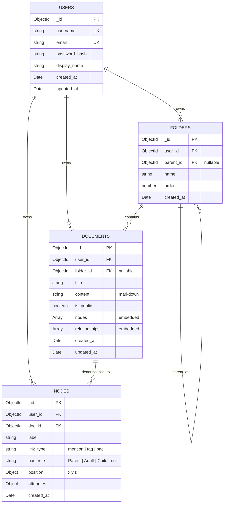

# 💾 DB 설계서 (MongoDB)

> **대상 독자**: 백엔드 개발자 (BE1, BE2)
> **선행 문서**: [`시스템_아키텍처.md`](./시스템_아키텍처.md)
> **참고**: 기존 샘플 코드 [`99_기존자료/backend_mongodb.js`](../99_기존자료/backend_mongodb.js)
> **버전**: v1.0 (2026-05-19)

---

## 1. 설계 원칙

### 1.1 모델링 전략: "Hybrid 임베드 + 참조"

MongoDB는 SQL과 달리 **임베드(embedding)** 와 **참조(referencing)** 둘 다 가능합니다. 우리 서비스는 둘을 혼합합니다.

| 데이터 | 패턴 | 이유 |
|---|---|---|
| 노트 ↔ 노드/관계 | **임베드** (`documents.nodes`, `documents.relationships`) | 노트와 함께 항상 조회됨. 1개 노트당 노드 수는 적음(평균 5-10개) |
| 사용자 ↔ 노트 | **참조** (`documents.user_id`) | 사용자 1명이 노트 수백 개 보유 가능 — 임베드 시 16MB 한도 초과 우려 |
| 노트 ↔ 폴더 | **참조** (`documents.folder_id`) | 폴더 트리 별도 조회 빈도 높음 |
| **그래프 전용 노드** | **별도 컬렉션** (`nodes`) | 사용자 전체 그래프 한 번에 조회 시 빠름 (인덱스 활용) |

### 1.2 왜 이중 저장? (For 학생)

```
사용자가 노트 편집:
  → documents.nodes[] 업데이트 (UI 미리보기용)
  → nodes 컬렉션도 함께 업데이트 (그래프 뷰 전용)
```

**트레이드오프**:
- ❌ 쓰기 시 한 번 더 작성 (코드 복잡도 ↑)
- ✅ 그래프 페이지 진입 시 빠른 조회 (수백 노트의 노드를 한 쿼리로)

→ 학기 프로젝트에서는 **읽기 성능** 우선. 쓰기는 사용자 한 명이 천천히 함.

---

## 2. ERD (Entity Relationship)



---

## 3. 컬렉션 상세 스키마

### 3.1 `users`

| 필드 | 타입 | 필수 | 설명 | 예시 |
|---|---|:---:|---|---|
| `_id` | ObjectId | ✅ | PK | `ObjectId("...")` |
| `username` | String | ✅ | 고유 사용자명 (3-20자, 영숫자) | `"ocean1229"` |
| `email` | String | ✅ | 이메일 (RFC 5322) | `"kang@example.com"` |
| `password_hash` | String | ✅ | bcrypt 해시 (salt rounds 10) | `"$2b$10$..."` |
| `display_name` | String | ✅ | 표시 이름 (1-30자) | `"강두현"` |
| `created_at` | Date | ✅ | 가입 시각 (UTC) | `ISODate("2026-05-19T...")` |
| `updated_at` | Date | ✅ | 마지막 수정 | 〃 |

**Mongoose 스키마**:

```typescript
// Backend/src/models/User.ts
import { Schema, model } from 'mongoose';

const userSchema = new Schema({
  username: {
    type: String,
    required: true,
    unique: true,
    trim: true,
    minlength: 3,
    maxlength: 20,
    match: /^[a-zA-Z0-9_]+$/,
  },
  email: {
    type: String,
    required: true,
    unique: true,
    lowercase: true,
    trim: true,
    match: /^[^\s@]+@[^\s@]+\.[^\s@]+$/,
  },
  password_hash: { type: String, required: true },
  display_name: { type: String, required: true, maxlength: 30 },
}, { timestamps: { createdAt: 'created_at', updatedAt: 'updated_at' } });

export const User = model('User', userSchema);
```

**인덱스**:
- `{ username: 1 }` — unique
- `{ email: 1 }` — unique

---

### 3.2 `folders`

| 필드 | 타입 | 필수 | 설명 |
|---|---|:---:|---|
| `_id` | ObjectId | ✅ | PK |
| `user_id` | ObjectId | ✅ | `users._id` 참조 |
| `parent_id` | ObjectId \| null | ❌ | 상위 폴더 (`null`이면 루트) |
| `name` | String | ✅ | 폴더명 (1-50자) |
| `order` | Number | ✅ | 같은 부모 안에서 정렬 순서 |
| `created_at` | Date | ✅ | — |

**예시 트리**:
```
📁 일기 (parent_id: null)
  └ 📁 2026 (parent_id: 일기._id)
      └ 📄 2026-05-19 (folder_id: 2026._id)
```

**인덱스**:
- `{ user_id: 1, parent_id: 1, order: 1 }` — 사용자별 트리 조회

---

### 3.3 `documents` (노트, 핵심 컬렉션)

| 필드 | 타입 | 필수 | 설명 |
|---|---|:---:|---|
| `_id` | ObjectId | ✅ | PK |
| `user_id` | ObjectId | ✅ | 소유자 |
| `folder_id` | ObjectId \| null | ❌ | 폴더 (`null`이면 루트) |
| `title` | String | ✅ | 제목 (1-200자) |
| `content` | String | ✅ | Markdown 본문 (최대 50,000자) |
| `is_public` | Boolean | ✅ | 공개 여부 (기본 false) |
| `nodes` | Array\<Node\> | ✅ | 임베드 노드 (파싱 결과) |
| `relationships` | Array\<Relationship\> | ✅ | 임베드 관계 |
| `created_at` | Date | ✅ | — |
| `updated_at` | Date | ✅ | — |

#### 임베드 서브 스키마

**Node** (노트 내 등장한 엔티티):
```typescript
{
  label: string;          // "엄마", "프로젝트A", "Child"
  link_type: 'mention' | 'tag' | 'pac';
  pac_role?: 'Parent' | 'Adult' | 'Child';  // link_type === 'pac' 일 때만
  position: { x: number; y: number; z: number };  // 3D 좌표 (서버 계산 or 클라이언트)
  attributes: Record<string, any>;  // 자유 형식 메타
}
```

**Relationship** (노드 간 연결):
```typescript
{
  source: string;       // node.label
  target: string;       // node.label
  type: 'mention' | 'tag' | 'pac' | 'co_occurrence';
  description?: string;
}
```

#### 예시 도큐먼트

```json
{
  "_id": "664a...",
  "user_id": "664a...",
  "folder_id": "664b...",
  "title": "2026-05-19 일기",
  "content": "오늘 @엄마 와 통화함. 또 #감정조절 실패. &Child 모드로 반응함.",
  "is_public": false,
  "nodes": [
    { "label": "엄마", "link_type": "mention", "position": {"x":0,"y":1,"z":0}, "attributes": {} },
    { "label": "감정조절", "link_type": "tag", "position": {"x":2,"y":1,"z":0}, "attributes": {} },
    { "label": "Child", "link_type": "pac", "pac_role": "Child", "position": {"x":0,"y":-1,"z":1}, "attributes": {"emotional_state": "negative"} }
  ],
  "relationships": [
    { "source": "엄마", "target": "Child", "type": "co_occurrence", "description": "엄마와 통화 중 Child 상태 발현" }
  ],
  "created_at": "2026-05-19T10:00:00Z",
  "updated_at": "2026-05-19T10:05:00Z"
}
```

**인덱스**:
- `{ user_id: 1, updated_at: -1 }` — 최근 노트 목록
- `{ user_id: 1, folder_id: 1 }` — 폴더 내 노트
- `{ user_id: 1, "nodes.label": 1 }` — 특정 엔티티 언급 노트 검색
- `{ user_id: 1, "nodes.link_type": 1 }` — 링크 타입별 필터
- `{ is_public: 1, updated_at: -1 }` — 공개 노트 피드 (보너스 기능)

---

### 3.4 `nodes` (그래프 전용 비정규화 컬렉션)

> 🎯 **목적**: 사용자의 전체 그래프를 한 쿼리로 빠르게 조회

| 필드 | 타입 | 필수 | 설명 |
|---|---|:---:|---|
| `_id` | ObjectId | ✅ | PK |
| `user_id` | ObjectId | ✅ | 소유자 |
| `doc_id` | ObjectId | ✅ | 원본 노트 |
| `label` | String | ✅ | 엔티티명 |
| `link_type` | String | ✅ | `mention` \| `tag` \| `pac` |
| `pac_role` | String \| null | ❌ | PAC 역할 |
| `position` | Object | ✅ | x, y, z |
| `attributes` | Object | ❌ | 자유 메타 |
| `created_at` | Date | ✅ | — |

**동기화 정책**:
- 노트 저장(Create/Update) 시 → `documents.nodes` 갱신 + `nodes` 컬렉션도 함께 upsert
- 노트 삭제 시 → `nodes`에서 `doc_id` 매칭 도큐먼트 모두 삭제
- 트랜잭션 사용 (Mongoose `session`)

**인덱스**:
- `{ user_id: 1, link_type: 1 }` — 타입별 그래프
- `{ user_id: 1, label: 1 }` — 라벨 검색
- `{ doc_id: 1 }` — 노트별 노드 (삭제 시)

---

## 4. 주요 쿼리 패턴

### 4.1 사용자 노트 목록 (최근순, 10개)

```javascript
db.documents.find(
  { user_id: ObjectId("...") },
  { content: 0, nodes: 0, relationships: 0 }   // 목록에선 본문 제외
)
.sort({ updated_at: -1 })
.limit(10);
```

### 4.2 특정 노트 상세

```javascript
db.documents.findOne({ _id: ObjectId("..."), user_id: ObjectId("...") });
```

### 4.3 '@언급' 그래프 데이터 추출

```javascript
db.nodes.aggregate([
  { $match: { user_id: ObjectId("..."), link_type: "mention" } },
  {
    $group: {
      _id: "$label",
      count: { $sum: 1 },
      docs: { $addToSet: "$doc_id" },
      position: { $first: "$position" }
    }
  }
]);
```

### 4.4 폴더 트리 조회

```javascript
db.folders.find({ user_id: ObjectId("...") })
  .sort({ parent_id: 1, order: 1 });
// → 서버에서 트리 형태로 변환
```

### 4.5 노트 검색 (제목 + 본문)

```javascript
db.documents.find({
  user_id: ObjectId("..."),
  $or: [
    { title: { $regex: "키워드", $options: "i" } },
    { content: { $regex: "키워드", $options: "i" } }
  ]
}).limit(20);
```

> 💡 노트 수가 많아지면 **MongoDB Atlas Search** 또는 텍스트 인덱스(`db.documents.createIndex({ title: "text", content: "text" })`)로 전환 검토.

---

## 5. 트랜잭션이 필요한 작업

| 작업 | 트랜잭션 범위 |
|---|---|
| 노트 저장 | `documents` 업데이트 + `nodes` upsert/delete |
| 노트 삭제 | `documents` 삭제 + `nodes` 삭제 |
| 회원 탈퇴 | 사용자의 모든 `documents`, `folders`, `nodes` 삭제 |

**Mongoose 예시**:

```typescript
const session = await mongoose.startSession();
session.startTransaction();
try {
  await Document.updateOne({ _id }, { $set: { ... } }).session(session);
  await Node.deleteMany({ doc_id: _id }).session(session);
  await Node.insertMany(newNodes, { session });
  await session.commitTransaction();
} catch (err) {
  await session.abortTransaction();
  throw err;
} finally {
  session.endSession();
}
```

> ⚠️ MongoDB Atlas Free Tier는 **replica set 환경**이라 트랜잭션 사용 가능. 로컬 단일 노드 Mongo에서는 트랜잭션 동작 안 함 → 개발 시 `replicaSet` 옵션으로 띄워야 함.

---

## 6. 시드 데이터 (개발용)

`Backend/src/scripts/seed.ts` 작성:

- 테스트 사용자 3명
- 사용자별 노트 5개씩
- 노트당 노드 3-5개
- PAC 관계 예시 포함

> 📌 기존 [`99_기존자료/backend_mongodb.js`](../99_기존자료/backend_mongodb.js) 가 그대로 시드 베이스가 됨 — TypeScript로 마이그레이션만 하면 됨.

---

## 7. 백업 & 마이그레이션

- **개발 중**: 매주 금요일 `mongodump` 으로 백업 (작업자 BE1)
- **스키마 변경**: `Backend/src/migrations/` 에 마이그레이션 스크립트 작성 (예: `001_add_is_public.ts`)
- **롤백**: 각 마이그레이션에 `down()` 함수 포함

---

## 8. 자가 점검 체크리스트

작업 완료 전 확인:

- [ ] 모든 컬렉션에 인덱스 정의 완료
- [ ] Mongoose 스키마에 `required`, `min/max`, `enum` 검증 적용
- [ ] `password_hash` 외 민감 필드 응답에서 제외 (`.select('-password_hash')`)
- [ ] `_id` 외 응답 변환 시 `__v` 제거
- [ ] 트랜잭션이 필요한 작업에 `session` 적용
- [ ] 시드 스크립트로 로컬에서 그래프 뷰까지 동작 확인

---

> 📌 **다음**: [API 명세서](./API_명세서.md) — 이 스키마를 어떻게 노출하는지 정의
