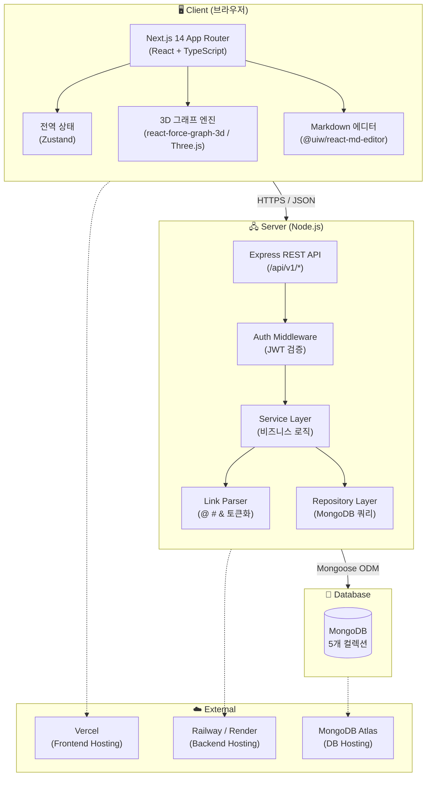
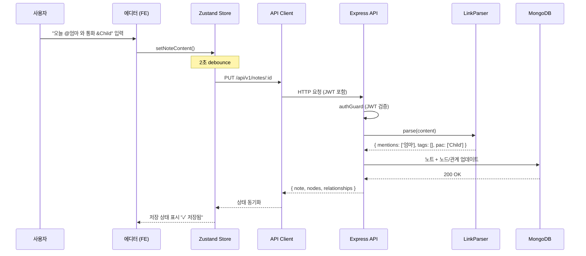
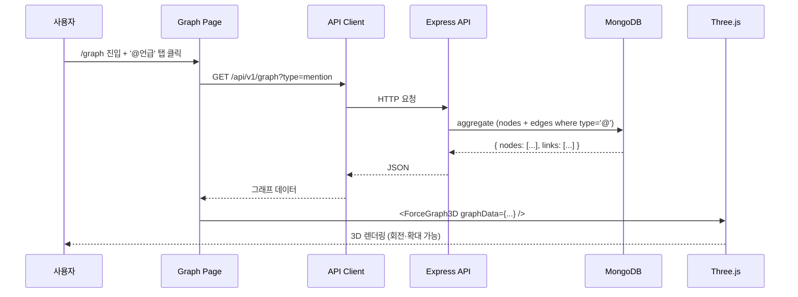

# 🏗️ 시스템 아키텍처 문서

> **대상 독자**: 프론트엔드·백엔드 개발자 전원
> **읽기 전 권장**: [`01_기획/프로젝트_기획서.md`](../01_기획/프로젝트_기획서.md)
> **버전**: v1.0 (2026-05-19)

---

## 1. 전체 아키텍처 한눈에 보기



---

## 2. 기술 스택 & 선정 이유

### 2.1 Frontend

| 영역 | 선택 | 선정 이유 | 대안 (탈락 이유) |
|---|---|---|---|
| **Framework** | **Next.js 14 (App Router)** | SSR/SSG로 SEO·초기 로딩 유리, React 표준 | CRA(deprecated), Vite (SSR 직접 구성 부담) |
| **언어** | **TypeScript 5.x** | 타입 안정성 — 4명 협업 시 사이드이펙트 최소화 | JS only (대규모 협업 시 디버깅 시간 증가) |
| **상태 관리** | **Zustand** | 보일러플레이트 적음, 학습 곡선 1시간 | Redux(러닝커브), Recoil(메인테너 이탈) |
| **스타일링** | **Tailwind CSS** | utility-first, 컴포넌트 일관성 빠르게 확보 | styled-components (런타임 비용) |
| **3D 그래프** | **react-force-graph-3d** | Three.js 래퍼, force-directed 내장 | D3 직접 구현(시간 부족), Cytoscape(2D만) |
| **에디터** | **@uiw/react-md-editor** | 마크다운 + 라이브 프리뷰, 커스터마이징 가능 | TipTap (오버스펙) |
| **HTTP** | **Axios + SWR** | 캐싱·revalidation, 로딩 상태 표준화 | fetch 직접(보일러플레이트) |
| **폼** | **react-hook-form + zod** | 검증·타입 추론 일관 | formik (성능 이슈) |

### 2.2 Backend

| 영역 | 선택 | 선정 이유 | 대안 (탈락 이유) |
|---|---|---|---|
| **Runtime** | **Node.js 20 LTS** | JS 풀스택 — 4명이 같은 언어 | Python/FastAPI (스택 분리 비용) |
| **Framework** | **Express 4** | 가장 검증된 미들웨어 생태계, 자료 풍부 | NestJS (학습곡선), Fastify (자료 부족) |
| **언어** | **TypeScript** | 프론트와 동일 — 타입 공유 가능 | JS (협업 비용) |
| **ODM** | **Mongoose** | 스키마·검증·미들웨어 내장 | 네이티브 드라이버 (수작업 검증) |
| **인증** | **JWT (jsonwebtoken)** | 무상태 — 학기 프로젝트에 적합 | 세션 (Redis 별도 필요) |
| **비밀번호** | **bcrypt** | 표준 단방향 해시 | argon2 (Node 호환성) |
| **검증** | **zod** | 프론트와 스키마 공유 가능 | joi (TS 추론 약함) |
| **테스트** | **Jest + Supertest** | 표준 조합, IDE 통합 우수 | Vitest (생태계 작음) |

### 2.3 Database

| 항목 | 결정 |
|---|---|
| **DB** | MongoDB (NoSQL 도큐먼트 DB) |
| **호스팅** | MongoDB Atlas Free Tier (512MB) |
| **모델링 패턴** | 노트(documents) 내부에 nodes/relationships **임베드** + 그래프 쿼리용 별도 `nodes` 컬렉션 |
| **선정 이유** | 노트 + 노드 + 관계가 유연한 스키마 / mermaid 그래프 데이터 자연스럽게 표현 |

### 2.4 DevOps & 도구

| 영역 | 선택 |
|---|---|
| **버전 관리** | GitHub (조직 또는 개인 리포) |
| **CI** | GitHub Actions (lint + test on PR) |
| **Frontend 배포** | Vercel (Next.js 공식 호스팅) |
| **Backend 배포** | Railway 또는 Render (무료 티어) |
| **이슈 트래킹** | GitHub Issues + Projects |
| **커뮤니케이션** | Discord 또는 카카오톡 |
| **디자인** | Figma (와이어프레임) |
| **문서** | Markdown (이 `docs/` 폴더) |

---

## 3. 레이어 구조

### 3.1 Frontend 레이어

```
┌─────────────────────────────────────────────┐
│  Pages (Next.js App Router)                  │  ← 라우팅 / SSR 진입
│  app/(auth)/login, app/notes/[id], ...      │
├─────────────────────────────────────────────┤
│  Features (도메인별 UI 모듈)                  │  ← 페이지가 조립하는 단위
│  features/editor, features/graph, ...        │
├─────────────────────────────────────────────┤
│  Components (재사용 UI)                       │  ← 디자인 시스템
│  components/Button, Modal, Sidebar, ...      │
├─────────────────────────────────────────────┤
│  Hooks (커스텀 훅)                            │  ← 로직 캡슐화
│  hooks/useNotes, useDebounce, ...           │
├─────────────────────────────────────────────┤
│  Store (Zustand)                             │  ← 전역 상태
│  store/authStore, noteStore, graphStore      │
├─────────────────────────────────────────────┤
│  Lib (API 클라이언트 / 유틸)                  │  ← 외부 통신
│  lib/api, lib/parser, lib/utils              │
└─────────────────────────────────────────────┘
```

### 3.2 Backend 레이어

```
┌─────────────────────────────────────────────┐
│  Routes (Express Router)                     │  ← URL → 컨트롤러 매핑
│  routes/auth, notes, folders, graph          │
├─────────────────────────────────────────────┤
│  Middlewares                                 │  ← 횡단 관심사
│  authGuard, errorHandler, validate, logger   │
├─────────────────────────────────────────────┤
│  Controllers                                 │  ← req/res 변환만
│  controllers/noteController, ...             │
├─────────────────────────────────────────────┤
│  Services (비즈니스 로직)                     │  ← 핵심 로직
│  services/noteService, linkParserService     │
├─────────────────────────────────────────────┤
│  Repositories (DB 접근)                      │  ← Mongoose 모델 호출
│  repositories/noteRepo, userRepo             │
├─────────────────────────────────────────────┤
│  Models (Mongoose Schema)                    │  ← DB 스키마
│  models/User, Note, Folder, Node             │
└─────────────────────────────────────────────┘
```

### 3.3 왜 레이어를 나누는가? (For 학생)

| 안 나누면 | 나누면 |
|---|---|
| `route.ts`에 DB 쿼리 + 검증 + 응답 변환이 다 들어감 (200줄) | 각 레이어 50줄 이하로 책임 분리 |
| 같은 로직을 여러 라우트에서 복붙 | service 1개를 여러 controller가 호출 |
| 테스트 작성 불가 (HTTP 전체 모킹 필요) | service만 단위 테스트 가능 |
| 4명이 동시 수정 시 충돌 폭발 | 파일 단위 책임이 명확해 충돌 적음 |

---

## 4. 폴더 구조 (Mono-repo)

```
Five_guys/
├── Front/                    # Next.js 앱
│   ├── app/
│   │   ├── (auth)/
│   │   │   ├── login/page.tsx
│   │   │   └── signup/page.tsx
│   │   ├── (main)/
│   │   │   ├── layout.tsx           # 사이드바 포함
│   │   │   ├── notes/page.tsx       # 노트 목록
│   │   │   ├── notes/[id]/page.tsx  # 노트 편집
│   │   │   └── graph/page.tsx       # 3D 그래프
│   │   ├── layout.tsx
│   │   └── globals.css
│   ├── features/
│   │   ├── editor/                  # 마크다운 에디터
│   │   ├── graph/                   # 3D 그래프
│   │   ├── sidebar/                 # 폴더 트리
│   │   └── auth/                    # 로그인 폼
│   ├── components/                  # 공통 UI (Button, Modal, ...)
│   ├── hooks/
│   ├── store/                       # Zustand
│   ├── lib/                         # api client, utils
│   ├── types/                       # 공통 타입 (백과 공유)
│   ├── public/
│   ├── tailwind.config.ts
│   ├── tsconfig.json
│   └── package.json
│
├── Backend/                  # Express 서버
│   ├── src/
│   │   ├── routes/
│   │   ├── controllers/
│   │   ├── services/
│   │   ├── repositories/
│   │   ├── models/                  # Mongoose Schema
│   │   ├── middlewares/
│   │   ├── utils/
│   │   ├── config/                  # env, db connection
│   │   ├── types/                   # 공통 타입
│   │   ├── app.ts                   # Express 앱 설정
│   │   └── server.ts                # 진입점
│   ├── tests/
│   ├── tsconfig.json
│   └── package.json
│
├── docs/                     # 본 문서 패키지
└── README.md
```

### 4.1 명명 규칙

| 종류 | 규칙 | 예시 |
|---|---|---|
| 폴더 | `kebab-case` | `link-parser/` |
| React 컴포넌트 파일 | `PascalCase.tsx` | `NoteEditor.tsx` |
| 일반 ts 파일 | `camelCase.ts` | `noteService.ts` |
| 훅 | `use` prefix | `useNotes.ts` |
| 타입 | `PascalCase` | `interface Note { ... }` |
| 상수 | `UPPER_SNAKE` | `MAX_NOTE_LENGTH` |

---

## 5. 핵심 데이터 흐름

### 5.1 노트 저장 흐름 (예시)



### 5.2 3D 그래프 렌더링 흐름



---

## 6. 환경 분리 (Environment)

| 환경 | URL | 용도 | DB |
|---|---|---|---|
| **local** | `http://localhost:3000` | 개발자 PC | 로컬 Mongo or Atlas dev cluster |
| **dev** | `dev.tri-link.app` | 팀 공유 데모 | Atlas dev cluster |
| **prod** | `tri-link.app` | 최종 시연용 | Atlas prod cluster |

### `.env` 변수 (예시)

```bash
# Frontend (.env.local)
NEXT_PUBLIC_API_BASE_URL=http://localhost:4000/api/v1

# Backend (.env)
NODE_ENV=development
PORT=4000
MONGO_URI=mongodb+srv://...
JWT_SECRET=change-me-in-prod
JWT_EXPIRES_IN=7d
CORS_ORIGIN=http://localhost:3000
```

> ⚠️ `.env` 파일은 **절대 Git에 커밋하지 않는다**. `.env.example`만 커밋.

---

## 7. 보안 & 비기능 요구사항

| 항목 | 정책 |
|---|---|
| **인증** | JWT (Authorization 헤더), 만료 7일 |
| **비밀번호** | bcrypt salt rounds = 10 |
| **CORS** | 화이트리스트 도메인만 허용 |
| **입력 검증** | 모든 API에 zod 스키마 |
| **에러 로깅** | 서버 측 winston 로거 (`logs/error.log`) |
| **응답 시간** | 일반 API 200ms, 그래프 데이터 500ms 이하 (100노드 기준) |
| **노트 본문 길이** | 최대 50,000자 |
| **사용자당 노트 수** | 무제한 (Free Tier 한도 내) |

---

## 8. 외부 라이브러리 의존성 요약

### Frontend (`Front/package.json` 예시)

```json
{
  "dependencies": {
    "next": "^14.2.0",
    "react": "^18.3.0",
    "react-dom": "^18.3.0",
    "typescript": "^5.4.0",
    "zustand": "^4.5.0",
    "axios": "^1.6.0",
    "swr": "^2.2.0",
    "react-hook-form": "^7.51.0",
    "zod": "^3.23.0",
    "@uiw/react-md-editor": "^4.0.0",
    "react-force-graph-3d": "^1.24.0",
    "three": "^0.164.0",
    "tailwindcss": "^3.4.0"
  }
}
```

### Backend (`Backend/package.json` 예시)

```json
{
  "dependencies": {
    "express": "^4.19.0",
    "mongoose": "^8.4.0",
    "jsonwebtoken": "^9.0.0",
    "bcrypt": "^5.1.0",
    "zod": "^3.23.0",
    "cors": "^2.8.5",
    "helmet": "^7.1.0",
    "winston": "^3.13.0",
    "dotenv": "^16.4.0"
  },
  "devDependencies": {
    "typescript": "^5.4.0",
    "ts-node-dev": "^2.0.0",
    "jest": "^29.7.0",
    "supertest": "^7.0.0"
  }
}
```

---

## 9. 추후 확장 고려 (Out of Scope, 학기 이후)

- 실시간 협업 (WebSocket / Yjs)
- 모바일 앱 (React Native)
- AI 기반 자동 PAC 분류 (LLM)
- 노트 버전 관리 (Git-like)

---

> 📌 **다음 문서**: [DB 설계서](./DB_설계서.md) · [API 명세서](./API_명세서.md) · [컴포넌트 설계서](./컴포넌트_설계서.md)
