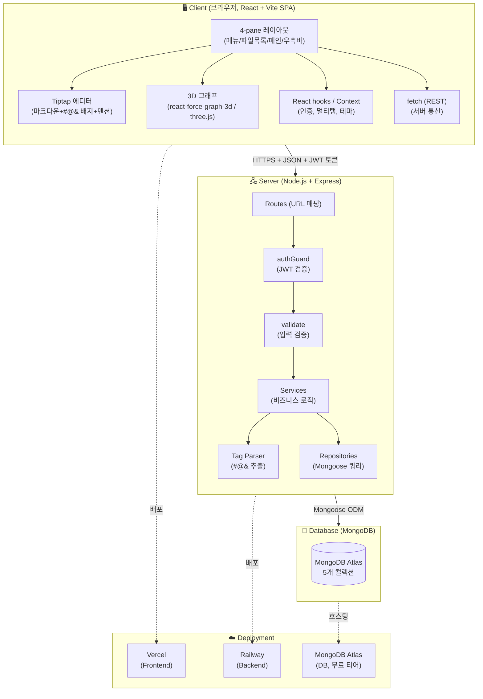
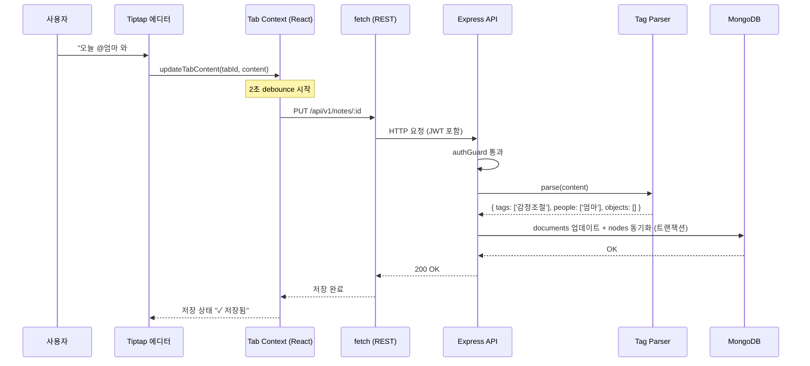
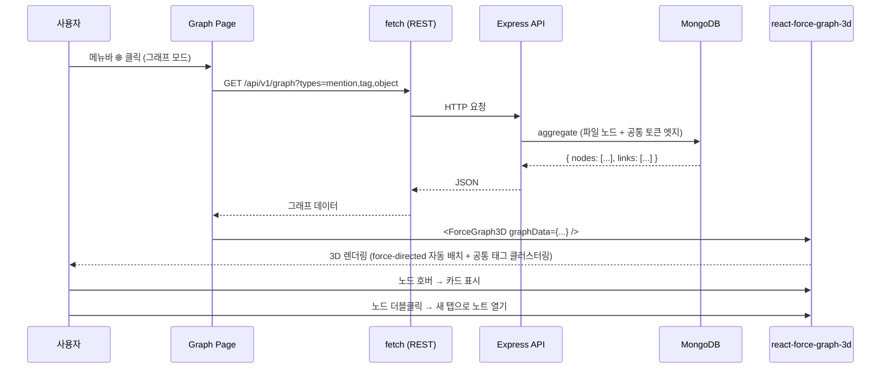
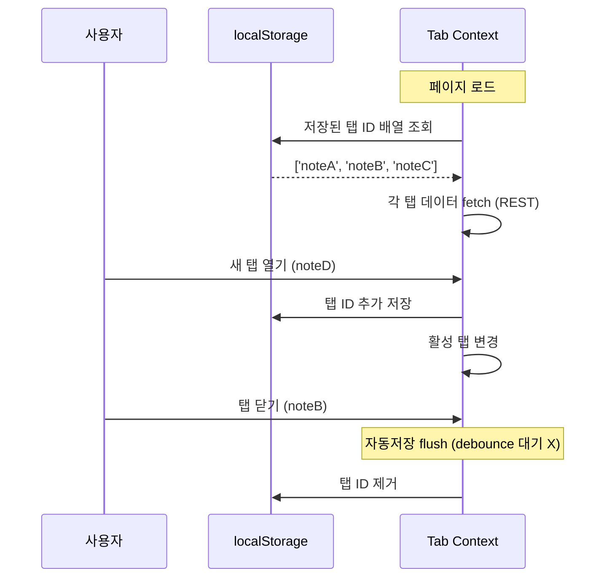

# 🏗️ 시스템 아키텍처 문서 (v2)

> **대상 독자**: 프론트엔드·백엔드 개발자 + 처음 보는 신규 멤버
> **읽기 전 권장**: [`01_기획/프로젝트_기획서.md`](../01_기획/프로젝트_기획서.md)
> **버전**: v2.0 (2026-05-23)

> **🇺🇸 English**
> **Audience**: Frontend / backend developers + new members seeing the project for the first time
> **Recommended pre-reading**: [`01_기획/프로젝트_기획서.md`](../01_기획/프로젝트_기획서.md)
> **Version**: v2.0 (2026-05-23)

---

## 0. 1분 요약 (학생용)

> 우리 서비스가 어떻게 굴러가는지 핵심만:

1. **사용자 PC (브라우저)**: React 19 + Vite 8로 만든 SPA(클라이언트 사이드 렌더링) 화면. 4-pane 레이아웃 (메뉴 / 파일목록 / 메인 / 우측바)
2. **메인 영역**: **Tiptap** 이라는 에디터로 일기 작성. `#@&` 입력하면 색깔 배지로 변신
3. **그래프 모드**: 메인 영역이 **3D 그래프**로 변신. 노트들이 자동으로 묶임 (공통 태그 클러스터링)
4. **서버 (Node.js + Express)**: 사용자가 쓴 일기를 REST API로 받아서 MongoDB에 저장
5. **데이터베이스 (MongoDB)**: 노트·폴더·사용자·노드 5개 컬렉션

```
사용자 ↔ React + Vite (브라우저, SPA)  ↔ Express (서버)  ↔ MongoDB (DB)
        └ Tiptap 에디터                  └ 인증·파서·API   └ 5개 컬렉션
        └ 3D 그래프 (three.js)           └ JWT 토큰         └ 인덱스 설계
        └ React hooks / Context 상태      └ Mongoose 검증
```

> **🇺🇸 English**
>
> ## 0. 1-Minute Summary (for students)
>
> The essentials of how our service runs:
>
> 1. **User PC (browser)**: A SPA (client-side rendering) screen built with React 19 + Vite 8. 4-pane layout (Menu / File list / Main / Right sidebar)
> 2. **Main area**: Diary writing in an editor called **Tiptap**. Typing `#@&` turns text into colored badges
> 3. **Graph mode**: The main area transforms into a **3D graph**. Notes are auto-grouped (common-tag clustering)
> 4. **Server (Node.js + Express)**: Receives the user's diary via a REST API and stores it in MongoDB
> 5. **Database (MongoDB)**: 5 collections — notes, folders, users, nodes
>
> ```
> User ↔ React + Vite (browser, SPA)  ↔ Express (server)  ↔ MongoDB (DB)
>        └ Tiptap editor                └ auth/parser/API   └ 5 collections
>        └ 3D graph (three.js)          └ JWT token         └ index design
>        └ React hooks / Context state  └ Mongoose validation
> ```

---

## 1. 전체 아키텍처 한눈에 보기



> **🇺🇸 English**
>
> ## 1. Architecture at a Glance
>
> _(Diagram above — English caption.)_ The client is a **React + Vite SPA** in the browser, containing the 4-pane layout, the Tiptap editor (markdown + `#@&` badges + mention), the **3D graph** (`react-force-graph-3d` / three.js), React-hooks/Context state (auth, multi-tab, theme), and `fetch` (REST) for server communication. The **Node.js + Express server** exposes Routes (URL mapping) → `authGuard` (JWT verification) → `validate` (input validation) → Services (business logic), with a Tag Parser (`#@&` extraction) and Repositories (Mongoose queries). The client talks to the server over **HTTPS + JSON + JWT token**; the server reaches **MongoDB (5 collections)** via the Mongoose ODM. Deployment: Frontend on **Vercel**, Backend on **Railway**, DB on **MongoDB Atlas** (free tier).

---

## 2. 기술 스택 & "왜 이걸 선택했는가"

> 각 기술마다 **다른 대안과 비교**한 표를 첨부합니다. 학기 프로젝트라 "유명도 / 학습 자료 / 우리 일정"에 가산점.

### 2.1 Frontend

| 영역 | 선택 ✅ | 선정 이유 (학생 친화 설명) | 탈락 대안 |
|---|---|---|---|
| **프레임워크 / 빌드** | **React 19 + Vite 8 (SPA)** | 초고속 dev 서버 + HMR으로 빠른 반복 개발. 2주짜리 학기 프로젝트엔 단순한 SPA가 가볍고 충분. 그래프/에디터의 클라이언트 렌더링을 완전히 우리가 제어 가능 | Next.js (SSR/RSC 오버스펙, 학습·설정 비용), CRA (구버전·느림) |
| **언어** | **TypeScript 6.x** | 변수 타입을 미리 정해서 실수 줄임. 4명이 협업할 때 충돌 ↓ | 순수 JS (협업 시 버그 ↑) |
| **에디터** | **Tiptap 3 (ProseMirror 기반)** ⭐ NEW | Obsidian 같은 GUI + #@& 배지 직접 만들 수 있음. 멘션·플레이스홀더 확장 풍부. 한국 자료도 많음 | `@uiw/react-md-editor` (배지 X, 확장 X) |
| **3D 그래프** | **react-force-graph-3d (three.js 기반)** ⭐ NEW | 노드들이 스스로 움직이며 3D 공간에 자연스럽게 배치 (force-directed). 공통 태그 자동 클러스터링. 한 줄로 시작 | D3 직접 구현 (러닝 1주+), Cytoscape (2D 전용·무거움) |
| **상태 관리** | **React hooks + Context API** | React 내장 기능만으로 인증·멀티탭·테마 전역 상태 처리. 외부 라이브러리 의존 ↓ | Redux (보일러플레이트), 별도 상태 라이브러리 (소규모엔 과함) |
| **아이콘** | **lucide-react** | 가볍고 일관된 SVG 아이콘 세트. tree-shaking 친화 | react-icons (번들 ↑) |
| **자동완성 UI** | **tippy.js** | 멘션/태그 입력 시 팝업 자동완성. Tiptap과 궁합 좋음 | 직접 구현 (위치 계산 번거로움) |

> **🇺🇸 English**
>
> ## 2. Tech Stack & "Why We Chose It"
>
> Each technology comes with a table **comparing it to alternatives**. Since this is a semester project, we add bonus weight to "popularity / learning resources / our schedule."
>
> ### 2.1 Frontend
>
> | Area | Choice ✅ | Reason (student-friendly) | Rejected alternatives |
> |---|---|---|---|
> | **Framework / build** | **React 19 + Vite 8 (SPA)** | Ultra-fast dev server + HMR enables rapid iteration. For a 2-week semester project a simple SPA is lighter and sufficient. We retain full control over the client-side rendering of the graph/editor | Next.js (SSR/RSC over-spec, learning & config cost), CRA (legacy, slow) |
> | **Language** | **TypeScript 6.x** | Declaring types up front reduces mistakes. Fewer conflicts when 4 people collaborate | Plain JS (more bugs in collaboration) |
> | **Editor** | **Tiptap 3 (ProseMirror-based)** ⭐ NEW | Obsidian-like GUI + build our own `#@&` badges. Rich mention/placeholder extensions. Plenty of Korean resources | `@uiw/react-md-editor` (no badges, no extensions) |
> | **3D graph** | **react-force-graph-3d (three.js based)** ⭐ NEW | Nodes move on their own and settle naturally in 3D space (force-directed). Auto-clustering by common tags. One line to start | Hand-rolled D3 (1+ week to learn), Cytoscape (2D-only, heavy) |
> | **State management** | **React hooks + Context API** | Handles global auth/multi-tab/theme state with React built-ins only. Fewer external dependencies | Redux (boilerplate), a separate state library (overkill at this scale) |
> | **Icons** | **lucide-react** | Lightweight, consistent SVG icon set. Tree-shaking friendly | react-icons (larger bundle) |
> | **Autocomplete UI** | **tippy.js** | Popup autocomplete for mention/tag input. Pairs well with Tiptap | Hand-rolled (cumbersome positioning math) |

### 2.2 Backend

| 영역 | 선택 ✅ | 선정 이유 | 탈락 대안 |
|---|---|---|---|
| **런타임** | **Node.js 20 LTS** | 프론트와 같은 언어 (JS) → 4명이 풀스택 협업 가능 | Python/FastAPI (스택 분리 비용) |
| **프레임워크** | **Express 5** | 가장 검증됨, 한국 자료 풍부, 미들웨어 생태계 풍부 | NestJS (학습곡선), Fastify (자료 부족) |
| **언어** | **TypeScript** | 프론트와 동일. 타입 공유 가능 | JS (협업 비용) |
| **DB 도구** | **Mongoose 9** | MongoDB와 자바스크립트 객체 연결. 스키마 검증 내장 | 네이티브 드라이버 (검증 직접) |
| **인증** | **JWT (jsonwebtoken)** | 토큰만 주고받으면 됨. 서버에 상태 저장 X (간단) | 세션 (Redis 추가 필요) |
| **비밀번호** | **bcrypt** | 단방향 암호화 표준. 해킹돼도 원본 비밀번호 못 알아냄 | (생략 X — 보안 필수) |
| **입력 검증** | **Mongoose 스키마 검증** | 모델 레벨에서 타입·필수값 검증. 별도 라이브러리 불필요 | joi/zod (소규모엔 추가 의존성) |
| **보안 미들웨어** | **cors + helmet** | 출처 제어 + 기본 보안 헤더 자동 설정 | 직접 헤더 설정 (누락 위험) |
| **로깅** | **winston** | 레벨별 로깅 + 파일 출력 표준 | console.log (운영 부적합) |
| **설정** | **dotenv** | `.env` 환경변수 로드 표준 | 하드코딩 (보안 위험) |

> **🇺🇸 English**
>
> ### 2.2 Backend
>
> | Area | Choice ✅ | Reason | Rejected alternatives |
> |---|---|---|---|
> | **Runtime** | **Node.js 20 LTS** | Same language as the frontend (JS) → all 4 can do full-stack | Python/FastAPI (cost of split stacks) |
> | **Framework** | **Express 5** | Most battle-tested, abundant Korean resources, rich middleware ecosystem | NestJS (learning curve), Fastify (fewer resources) |
> | **Language** | **TypeScript** | Same as frontend. Shareable types | JS (collaboration cost) |
> | **DB tool** | **Mongoose 9** | Maps MongoDB to JS objects. Built-in schema validation | Native driver (validate by hand) |
> | **Auth** | **JWT (jsonwebtoken)** | Just exchange tokens. No server-side state (simple) | Sessions (require adding Redis) |
> | **Password** | **bcrypt** | Standard one-way hashing. Original password unrecoverable even if breached | (Not optional — security essential) |
> | **Input validation** | **Mongoose schema validation** | Validate types/required fields at the model level. No extra library | joi/zod (extra dependency at this scale) |
> | **Security middleware** | **cors + helmet** | Origin control + automatic baseline security headers | Manual headers (risk of omission) |
> | **Logging** | **winston** | Standard leveled logging + file output | console.log (unfit for ops) |
> | **Config** | **dotenv** | Standard `.env` environment-variable loading | Hardcoding (security risk) |
>
> _Dev tooling: **ts-node-dev** for hot-reloading TypeScript in development._

### 2.3 Database

| 항목 | 결정 | 학생 친화 설명 |
|---|---|---|
| DB | **MongoDB** (NoSQL 도큐먼트) | JSON 모양 그대로 저장. 노트처럼 형태 자유로운 데이터에 적합 |
| 호스팅 | **MongoDB Atlas Free Tier** | 무료 512MB. 학기 프로젝트에 충분 |
| 모델링 | 노트 안에 노드/관계 **임베드** + 그래프용 별도 `nodes` 컬렉션 | 노트와 관계가 함께 조회됨 → 임베드. 그래프는 빠르게 → 별도 컬렉션 |

> **🇺🇸 English**
>
> ### 2.3 Database
>
> | Item | Decision | Student-friendly explanation |
> |---|---|---|
> | DB | **MongoDB** (NoSQL document) | Stores JSON-shaped data as-is. Good for free-form data like notes |
> | Hosting | **MongoDB Atlas Free Tier** | Free 512MB. Enough for a semester project |
> | Modeling | **Embed** nodes/relations inside notes + a separate `nodes` collection for the graph | Notes and relations are queried together → embed. Graph must be fast → separate collection |

### 2.4 DevOps & 협업 도구

| 영역 | 선택 |
|---|---|
| **버전 관리** | GitHub (조직 `GC-Five-Guys` + 리포 `FiveGuys-Frontend`, `FiveGuys-Backend`, `Docs` — 3개 분리) |
| **브랜치 전략** | `feature/*` → `dev` → `main` |
| **CI** | GitHub Actions (모든 PR마다 lint + test 자동) |
| **Frontend 배포** | Vercel (React + Vite SPA 정적 호스팅, 무료) |
| **Backend 배포** | Railway (무료 티어) |
| **DB 호스팅** | MongoDB Atlas |
| **이슈 트래킹** | GitHub Issues + Projects (칸반) |
| **커뮤니케이션** | Discord (실시간) + 카톡 (긴급) |
| **디자인** | Figma (와이어프레임, 선택) |

> **🇺🇸 English**
>
> ### 2.4 DevOps & Collaboration Tools
>
> | Area | Choice |
> |---|---|
> | **Version control** | GitHub (org `GC-Five-Guys` + repos `FiveGuys-Frontend`, `FiveGuys-Backend`, `Docs` — 3 separate) |
> | **Branch strategy** | `feature/*` → `dev` → `main` |
> | **CI** | GitHub Actions (lint + test automatically on every PR) |
> | **Frontend deploy** | Vercel (static hosting for the React + Vite SPA, free) |
> | **Backend deploy** | Railway (free tier) |
> | **DB hosting** | MongoDB Atlas |
> | **Issue tracking** | GitHub Issues + Projects (Kanban) |
> | **Communication** | Discord (real-time) + KakaoTalk (urgent) |
> | **Design** | Figma (wireframes, optional) |

---

## 3. 4-pane 레이아웃 (v2 핵심 변경) ⭐

### 3.1 왜 4-pane인가?

기존 3-pane (사이드바 + 메인 + 없음)으로는 "검색·자주 쓴 태그·캘린더"를 둘 곳이 없었습니다. Slack·Discord·VSCode 같은 도구들이 표준으로 쓰는 **4-pane 패턴**으로 바꿉니다.

```
┌──┬──────────┬──────────────────────────┬──────────────┐
│📁│ 일기     │ [노트1 ▼] [노트2 ×]       │ 🔍 검색      │
│🌐│ ├ 2026   │ ──────────────────────   │              │
│⚙│ │ └ 5월   │ # 오늘 일기 (Tiptap)      │ 🏷 자주 쓴   │
│  │ 📁 회의   │ [@엄마] 와 통화함.        │   태그 9개   │
│  │          │ [#감정조절] 실패.          │              │
│  │ + 새파일 │ [&독서] 안 함.             │ 📅 월간      │
│  │ + 새폴더 │                            │   캘린더      │
└──┴──────────┴──────────────────────────┴──────────────┘
   60px       240px           가변                  300px

  ↑ 메뉴       ↑ 파일목록바       ↑ 메인(멀티탭)        ↑ 우측바
  (모드)       (폴더 트리)        (Tiptap or 그래프)    (검색/태그/캘린더)
```

> **🇺🇸 English**
>
> ## 3. 4-Pane Layout (Core v2 Change) ⭐
>
> ### 3.1 Why 4-Pane?
>
> The previous 3-pane setup (sidebar + main + nothing) had nowhere to put "search / frequent tags / calendar." We switch to the **4-pane pattern** used as a standard by tools like Slack, Discord, and VSCode.
>
> _(ASCII layout above — labels: leftmost is the Menu (mode), 60px; then the File-list bar (folder tree), 240px; the Main area (multi-tab: Tiptap or graph), flexible width; and the Right sidebar (search / tags / calendar), 300px.)_

### 3.2 각 pane의 역할

| Pane | 너비 | 책임 | 변경 빈도 |
|---|---|---|---|
| **세로 메뉴바** | 60px | 모드 전환 (📁 파일 / 🌐 그래프 / ⚙ 설정) | 거의 없음 |
| **파일목록바** | 240px | 폴더 트리 + 파일 목록 + 새 파일/폴더 버튼 | 자주 변경 |
| **메인 영역** | 가변 | **Tiptap 에디터 (멀티탭)** 또는 **3D 그래프** (모드 따라) | 매 입력 |
| **우측바** | 300px | 검색 입력 + 자주 쓴 태그 9개 + 월간 캘린더 | 가끔 |

> **🇺🇸 English**
>
> ### 3.2 Role of Each Pane
>
> | Pane | Width | Responsibility | Change frequency |
> |---|---|---|---|
> | **Vertical menu bar** | 60px | Mode switch (📁 Files / 🌐 Graph / ⚙ Settings) | Almost never |
> | **File-list bar** | 240px | Folder tree + file list + new file/folder buttons | Frequent |
> | **Main area** | flexible | **Tiptap editor (multi-tab)** or **3D graph** (depending on mode) | Every keystroke |
> | **Right sidebar** | 300px | Search input + 9 frequent tags + monthly calendar | Occasional |

### 3.3 반응형

| 너비 | 동작 |
|---|---|
| ≥ 1440px | 4-pane 모두 표시 (가장 쾌적) |
| 1280-1439px | 4-pane 모두 표시 (메인 좁아짐) |
| 1024-1279px | 우측바 토글 (햄버거 메뉴) |
| < 1024px | 모바일 — PRD 범위 외 |

> **🇺🇸 English**
>
> ### 3.3 Responsive
>
> | Width | Behavior |
> |---|---|
> | ≥ 1440px | All 4 panes shown (most comfortable) |
> | 1280–1439px | All 4 panes shown (main area narrows) |
> | 1024–1279px | Right sidebar toggled (hamburger menu) |
> | < 1024px | Mobile — out of PRD scope |

---

## 4. 레이어 구조 (코드를 어떻게 나눌까?)

### 4.1 Frontend 레이어 (React + Vite)

```
┌─────────────────────────────────────────────┐
│ Routes (react-router)                       │  ← URL ↔ 화면 매핑
│ /login, /notes/:id, /graph                  │
├─────────────────────────────────────────────┤
│ Layouts                                     │  ← 4-pane 공통 골격
│ layouts/MainLayout.tsx                      │
├─────────────────────────────────────────────┤
│ Features (도메인별 UI)                       │  ← 페이지가 조립하는 단위
│ features/editor/, features/graph/,          │
│ features/sidebar/, features/right-panel/    │
├─────────────────────────────────────────────┤
│ Components (재사용 UI)                       │  ← 디자인 시스템
│ components/ui/Button, Modal, ...            │
├─────────────────────────────────────────────┤
│ Hooks (커스텀 훅)                            │  ← 로직 캡슐화
│ hooks/useNotes, useTabs, useAutosave        │
├─────────────────────────────────────────────┤
│ Context (전역 상태)                          │  ← 인증, 멀티탭, 테마
│ context/AuthContext, TabContext, UiContext  │
├─────────────────────────────────────────────┤
│ Lib (API / 유틸)                            │  ← 외부 통신
│ lib/api/ (fetch), lib/parser/, lib/utils/   │
└─────────────────────────────────────────────┘
```

> **🇺🇸 English**
>
> ## 4. Layer Structure (How Do We Split the Code?)
>
> ### 4.1 Frontend Layers (React + Vite)
>
> _(Diagram above — English labels.)_ Top to bottom: **Routes** (`react-router`, URL ↔ screen mapping: `/login`, `/notes/:id`, `/graph`) → **Layouts** (shared 4-pane skeleton, `layouts/MainLayout.tsx`) → **Features** (domain UI assembled by pages: `features/editor/`, `features/graph/`, `features/sidebar/`, `features/right-panel/`) → **Components** (reusable UI / design system: `components/ui/Button, Modal, …`) → **Hooks** (custom hooks encapsulating logic: `useNotes`, `useTabs`, `useAutosave`) → **Context** (global state — auth, multi-tab, theme: `AuthContext`, `TabContext`, `UiContext`) → **Lib** (external comms: `lib/api/` via `fetch`, `lib/parser/`, `lib/utils/`).

### 4.2 Backend 레이어 (Express)

```
┌─────────────────────────────────────────────┐
│ Routes (URL → 컨트롤러)                      │
├─────────────────────────────────────────────┤
│ Middlewares (authGuard, validate, errors)   │
├─────────────────────────────────────────────┤
│ Controllers (req/res 변환)                  │
├─────────────────────────────────────────────┤
│ Services (비즈니스 로직)                    │
│ - noteService, tagParserService, ...        │
├─────────────────────────────────────────────┤
│ Repositories (Mongoose 모델 호출)            │
├─────────────────────────────────────────────┤
│ Models (Mongoose Schema)                    │
└─────────────────────────────────────────────┘
```

> **🇺🇸 English**
>
> ### 4.2 Backend Layers (Express)
>
> _(Diagram above — English labels.)_ Top to bottom: **Routes** (URL → controller) → **Middlewares** (`authGuard`, `validate`, error handlers) → **Controllers** (req/res conversion) → **Services** (business logic — `noteService`, `tagParserService`, …) → **Repositories** (call Mongoose models) → **Models** (Mongoose Schema).

### 4.3 왜 레이어를 나누나? (학생 친화 설명)

| 안 나누면 | 나누면 |
|---|---|
| 한 파일에 검증·로직·DB가 다 섞임 (300줄) | 각 레이어 50줄 이내 |
| 같은 로직을 여러 라우트에서 복붙 | 1개 service를 여러 controller가 사용 |
| 테스트 작성 불가 | service만 단위 테스트 가능 |
| 4명이 동시 수정 시 충돌 폭발 | 파일 단위 책임 명확 → 충돌 적음 |

> **🇺🇸 English**
>
> ### 4.3 Why Split Into Layers? (student-friendly)
>
> | Without layers | With layers |
> |---|---|
> | Validation, logic, and DB all mixed in one file (300 lines) | Each layer under 50 lines |
> | Same logic copy-pasted across multiple routes | One service reused by multiple controllers |
> | Tests impossible to write | Service can be unit-tested in isolation |
> | Conflicts explode when 4 people edit at once | Clear per-file responsibility → fewer conflicts |

---

## 5. 폴더 구조 (Multi-repo)

> 프론트엔드와 백엔드는 **별도 GitHub 리포지토리**(`FiveGuys-Frontend`, `FiveGuys-Backend`)로 분리되어 있습니다. 아래는 각 리포의 내부 구조입니다.

```
FiveGuys-Frontend/           # React + Vite 앱
├── src/
│   ├── routes/                  # react-router 라우트 정의
│   │   ├── LoginPage.tsx
│   │   ├── SignupPage.tsx
│   │   ├── NotesPage.tsx        # 노트 목록/편집 (메인 모드)
│   │   └── GraphPage.tsx        # 3D 그래프 (메인 모드 전환)
│   ├── layouts/
│   │   └── MainLayout.tsx       # 4-pane 골격
│   ├── features/
│   │   ├── editor/              # Tiptap 에디터
│   │   ├── graph/               # 3D 그래프 (react-force-graph-3d)
│   │   ├── sidebar/             # 파일목록바
│   │   ├── right-panel/         # 우측바 (검색/태그/캘린더)
│   │   ├── menu-bar/            # 세로 메뉴바
│   │   └── auth/                # 로그인 폼
│   ├── components/ui/           # 공통 UI (Button, Modal, ...)
│   ├── hooks/                   # useTabs, useAutosave, useDebounce
│   ├── context/                 # AuthContext, TabContext, UiContext
│   ├── lib/                     # api/ (fetch), parser/, utils/
│   ├── types/                   # 공통 타입
│   ├── main.tsx                 # 진입점 (Vite)
│   └── App.tsx
├── index.html                   # Vite SPA 엔트리
├── vite.config.ts
└── package.json

FiveGuys-Backend/            # Express 서버
├── src/
│   ├── routes/
│   ├── controllers/
│   ├── services/
│   ├── repositories/
│   ├── models/                  # Mongoose Schema
│   ├── middlewares/
│   ├── utils/
│   ├── config/                  # env, db connection
│   ├── types/                   # 공통 타입
│   ├── app.ts                   # Express 앱
│   └── server.ts                # 진입점
├── tests/
└── package.json

Docs/                        # 본 문서 패키지
```

> **🇺🇸 English**
>
> ## 5. Folder Structure (Multi-repo)
>
> Frontend and backend live in **separate GitHub repositories** (`FiveGuys-Frontend`, `FiveGuys-Backend`). Below is the internal structure of each repo. The frontend is a Vite SPA entered via `index.html` → `src/main.tsx`; routing uses `react-router` (`routes/`), the 4-pane skeleton lives in `layouts/MainLayout.tsx`, domain UI in `features/` (editor, graph, sidebar, right-panel, menu-bar, auth), shared UI in `components/ui/`, custom hooks in `hooks/`, global state in `context/` (AuthContext, TabContext, UiContext), and external comms in `lib/api/` (via `fetch`). The backend mirrors the layered structure under `src/` (routes, controllers, services, repositories, models, middlewares, utils, config), entered via `server.ts`. The `Docs/` repo holds this documentation package.

### 5.1 명명 규칙

| 종류 | 규칙 | 예시 |
|---|---|---|
| 폴더 | `kebab-case` | `right-panel/` |
| React 컴포넌트 파일 | `PascalCase.tsx` | `Editor.tsx`, `GraphCanvas.tsx` |
| 일반 ts 파일 | `camelCase.ts` | `noteService.ts` |
| 훅 | `use` prefix | `useTabs.ts` |
| 타입 | `PascalCase` | `type Note = { ... }` |
| 상수 | `UPPER_SNAKE` | `MAX_NOTE_LENGTH` |
| CSS 클래스 | `kebab-case` (CSS Modules) | `graph-canvas` |
| DB 필드 | `snake_case` | `user_id`, `created_at` |
| API URL | `kebab-case` 복수형 | `/api/v1/notes` |

> **🇺🇸 English**
>
> ### 5.1 Naming Conventions
>
> | Kind | Rule | Example |
> |---|---|---|
> | Folder | `kebab-case` | `right-panel/` |
> | React component file | `PascalCase.tsx` | `Editor.tsx`, `GraphCanvas.tsx` |
> | General ts file | `camelCase.ts` | `noteService.ts` |
> | Hook | `use` prefix | `useTabs.ts` |
> | Type | `PascalCase` | `type Note = { ... }` |
> | Constant | `UPPER_SNAKE` | `MAX_NOTE_LENGTH` |
> | CSS class | `kebab-case` (CSS Modules) | `graph-canvas` |
> | DB field | `snake_case` | `user_id`, `created_at` |
> | API URL | `kebab-case` plural | `/api/v1/notes` |

---

## 6. 핵심 데이터 흐름 (시퀀스)

### 6.1 노트 저장 흐름 (자동저장)



> **🇺🇸 English**
>
> ## 6. Core Data Flows (Sequences)
>
> ### 6.1 Note Save Flow (autosave)
>
> _(Sequence above — English narration.)_ The **User** types `"오늘 @엄마 와 #감정조절"` into the **Tiptap editor**, which calls `updateTabContent(tabId, content)` on the **Tab Context (React)**. A 2-second debounce starts, then the context issues `PUT /api/v1/notes/:id` via **fetch (REST)**. The HTTP request (with JWT) reaches the **Express API**, passes `authGuard`, and calls the **Tag Parser** `parse(content)`, which returns `{ tags: ['감정조절'], people: ['엄마'], objects: [] }`. The API updates the documents and syncs nodes in **MongoDB** (transaction); MongoDB returns OK, the API returns `200 OK`, the context marks the save complete, and the editor shows "✓ Saved".

### 6.2 그래프 데이터 흐름 (옵션 A — 파일 중심)



> **🇺🇸 English**
>
> ### 6.2 Graph Data Flow (Option A — file-centric)
>
> _(Sequence above — English narration.)_ The **User** clicks 🌐 on the menu bar (graph mode); the **Graph Page** issues `GET /api/v1/graph?types=mention,tag,object` via **fetch (REST)**. The **Express API** runs an `aggregate` over **MongoDB** (file nodes + common-token edges), which returns `{ nodes: [...], links: [...] }`. The API returns JSON, the page passes it to **`react-force-graph-3d`** as `<ForceGraph3D graphData={...} />`, which renders in **3D** (force-directed auto-layout + common-tag clustering). Hovering a node shows a card; double-clicking a node opens the note in a new tab.

### 6.3 멀티탭 + localStorage 동기화



> **🇺🇸 English**
>
> ### 6.3 Multi-tab + localStorage Sync
>
> _(Sequence above — English narration.)_ On page load, the **Tab Context** reads the saved tab-ID array from **localStorage** (`['noteA', 'noteB', 'noteC']`) and fetches each tab's data via REST. When the **User** opens a new tab (`noteD`), the context appends the tab ID to localStorage and changes the active tab. When the user closes a tab (`noteB`), the autosave is flushed immediately (no debounce wait) and the tab ID is removed from localStorage.

---

## 7. 환경 분리 (Environment)

| 환경 | URL | 용도 | DB |
|---|---|---|---|
| **local** | `http://localhost:5173` | 개발자 PC (Vite dev 서버) | 로컬 Mongo or Atlas dev cluster |
| **dev** | `dev.yggdrasil.app` | 팀 공유 데모 | Atlas dev cluster |
| **prod** | `yggdrasil.app` | 최종 시연 | Atlas prod cluster |

### `.env` 예시

```bash
# Frontend (.env)  — Vite는 VITE_ 접두사 환경변수만 클라이언트에 노출
VITE_API_BASE_URL=http://localhost:4000/api/v1

# Backend (.env)
NODE_ENV=development
PORT=4000
MONGO_URI=mongodb+srv://...
JWT_SECRET=change-me-in-prod-min-32-chars-aabbccddeeff
JWT_EXPIRES_IN=7d
CORS_ORIGIN=http://localhost:5173
```

> ⚠️ `.env`는 **절대 Git에 커밋하지 않음**. `.env.example`만 커밋.

> **🇺🇸 English**
>
> ## 7. Environment Separation
>
> | Environment | URL | Purpose | DB |
> |---|---|---|---|
> | **local** | `http://localhost:5173` | Developer PC (Vite dev server) | Local Mongo or Atlas dev cluster |
> | **dev** | `dev.yggdrasil.app` | Team-shared demo | Atlas dev cluster |
> | **prod** | `yggdrasil.app` | Final demo | Atlas prod cluster |
>
> ### `.env` Example
>
> ```bash
> # Frontend (.env)  — Vite exposes only VITE_-prefixed vars to the client
> VITE_API_BASE_URL=http://localhost:4000/api/v1
>
> # Backend (.env)
> NODE_ENV=development
> PORT=4000
> MONGO_URI=mongodb+srv://...
> JWT_SECRET=change-me-in-prod-min-32-chars-aabbccddeeff
> JWT_EXPIRES_IN=7d
> CORS_ORIGIN=http://localhost:5173
> ```
>
> ⚠️ The `.env` file is **never committed to Git**. Only `.env.example` is committed.

---

## 8. 보안 & 비기능 요구사항

| 항목 | 정책 |
|---|---|
| **인증** | JWT (Authorization 헤더), 만료 7일 |
| **비밀번호** | bcrypt salt rounds = 10 |
| **CORS** | 화이트리스트 도메인만 허용 (cors 미들웨어) |
| **보안 헤더** | helmet 기본 헤더 적용 |
| **입력 검증** | 모든 API에 Mongoose 스키마 검증 |
| **에러 로깅** | winston (`logs/error.log`) |
| **응답 시간** | 일반 API < 200ms, 그래프 데이터 < 500ms (100 노드 기준) |
| **노트 본문 길이** | 최대 50,000자 |
| **사용자당 노트 수** | 무제한 (Atlas 무료 한도 내) |
| **자동저장** | 모든 탭 실시간 (탭 전환·페이지 종료 시 즉시 flush) |

> **🇺🇸 English**
>
> ## 8. Security & Non-Functional Requirements
>
> | Item | Policy |
> |---|---|
> | **Auth** | JWT (Authorization header), 7-day expiry |
> | **Password** | bcrypt salt rounds = 10 |
> | **CORS** | Whitelisted domains only (cors middleware) |
> | **Security headers** | helmet default headers applied |
> | **Input validation** | Mongoose schema validation on every API |
> | **Error logging** | winston (`logs/error.log`) |
> | **Response time** | Normal API < 200ms, graph data < 500ms (per 100 nodes) |
> | **Note body length** | Max 50,000 characters |
> | **Notes per user** | Unlimited (within Atlas free limit) |
> | **Autosave** | All tabs in real time (immediate flush on tab switch / page exit) |

---

## 9. 외부 라이브러리 의존성 요약

### Frontend (`FiveGuys-Frontend/package.json` 예시)

```json
{
  "dependencies": {
    "react": "^19.0.0",
    "react-dom": "^19.0.0",
    "react-router-dom": "^7.0.0",

    "@tiptap/react": "^3.0.0",
    "@tiptap/starter-kit": "^3.0.0",
    "@tiptap/extension-mention": "^3.0.0",
    "@tiptap/extension-placeholder": "^3.0.0",

    "react-force-graph-3d": "^1.24.0",
    "three": "^0.169.0",

    "lucide-react": "^0.460.0",
    "tippy.js": "^6.3.0"
  },
  "devDependencies": {
    "vite": "^8.0.0",
    "@vitejs/plugin-react": "^4.3.0",
    "typescript": "^6.0.0"
  }
}
```

### Backend (`FiveGuys-Backend/package.json` 예시)

```json
{
  "dependencies": {
    "express": "^5.0.0",
    "mongoose": "^9.0.0",
    "jsonwebtoken": "^9.0.0",
    "bcrypt": "^5.1.0",
    "cors": "^2.8.5",
    "helmet": "^7.1.0",
    "winston": "^3.13.0",
    "dotenv": "^16.4.0"
  },
  "devDependencies": {
    "typescript": "^6.0.0",
    "ts-node-dev": "^2.0.0",
    "jest": "^29.7.0",
    "supertest": "^7.0.0"
  }
}
```

> **🇺🇸 English**
>
> ## 9. External Library Dependency Summary
>
> The two fenced `package.json` snippets above list the real dependencies (shown once; library names are proper nouns and not translated). **Frontend** (`FiveGuys-Frontend`): React 19 + react-dom 19 + react-router-dom, Tiptap 3 (`@tiptap/react`, `starter-kit`, `extension-mention`, `extension-placeholder`), `react-force-graph-3d` with `three` (three.js), `lucide-react` (icons), `tippy.js` (autocomplete); built with Vite 8 (`@vitejs/plugin-react`) and TypeScript 6. **Backend** (`FiveGuys-Backend`): Express 5, Mongoose 9, `jsonwebtoken`, `bcrypt`, `cors`, `helmet`, `winston`, `dotenv`; dev tooling is TypeScript 6, `ts-node-dev`, Jest, and Supertest.

---

## 10. 추후 확장 (학기 이후)

- 실시간 협업 (WebSocket / Yjs)
- 모바일 앱 (React Native)
- AI 기반 자동 태그 분류 (LLM)
- 노트 버전 관리 (Git-like)
- 휴지통 (소프트 삭제) 부활

> **🇺🇸 English**
>
> ## 10. Future Extensions (after the semester)
>
> - Real-time collaboration (WebSocket / Yjs)
> - Mobile app (React Native)
> - AI-based automatic tag classification (LLM)
> - Note version control (Git-like)
> - Trash (soft delete) revival

---

> 📌 **다음 문서**: [DB 설계서](./DB_설계서.md) · [API 명세서](./API_명세서.md) · [컴포넌트 설계서](./컴포넌트_설계서.md)

> **🇺🇸 English** — 📌 **Next documents**: [DB Design](./DB_설계서.md) · [API Specification](./API_명세서.md) · [Component Design](./컴포넌트_설계서.md)
