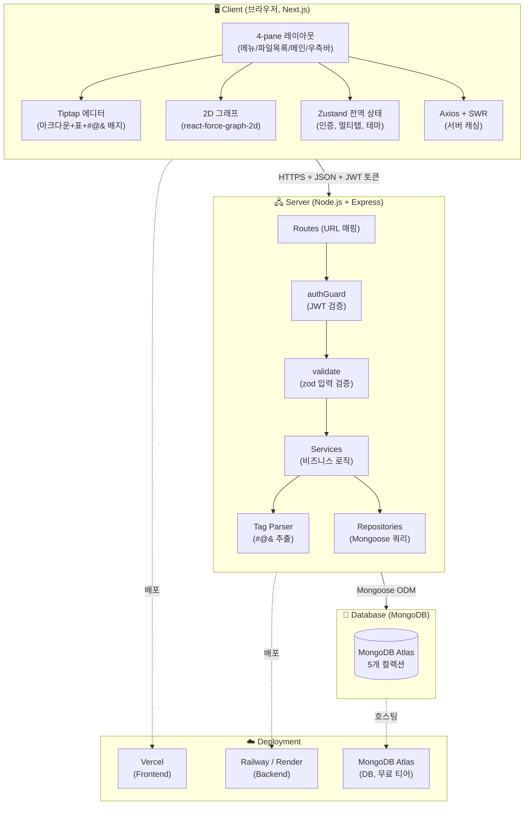
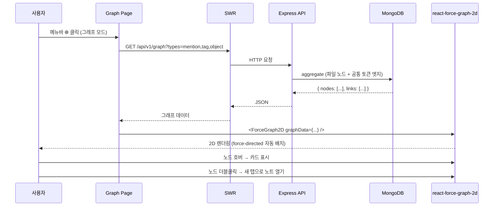
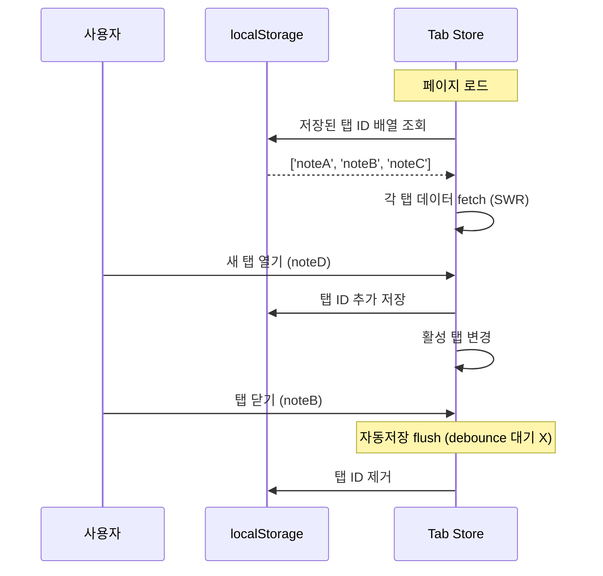

# 🏗️ 시스템 아키텍처 문서 (v2)

> **대상 독자**: 프론트엔드·백엔드 개발자 + 처음 보는 신규 멤버
> **읽기 전 권장**: [`01_기획/프로젝트_기획서.md`](../01_기획/프로젝트_기획서.md)
> **버전**: v2.0 (2026-05-23)
> **이전 버전과 차이**: 3D → 2D 그래프, `react-md-editor` → **Tiptap**, 3-pane → **4-pane** 레이아웃

---

## 0. 1분 요약 (학생용)

> 우리 서비스가 어떻게 굴러가는지 핵심만:

1. **사용자 PC (브라우저)**: Next.js 14로 만든 화면. 4-pane 레이아웃 (메뉴 / 파일목록 / 메인 / 우측바)
2. **메인 영역**: **Tiptap** 이라는 에디터로 일기 작성. `#@&` 입력하면 색깔 배지로 변신
3. **그래프 모드**: 메인 영역이 **2D 그래프**로 변신. 노트들이 자동으로 묶임
4. **서버 (Node.js + Express)**: 사용자가 쓴 일기를 REST API로 받아서 MongoDB에 저장
5. **데이터베이스 (MongoDB)**: 노트·폴더·사용자·노드 5개 컬렉션

```
사용자 ↔ Next.js (브라우저)  ↔ Express (서버)  ↔ MongoDB (DB)
        └ Tiptap 에디터        └ 인증·파서·API   └ 5개 컬렉션
        └ 2D 그래프            └ JWT 토큰         └ 인덱스 설계
        └ Zustand 상태          └ zod 검증
```

---

## 1. 전체 아키텍처 한눈에 보기



---

## 2. 기술 스택 & "왜 이걸 선택했는가"

> 각 기술마다 **다른 대안과 비교**한 표를 첨부합니다. 학기 프로젝트라 "유명도 / 학습 자료 / 우리 일정"에 가산점.

### 2.1 Frontend

| 영역 | 선택 ✅ | 선정 이유 (학생 친화 설명) | 탈락 대안 |
|---|---|---|---|
| **프레임워크** | **Next.js 14 (App Router)** | React 표준 + 서버 사이드 렌더링(SSR) 내장. 한 번 배운 게 취업에도 도움 | CRA (구버전), Vite (SSR 직접 구성 필요) |
| **언어** | **TypeScript 5.x** | 변수 타입을 미리 정해서 실수 줄임. 4명이 협업할 때 충돌 ↓ | 순수 JS (협업 시 버그 ↑) |
| **에디터** | **Tiptap (ProseMirror 기반)** ⭐ NEW | Obsidian 같은 표 GUI + #@& 배지 직접 만들 수 있음. 한국 자료도 많음 | `@uiw/react-md-editor` (표 GUI X, 배지 X) |
| **2D 그래프** | **react-force-graph-2d** ⭐ NEW | 노드들이 스스로 움직이며 자연스럽게 배치 (force-directed). 한 줄로 시작 | D3 직접 구현 (러닝 1주+), Cytoscape (2D 전용이지만 무거움) |
| **상태 관리** | **Zustand** | "전역 변수" 같은 거. Redux보다 코드 적음 | Redux (보일러플레이트), Recoil (메인테너 이탈) |
| **스타일링** | **Tailwind CSS** | className만 적으면 스타일 끝. 디자인 시스템 빠르게 구축 | styled-components (런타임 비용) |
| **서버 데이터** | **SWR + Axios** | 자동 캐싱 + 자동 재요청. 로딩/에러 상태 표준화 | fetch 직접 (반복 코드) |
| **폼 처리** | **react-hook-form + zod** | 폼 검증을 타입과 함께. zod 스키마는 백엔드와 공유 가능 | formik (성능 이슈) |

### 2.2 Backend

| 영역 | 선택 ✅ | 선정 이유 | 탈락 대안 |
|---|---|---|---|
| **런타임** | **Node.js 20 LTS** | 프론트와 같은 언어 (JS) → 4명이 풀스택 협업 가능 | Python/FastAPI (스택 분리 비용) |
| **프레임워크** | **Express 4** | 가장 검증됨, 한국 자료 풍부, 미들웨어 생태계 풍부 | NestJS (학습곡선), Fastify (자료 부족) |
| **언어** | **TypeScript** | 프론트와 동일. 타입 공유 가능 | JS (협업 비용) |
| **DB 도구** | **Mongoose** | MongoDB와 자바스크립트 객체 연결. 스키마 검증 내장 | 네이티브 드라이버 (검증 직접) |
| **인증** | **JWT (jsonwebtoken)** | 토큰만 주고받으면 됨. 서버에 상태 저장 X (간단) | 세션 (Redis 추가 필요) |
| **비밀번호** | **bcrypt** | 단방향 암호화 표준. 해킹돼도 원본 비밀번호 못 알아냄 | (생략 X — 보안 필수) |
| **입력 검증** | **zod** | 프론트와 같은 스키마 사용 가능. TypeScript 추론 자동 | joi (TS 약함) |
| **테스트** | **Jest + Supertest** | 가장 표준 조합. IDE 통합 좋음 | Vitest (생태계 작음) |

### 2.3 Database

| 항목 | 결정 | 학생 친화 설명 |
|---|---|---|
| DB | **MongoDB** (NoSQL 도큐먼트) | JSON 모양 그대로 저장. 노트처럼 형태 자유로운 데이터에 적합 |
| 호스팅 | **MongoDB Atlas Free Tier** | 무료 512MB. 학기 프로젝트에 충분 |
| 모델링 | 노트 안에 노드/관계 **임베드** + 그래프용 별도 `nodes` 컬렉션 | 노트와 관계가 함께 조회됨 → 임베드. 그래프는 빠르게 → 별도 컬렉션 |

### 2.4 DevOps & 협업 도구

| 영역 | 선택 |
|---|---|
| **버전 관리** | GitHub (조직 `GC-Five-Guys` + 리포 `Docs`, `Code`) |
| **CI** | GitHub Actions (PR 시 lint + test 자동) |
| **Frontend 배포** | Vercel (Next.js 공식 호스팅, 무료) |
| **Backend 배포** | Railway 또는 Render (무료 티어) |
| **이슈 트래킹** | GitHub Issues + Projects (칸반) |
| **커뮤니케이션** | Discord (실시간) + 카톡 (긴급) |
| **디자인** | Figma (와이어프레임, 선택) |

---

## 3. 4-pane 레이아웃 (v2 핵심 변경) ⭐

### 3.1 왜 4-pane인가?

기존 3-pane (사이드바 + 메인 + 없음)으로는 "검색·자주 쓴 태그·캘린더"를 둘 곳이 없었습니다. Slack·Discord·VSCode 같은 도구들이 표준으로 쓰는 **4-pane 패턴**으로 바꿉니다.

```
┌──┬──────────┬──────────────────────────┬──────────────┐
│📁│ 일기     │ [노트1 ▼] [노트2 ×]       │ 🔍 검색      │
│🌐│ ├ 2026   │ ──────────────────────   │              │
│⚙│ │ └ 5월   │ # 오늘 일기 (Tiptap)      │ 🏷 자주 쓴   │
│  │ 📁 회의   │ [@엄마] 와 통화함.        │   태그 9개   │
│  │          │ [#감정조절] 실패.          │              │
│  │ + 새파일 │ [&독서] 안 함.             │ 📅 월간      │
│  │ + 새폴더 │                            │   캘린더      │
└──┴──────────┴──────────────────────────┴──────────────┘
   60px       240px           가변                  300px

  ↑ 메뉴       ↑ 파일목록바       ↑ 메인(멀티탭)        ↑ 우측바
  (모드)       (폴더 트리)        (Tiptap or 그래프)    (검색/태그/캘린더)
```

### 3.2 각 pane의 역할

| Pane | 너비 | 책임 | 변경 빈도 |
|---|---|---|---|
| **세로 메뉴바** | 60px | 모드 전환 (📁 파일 / 🌐 그래프 / ⚙ 설정) | 거의 없음 |
| **파일목록바** | 240px | 폴더 트리 + 파일 목록 + 새 파일/폴더 버튼 | 자주 변경 |
| **메인 영역** | 가변 | **Tiptap 에디터 (멀티탭)** 또는 **2D 그래프** (모드 따라) | 매 입력 |
| **우측바** | 300px | 검색 입력 + 자주 쓴 태그 9개 + 월간 캘린더 | 가끔 |

### 3.3 반응형

| 너비 | 동작 |
|---|---|
| ≥ 1440px | 4-pane 모두 표시 (가장 쾌적) |
| 1280-1439px | 4-pane 모두 표시 (메인 좁아짐) |
| 1024-1279px | 우측바 토글 (햄버거 메뉴) |
| < 1024px | 모바일 — PRD 범위 외 |

---

## 4. 레이어 구조 (코드를 어떻게 나눌까?)

### 4.1 Frontend 레이어 (Next.js)

```
┌─────────────────────────────────────────────┐
│ Pages (Next.js App Router)                  │  ← URL ↔ 페이지 매핑
│ app/(auth)/login, app/(main)/notes/[id]    │
├─────────────────────────────────────────────┤
│ Layouts                                     │  ← 4-pane 공통 골격
│ app/(main)/layout.tsx                       │
├─────────────────────────────────────────────┤
│ Features (도메인별 UI)                       │  ← 페이지가 조립하는 단위
│ features/editor/, features/graph/,          │
│ features/sidebar/, features/right-panel/    │
├─────────────────────────────────────────────┤
│ Components (재사용 UI)                       │  ← 디자인 시스템
│ components/ui/Button, Modal, ...            │
├─────────────────────────────────────────────┤
│ Hooks (커스텀 훅)                            │  ← 로직 캡슐화
│ hooks/useNotes, useTabs, useAutosave        │
├─────────────────────────────────────────────┤
│ Store (Zustand 전역 상태)                   │  ← 인증, 멀티탭, 테마
│ store/authStore, tabStore, uiStore          │
├─────────────────────────────────────────────┤
│ Lib (API / 유틸)                            │  ← 외부 통신
│ lib/api/, lib/parser/, lib/utils/           │
└─────────────────────────────────────────────┘
```

### 4.2 Backend 레이어 (Express)

```
┌─────────────────────────────────────────────┐
│ Routes (URL → 컨트롤러)                      │
├─────────────────────────────────────────────┤
│ Middlewares (authGuard, validate, errors)   │
├─────────────────────────────────────────────┤
│ Controllers (req/res 변환)                  │
├─────────────────────────────────────────────┤
│ Services (비즈니스 로직)                    │
│ - noteService, tagParserService, ...        │
├─────────────────────────────────────────────┤
│ Repositories (Mongoose 모델 호출)            │
├─────────────────────────────────────────────┤
│ Models (Mongoose Schema)                    │
└─────────────────────────────────────────────┘
```

### 4.3 왜 레이어를 나누나? (학생 친화 설명)

| 안 나누면 | 나누면 |
|---|---|
| 한 파일에 검증·로직·DB가 다 섞임 (300줄) | 각 레이어 50줄 이내 |
| 같은 로직을 여러 라우트에서 복붙 | 1개 service를 여러 controller가 사용 |
| 테스트 작성 불가 | service만 단위 테스트 가능 |
| 4명이 동시 수정 시 충돌 폭발 | 파일 단위 책임 명확 → 충돌 적음 |

---

## 5. 폴더 구조 (Mono-repo)

```
Five_guys/
├── Front/                    # Next.js 앱
│   ├── app/
│   │   ├── (auth)/
│   │   │   ├── login/page.tsx
│   │   │   └── signup/page.tsx
│   │   ├── (main)/
│   │   │   ├── layout.tsx           # 4-pane 골격
│   │   │   ├── notes/page.tsx       # 노트 목록 (메인 모드)
│   │   │   ├── notes/[id]/page.tsx  # 노트 편집
│   │   │   └── graph/page.tsx       # 2D 그래프 (메인 모드 전환)
│   │   ├── layout.tsx               # 글로벌 Provider
│   │   └── globals.css
│   ├── features/
│   │   ├── editor/                  # Tiptap 에디터
│   │   ├── graph/                   # 2D 그래프
│   │   ├── sidebar/                 # 파일목록바
│   │   ├── right-panel/             # 우측바 (검색/태그/캘린더)
│   │   ├── menu-bar/                # 세로 메뉴바
│   │   └── auth/                    # 로그인 폼
│   ├── components/ui/               # 공통 UI (Button, Modal, ...)
│   ├── hooks/                       # useTabs, useAutosave, useDebounce
│   ├── store/                       # Zustand (auth, tab, ui)
│   ├── lib/                         # api/, parser/, utils/
│   ├── types/                       # 공통 타입 (백과 공유)
│   ├── public/
│   ├── tailwind.config.ts
│   └── package.json
│
├── Backend/                  # Express 서버
│   ├── src/
│   │   ├── routes/
│   │   ├── controllers/
│   │   ├── services/
│   │   ├── repositories/
│   │   ├── models/                  # Mongoose Schema
│   │   ├── middlewares/
│   │   ├── utils/
│   │   ├── config/                  # env, db connection
│   │   ├── types/                   # 공통 타입
│   │   ├── app.ts                   # Express 앱
│   │   └── server.ts                # 진입점
│   ├── tests/
│   └── package.json
│
├── docs/                     # 본 문서 패키지
└── README.md
```

### 5.1 명명 규칙

| 종류 | 규칙 | 예시 |
|---|---|---|
| 폴더 | `kebab-case` | `right-panel/` |
| React 컴포넌트 파일 | `PascalCase.tsx` | `Editor.tsx`, `GraphCanvas.tsx` |
| 일반 ts 파일 | `camelCase.ts` | `noteService.ts` |
| 훅 | `use` prefix | `useTabs.ts` |
| 타입 | `PascalCase` | `type Note = { ... }` |
| 상수 | `UPPER_SNAKE` | `MAX_NOTE_LENGTH` |
| CSS 클래스 | Tailwind utility | `bg-blue-500` |
| DB 필드 | `snake_case` | `user_id`, `created_at` |
| API URL | `kebab-case` 복수형 | `/api/v1/notes` |

---

## 6. 핵심 데이터 흐름 (시퀀스)

### 6.1 노트 저장 흐름 (자동저장)


### 6.2 그래프 데이터 흐름 (옵션 A — 파일 중심)



### 6.3 멀티탭 + localStorage 동기화



---

## 7. 환경 분리 (Environment)

| 환경 | URL | 용도 | DB |
|---|---|---|---|
| **local** | `http://localhost:3000` | 개발자 PC | 로컬 Mongo or Atlas dev cluster |
| **dev** | `dev.tri-link.app` | 팀 공유 데모 | Atlas dev cluster |
| **prod** | `tri-link.app` | 최종 시연 | Atlas prod cluster |

### `.env` 예시

```bash
# Frontend (.env.local)
NEXT_PUBLIC_API_BASE_URL=http://localhost:4000/api/v1

# Backend (.env)
NODE_ENV=development
PORT=4000
MONGO_URI=mongodb+srv://...
JWT_SECRET=change-me-in-prod-min-32-chars-aabbccddeeff
JWT_EXPIRES_IN=7d
CORS_ORIGIN=http://localhost:3000
```

> ⚠️ `.env`는 **절대 Git에 커밋하지 않음**. `.env.example`만 커밋.

---

## 8. 보안 & 비기능 요구사항

| 항목 | 정책 |
|---|---|
| **인증** | JWT (Authorization 헤더), 만료 7일 |
| **비밀번호** | bcrypt salt rounds = 10 |
| **CORS** | 화이트리스트 도메인만 허용 |
| **입력 검증** | 모든 API에 zod 스키마 |
| **에러 로깅** | winston (`logs/error.log`) |
| **응답 시간** | 일반 API < 200ms, 그래프 데이터 < 500ms (100 노드 기준) |
| **노트 본문 길이** | 최대 50,000자 |
| **사용자당 노트 수** | 무제한 (Atlas 무료 한도 내) |
| **자동저장** | 모든 탭 실시간 (탭 전환·페이지 종료 시 즉시 flush) |

---

## 9. 외부 라이브러리 의존성 요약

### Frontend (`Front/package.json` 예시)

```json
{
  "dependencies": {
    "next": "^14.2.0",
    "react": "^18.3.0",
    "react-dom": "^18.3.0",
    "typescript": "^5.4.0",

    "@tiptap/react": "^2.4.0",
    "@tiptap/starter-kit": "^2.4.0",
    "@tiptap/extension-table": "^2.4.0",
    "@tiptap/extension-mention": "^2.4.0",
    "tiptap-markdown": "^0.8.0",

    "react-force-graph-2d": "^1.25.0",

    "zustand": "^4.5.0",
    "axios": "^1.6.0",
    "swr": "^2.2.0",
    "react-hook-form": "^7.51.0",
    "zod": "^3.23.0",

    "tailwindcss": "^3.4.0",
    "clsx": "^2.1.0"
  }
}
```

### Backend (`Backend/package.json` 예시)

```json
{
  "dependencies": {
    "express": "^4.19.0",
    "mongoose": "^8.4.0",
    "jsonwebtoken": "^9.0.0",
    "bcrypt": "^5.1.0",
    "zod": "^3.23.0",
    "cors": "^2.8.5",
    "helmet": "^7.1.0",
    "winston": "^3.13.0",
    "dotenv": "^16.4.0"
  },
  "devDependencies": {
    "typescript": "^5.4.0",
    "ts-node-dev": "^2.0.0",
    "jest": "^29.7.0",
    "supertest": "^7.0.0"
  }
}
```

---

## 10. v1 → v2 변경 요약 (학생용)

| 영역 | v1 | v2 | 영향 |
|---|---|---|---|
| 그래프 | react-force-graph-3d | **react-force-graph-2d** | 학습 부담 ↓, 모바일/태블릿 호환 ↑ |
| 에디터 | `@uiw/react-md-editor` | **Tiptap (ProseMirror)** | 학습 +2일, 표 GUI + 배지 가능 |
| 레이아웃 | 3-pane (사이드+메인) | **4-pane** (메뉴/파일목록/메인/우측바) | 컴포넌트 +5개, UX 풍부 |
| 멀티탭 | 없음 | **무제한 + 실시간 자동저장** | 상태 관리 추가, UX ↑ |
| 우측바 | 없음 | **검색 + 자주 쓴 태그 + 캘린더** | API +3개, UX ↑ |
| 삭제 | 정의 없음 | **하드 삭제 + 확인 모달** | `deleted_at` 필드 제거 |

> **순영향**: 3D 학습 -2일 + Tiptap 학습 +2일 = **상쇄**. 단, 4주 일정 내 안정적 완성 가능성은 **상승** (3D 라이브러리는 실패 시 큰 리스크였음).

---

## 11. 추후 확장 (학기 이후)

- 실시간 협업 (WebSocket / Yjs)
- 모바일 앱 (React Native)
- AI 기반 자동 태그 분류 (LLM)
- 노트 버전 관리 (Git-like)
- 휴지통 (소프트 삭제) 부활

---

> 📌 **다음 문서**: [DB 설계서](./DB_설계서.md) · [API 명세서](./API_명세서.md) · [컴포넌트 설계서](./컴포넌트_설계서.md)
