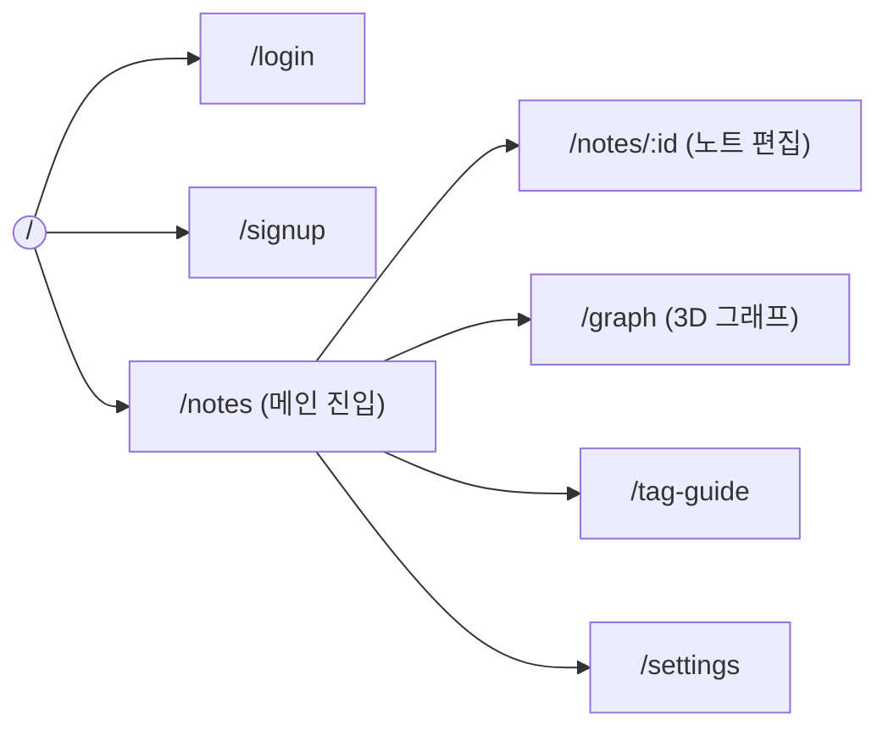
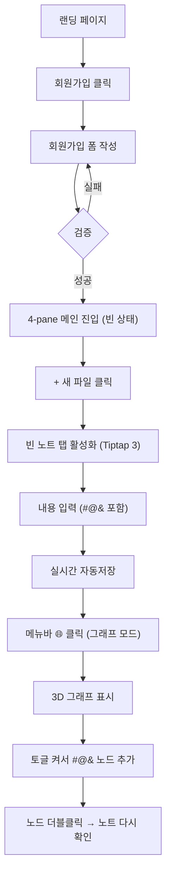
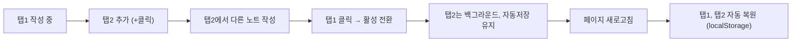

# 🎨 화면 설계서 (Wireframe & Flow) — v2

> **대상 독자**: 프론트엔드 개발자 (FE1, FE2) + 디자이너 + 처음 보는 신규 멤버
> **선행 문서**: [`시스템_아키텍처.md`](./시스템_아키텍처.md), [`API_명세서.md`](./API_명세서.md)
> **버전**: v2.0 (2026-05-23)

---

## 0. 1분 요약 (학생용)

> 화면이 어떻게 생겼는지 핵심만:

- **4-pane 레이아웃**: 메뉴(60px) / 파일목록(240px) / 메인(가변) / 우측바(300px)
- **메인 영역**: 노트 멀티탭 (Tiptap 3 에디터) **또는** 3D force-directed 그래프 (모드 전환)
- **우측바**: 검색 + 자주 쓴 태그 9개 (3타입 × 3개) + 월간 캘린더
- **9개 페이지**: 로그인 / 회원가입 / 메인(노트목록·편집·그래프) / 태그가이드 / 설정 / 404
- **반응형**: 데스크톱 우선 (1280px+)

**🇺🇸 English**

Summary (at a glance):
- **4-pane layout**: sidebar menu (60 px) / file list (240 px) / main area (fluid) / right sidebar (300 px)
- **Main area**: multi-tab note editor (Tiptap 3) **or** 3D force-directed graph view (mode toggle)
- **Right sidebar**: search + top-9 tags (3 types × 3 each) + monthly calendar
- **9 pages**: Login / Sign-up / Main (note list · editor · graph) / Tag Guide / Settings / 404
- **Responsive**: desktop-first (1280 px+)

---

## 1. 정보 구조 (IA, Information Architecture)



### 1.1 페이지 목록

| # | 경로 | 페이지명 | 인증 | 우선순위 | 담당 |
|---|---|---|:---:|:---:|:---:|
| 1 | `/` | 랜딩 (Hero + CTA) | ❌ | 🟡 | FE2 |
| 2 | `/login` | 로그인 | ❌ | 🔴 | FE2 |
| 3 | `/signup` | 회원가입 | ❌ | 🔴 | FE2 |
| 4 | `/notes` | 메인 대시보드 (4-pane 진입점) | ✅ | 🔴 | FE1+FE2 |
| 5 | `/notes/:id` | 메인 영역에 특정 노트 탭 활성화 | ✅ | 🔴 | FE1 |
| 6 | `/graph` | 메인 영역에 3D 그래프 모드 | ✅ | 🔴 | FE1 |
| 7 | `/tag-guide` | `#@&` 사용 가이드 (정적) | ✅ | 🟢 | FE2 |
| 8 | `/settings` | 설정 (프로필·테마) | ✅ | 🟡 | FE2 |
| 9 | `/404` | Not Found | — | 🟢 | FE2 |

> 💡 **노트의 URL**: `/notes/:id`는 사실상 메인 영역에서 해당 노트 탭을 활성화하는 라우트. 4-pane은 그대로 유지.

**🇺🇸 English**

### 1.1 Page List

| # | Route | Page Name | Auth Required | Priority | Owner |
|---|---|---|:---:|:---:|:---:|
| 1 | `/` | Landing (Hero + CTA) | ❌ | 🟡 | FE2 |
| 2 | `/login` | Login | ❌ | 🔴 | FE2 |
| 3 | `/signup` | Sign Up | ❌ | 🔴 | FE2 |
| 4 | `/notes` | Main Dashboard (4-pane entry point) | ✅ | 🔴 | FE1+FE2 |
| 5 | `/notes/:id` | Activate a specific note tab in the main area | ✅ | 🔴 | FE1 |
| 6 | `/graph` | 3D graph mode in the main area | ✅ | 🔴 | FE1 |
| 7 | `/tag-guide` | `#@&` usage guide (static) | ✅ | 🟢 | FE2 |
| 8 | `/settings` | Settings (profile · theme) | ✅ | 🟡 | FE2 |
| 9 | `/404` | Not Found | — | 🟢 | FE2 |

> 💡 `/notes/:id` is effectively a route that activates the corresponding note tab inside the main area — the 4-pane shell stays intact.

---

## 2. 글로벌 4-pane 레이아웃 (인증 후)

```
┌──┬──────────────┬─────────────────────────────────┬─────────────────┐
│📁│ 일기 ▾       │ [📄 2026-05-23 ▼] [📄 회의 ×]    │ 🔍 검색…         │
│🌐│   ├ 2026 ▾  │ ─────────────────────────────── │                  │
│⚙│   │ └ 5월   │                                  │ 🏷 자주 쓴 태그   │
│  │ 회의 ▾       │   # 오늘 일기                   │  주제             │
│  │              │   (Tiptap 3 에디터, 표 GUI)      │   #감정조절(12)  │
│  │ + 새 폴더    │                                  │   #공부(8)       │
│  │ + 새 파일    │   [@엄마] 와 통화함.             │   #회사(5)       │
│  │              │   [#감정조절] 실패.              │  인물             │
│  │ 최근 노트    │   [&커피] 너무 많이.             │   @엄마(7)       │
│  │  📄 5/22     │                                  │   @동기A(4)      │
│  │  📄 5/21     │                                  │   @교수님(3)     │
│  │              │                                  │  오브젝트         │
│  │              │                                  │   &커피(6)       │
│  │              │                                  │   &독서(4)       │
│  │              │                                  │   &프로젝트(3)   │
│  │              │                                  │                  │
│  │              │                                  │ 📅 2026 / 5월   │
│  │              │                                  │  ┌────────────┐ │
│  │              │                                  │  │일월화수목금토│ │
│  │              │                                  │  │1  2 ● 4 5  │ │
│  │              │                                  │  │8 ● ●●● 14  │ │
│  │              │                                  │  │ ●15...22  │ │
│  │              │                                  │  │  ●23 (today)│ │
│  │              │                                  │  └────────────┘ │
├──┴──────────────┴─────────────────────────────────┴─────────────────┤
│ 강두현 | 다크모드 [○] | 저장됨 ✓ | v0.2.0                          │
└─────────────────────────────────────────────────────────────────────┘
  ↑60px↑   ↑240px       ↑가변(메인)                       ↑300px↑
```

*Wireframe labels: 📁 = File mode, 🌐 = Graph mode, ⚙ = Settings, 일기/회의 = folder names ("Diary"/"Meeting"), 최근 노트 = "Recent notes", 자주 쓴 태그 = "Frequently used tags", 주제/인물/오브젝트 = "Topic / Person / Object", 저장됨 = "Saved"*

### 2.1 각 pane 책임

| Pane | 너비 | 콘텐츠 | 변경 빈도 |
|---|---|---|---|
| **세로 메뉴바** | 60px | 📁 파일 모드 / 🌐 그래프 모드 / ⚙ 설정 — 아이콘만 | 거의 없음 |
| **파일목록바** | 240px | 폴더 트리 + 새 폴더/파일 버튼 + 최근 노트 5개 | 자주 |
| **메인 영역** | 가변 | 노트 멀티탭 (Tiptap 3) 또는 3D force-directed 그래프 (모드 따라) | 매 입력 |
| **우측바** | 300px | 검색 + 자주 쓴 태그 9개 + 월간 캘린더 | 가끔 |

**🇺🇸 English**

### 2.1 Pane Responsibilities

| Pane | Width | Content | Change Frequency |
|---|---|---|---|
| **Vertical menu bar** | 60 px | 📁 File mode / 🌐 Graph mode / ⚙ Settings — icons only | Rarely |
| **File list bar** | 240 px | Folder tree + new folder/file buttons + 5 recent notes | Often |
| **Main area** | fluid | Multi-tab note editor (Tiptap 3) or 3D force-directed graph (depending on mode) | Every keystroke |
| **Right sidebar** | 300 px | Search + top-9 tags + monthly calendar | Occasionally |

### 2.2 반응형

| 너비 | 동작 |
|---|---|
| ≥ 1440px | 4-pane 모두 표시 (쾌적) |
| 1280-1439px | 4-pane 모두 표시 (메인 좁아짐) |
| 1024-1279px | 우측바를 햄버거 메뉴로 (메뉴 ☰ 클릭 시 슬라이드) |
| < 1024px | 모바일 — PRD 범위 외 (학기 이후) |

**🇺🇸 English**

### 2.2 Responsive Breakpoints

| Width | Behavior |
|---|---|
| ≥ 1440 px | All 4 panes visible (comfortable) |
| 1280–1439 px | All 4 panes visible (main area narrower) |
| 1024–1279 px | Right sidebar collapses to hamburger menu (slides in on ☰ click) |
| < 1024 px | Mobile — out of PRD scope (post-semester) |

---

## 3. 페이지별 와이어프레임

### 3.1 로그인 `/login`

```
┌────────────────────────────────────────────────────────────────────┐
│                                                                    │
│                          [ Yggdrasil 로고 ]                         │
│                                                                    │
│                          ┌────────────────┐                         │
│                          │ 로그인          │                         │
│                          │                │                         │
│                          │ 이메일           │                         │
│                          │ ┌────────────┐ │                         │
│                          │ │            │ │                         │
│                          │ └────────────┘ │                         │
│                          │                │                         │
│                          │ 비밀번호         │                         │
│                          │ ┌────────────┐ │                         │
│                          │ │            │ │                         │
│                          │ └────────────┘ │                         │
│                          │                │                         │
│                          │ [    로그인    ] │                         │
│                          │                │                         │
│                          │ 계정이 없나요?   │                         │
│                          │ → 회원가입       │                         │
│                          └────────────────┘                         │
└────────────────────────────────────────────────────────────────────┘
```

*Wireframe labels: 로그인 = "Login" (page title & button), 이메일 = "Email", 비밀번호 = "Password", 계정이 없나요? → 회원가입 = "No account? → Sign up"*

**상호작용**:
- 이메일·비밀번호 입력 → 클라이언트 검증 (zod)
- [로그인] 클릭 → `POST /auth/login`
- 성공: 토큰 `localStorage` 저장 → `/notes`로 이동
- 실패: "이메일 또는 비밀번호가 올바르지 않습니다"

**컴포넌트**: `LoginForm`, `Input`, `Button`, `Logo`, `ErrorBanner`

**🇺🇸 English**

**Interactions**:
- User enters email and password → client-side validation via zod
- Click [Login] → `POST /auth/login`
- Success: token saved to `localStorage` → redirect to `/notes`
- Failure: "Email or password is incorrect"

**Components**: `LoginForm`, `Input`, `Button`, `Logo`, `ErrorBanner`

---

### 3.2 회원가입 `/signup`

```
┌────────────────────────────────────────────────────────────────────┐
│                          [ Yggdrasil 로고 ]                         │
│                          ┌────────────────┐                         │
│                          │ 회원가입         │                         │
│                          │                │                         │
│                          │ 이름            │                         │
│                          │ [ 강두현    ]   │                         │
│                          │                │                         │
│                          │ 사용자명         │                         │
│                          │ [ @ocean1229 ]  │ ← 실시간 중복 체크      │
│                          │ ✓ 사용 가능     │                         │
│                          │                │                         │
│                          │ 이메일           │                         │
│                          │ [             ] │                         │
│                          │                │                         │
│                          │ 비밀번호         │                         │
│                          │ [ ●●●●●●●●●  ] │                         │
│                          │ ▓▓▓▓▓░░░ 보통   │ ← 강도 미터            │
│                          │                │                         │
│                          │ [   가입하기   ] │                         │
│                          └────────────────┘                         │
└────────────────────────────────────────────────────────────────────┘
```

*Wireframe labels: 회원가입 = "Sign Up", 이름 = "Name", 사용자명 = "Username", 실시간 중복 체크 = "real-time duplicate check", ✓ 사용 가능 = "✓ Available", 이메일 = "Email", 비밀번호 = "Password", 보통 = "Medium" (password strength), 강도 미터 = "strength meter", 가입하기 = "Register"*

**실시간 검증** (debounce 500ms):
- 사용자명: 3-20자, 영숫자, 중복 체크
- 이메일: 형식 + 중복 체크
- 비밀번호: 8자 이상 + 강도 미터

**🇺🇸 English**

**Real-time Validation** (debounce 500 ms):
- Username: 3–20 characters, alphanumeric, duplicate check
- Email: format check + duplicate check
- Password: minimum 8 characters + strength meter

---

### 3.3 메인 대시보드 `/notes` — **4-pane 진입점**

빈 상태 (탭 없음):

```
┌──┬──────────────┬─────────────────────────────────┬─────────────────┐
│📁│ 일기 ▾       │   (탭 없음 — 빈 영역)            │ 🔍 검색…         │
│🌐│   ├ 2026 ▾  │                                  │ 🏷 자주 쓴 태그   │
│⚙│   │ └ 5월   │       📝                         │   ...            │
│  │ 회의 ▾       │   첫 노트를 만들어 보세요         │ 📅 캘린더         │
│  │              │   [ + 새 파일 만들기 ]            │   ...            │
│  │ + 새 폴더    │                                  │                  │
│  │ + 새 파일    │                                  │                  │
└──┴──────────────┴─────────────────────────────────┴─────────────────┘
```

*Wireframe labels: 탭 없음 = "No tabs open", 첫 노트를 만들어 보세요 = "Create your first note", + 새 파일 만들기 = "+ Create new file", + 새 폴더 = "+ New folder", + 새 파일 = "+ New file", 자주 쓴 태그 = "Frequently used tags", 캘린더 = "Calendar"*

탭 활성 (`/notes/:id`로 이동):

```
┌──┬──────────────┬─────────────────────────────────┬─────────────────┐
│📁│ 일기 ▾       │ [📄 5/23 ▼] [📄 회의 ×] [+ 새탭] │ 🔍 검색…         │
│🌐│   ├ 2026 ▾  │ ─────────────────────────────── │                  │
│⚙│   │ └ 5월   │ # 2026-05-23 일기                │ ...              │
│  │ 회의 ▾       │                                  │                  │
│  │              │ Tiptap 3 에디터…                 │                  │
│  │ + 새 폴더    │                                  │                  │
│  │ + 새 파일    │                                  │                  │
│  │ 최근         │                                  │                  │
│  │  📄 5/22     │                                  │                  │
│  │  📄 5/21     │                                  │                  │
└──┴──────────────┴─────────────────────────────────┴─────────────────┘
```

*Wireframe labels: + 새탭 = "+ New tab", 일기 = "Diary" (folder), 최근 = "Recent"*

**상호작용**:
- 파일목록바에서 노트 클릭 → 메인 영역에 새 탭으로 추가 (이미 열려있으면 활성화)
- [+ 새 폴더] → 폴더명 입력 인라인 → 엔터로 생성
- [+ 새 파일] → 빈 노트 생성 + 즉시 활성 탭으로 열기
- 폴더 / 노트 우클릭 → 컨텍스트 메뉴 (이름 변경, 이동, 삭제)

**API 호출**:
- `GET /folders` (트리)
- `GET /notes?limit=5&sort=-updated_at` (최근 노트)
- `GET /stats/top-tokens` (우측바)
- `GET /calendar?year=2026&month=5` (우측바)

**🇺🇸 English**

**Interactions**:
- Click a note in the file list bar → opens in a new tab in the main area (or activates the existing tab)
- [+ New folder] → inline folder name input → press Enter to create
- [+ New file] → creates a blank note and immediately opens it as the active tab
- Right-click folder / note → context menu (rename, move, delete)

**API calls**:
- `GET /folders` (folder tree)
- `GET /notes?limit=5&sort=-updated_at` (recent notes)
- `GET /stats/top-tokens` (right sidebar)
- `GET /calendar?year=2026&month=5` (right sidebar)

---

### 3.4 노트 편집 (메인 영역) — **Tiptap 3 + 멀티탭 ⭐ 핵심**

```
┌──┬──────────────┬─────────────────────────────────┬─────────────────┐
│📁│ 일기 ▾       │ [📄 5/23 ▼] [📄 회의 ×] [+]     │ ...              │
│🌐│              │ ─────────────────────────────── │                  │
│⚙│              │ # 2026-05-23 일기   [✓ 저장됨]   │                  │
│  │              │ ─────────────────────────────── │                  │
│  │              │ 오늘 [@엄마] 와 통화함.          │                  │
│  │              │ 또 [#감정조절] 실패. ╲           │                  │
│  │              │ [&커피] 너무 많이 마심.         │                  │
│  │              │                                  │                  │
│  │              │ ┌───┬─────┬─────┐                │                  │
│  │              │ │   │ 월  │ 화  │ ← Obsidian-like │                  │
│  │              │ ├───┼─────┼─────┤   GUI 표        │                  │
│  │              │ │운동│ 30분│ 40분│                 │                  │
│  │              │ └───┴─────┴─────┘                │                  │
│  │              │                                  │                  │
│  │              │ 새 문장 입력 중…|                │                  │
│  │              │ ╔═════════════╗                  │                  │
│  │              │ ║ @엄마        ║ ← @ 자동완성     │                  │
│  │              │ ║ @엄빠        ║                  │                  │
│  │              │ ║ + 새로 만들기 ║                  │                  │
│  │              │ ╚═════════════╝                  │                  │
└──┴──────────────┴─────────────────────────────────┴─────────────────┘
```

*Wireframe labels: 저장됨 = "Saved", 월/화 = "Mon / Tue" (table headers), 운동 = "Exercise", 분 = "min", 새 문장 입력 중 = "Typing new sentence…", @ 자동완성 = "@ autocomplete", + 새로 만들기 = "+ Create new"*

**상호작용**:
- **자동저장**: 모든 탭이 변경될 때마다 실시간 자동저장 (탭 전환 시 즉시 flush)
- **저장 상태**: 헤더에 "✏️ 저장 중…" → "✓ 저장됨"
- **`#@&` 입력 (공백 다음에만 트리거)**:
  - `@` → 인물 자동완성 드롭다운
  - `#` → 주제 자동완성 드롭다운
  - `&` → 오브젝트 자동완성 드롭다운
  - 각 드롭다운 마지막에 `+ 새로 만들기: @XX` 옵션
- **배지 시각화 (Tiptap 3 inline node)**: `@엄마` `#감정조절` `&커피`가 색깔 박스로 표시됨
- **배지 클릭**: 우측바에 "관련 노트 목록"이 펼쳐짐
- **표 삽입**: 툴바 [표] 버튼 → Obsidian처럼 GUI로 셀 추가/삭제
- **단축키**: `Cmd+S` 수동저장, `Cmd+B` Bold, `Cmd+I` Italic

**탭 동작**:
- 탭 좌클릭 → 활성화
- 탭 [×] 클릭 → 자동저장 flush → 닫힘
- 탭 우클릭 → "왼쪽 모두 닫기" / "다른 탭 모두 닫기" (P2 — 시간 남으면)
- 무제한 탭 (학기 시연에선 5-10개면 충분)
- 페이지 새로고침 → localStorage에서 탭 ID 배열 복원

**컴포넌트**: `NoteHeader`, `TabBar`, `TiptapEditor`, `AutocompleteDropdown`, `SaveIndicator`, `TableExtension`

**🇺🇸 English**

**Interactions**:
- **Auto-save**: every tab auto-saves on each change; flushed immediately on tab switch
- **Save state**: header shows "✏️ Saving…" → "✓ Saved"
- **`#@&` triggers (only after a space)**:
  - `@` → Person autocomplete dropdown
  - `#` → Topic autocomplete dropdown
  - `&` → Object autocomplete dropdown
  - Each dropdown ends with `+ Create new: @XX`
- **Badge visualization (Tiptap 3 inline node)**: `@엄마`, `#감정조절`, `&커피` render as colored inline chips
- **Badge click**: expands "Related notes" list in the right sidebar
- **Table insert**: toolbar [Table] button → GUI cell add/delete (Obsidian-style)
- **Shortcuts**: `Cmd+S` manual save, `Cmd+B` Bold, `Cmd+I` Italic

**Tab behavior**:
- Left-click tab → activate
- Click tab [×] → auto-save flush → close
- Right-click tab → "Close all to the left" / "Close all others" (P2 — if time allows)
- Unlimited tabs (5–10 sufficient for semester demo)
- Page refresh → tab ID array restored from `localStorage`

**Components**: `NoteHeader`, `TabBar`, `TiptapEditor`, `AutocompleteDropdown`, `SaveIndicator`, `TableExtension`

---

### 3.5 3D 그래프 뷰 `/graph` ⭐ 차별점

```
┌──┬──────────────┬─────────────────────────────────┬─────────────────┐
│📁│ 일기 ▾       │ 그래프 모드                       │ 🔍 검색…         │
│🌐│              │ ┌─────────────────────────────┐ │                  │
│⚙│              │ │ [✓#주제] [✓@인물] [☐&오브젝트]│ │                  │
│  │              │ ├─────────────────────────────┤ │                  │
│  │              │ │                              │ │                  │
│  │              │ │  ●5/19      ●5/22            │ │                  │
│  │              │ │   ╲          │               │ │                  │
│  │              │ │    ╲         │               │ │                  │
│  │              │ │     ▲#감정 ──●5/23 (today)   │ │                  │
│  │              │ │                │              │ │                  │
│  │              │ │              ●@엄마          │ │                  │
│  │              │ │                │              │ │                  │
│  │              │ │              ●5/15           │ │                  │
│  │              │ │                              │ │                  │
│  │              │ │ ↻ 드래그: 회전  🔍 휠: 줌    │ │                  │
│  │              │ └─────────────────────────────┘ │                  │
│  │              │ 범례: ●파일  ▲주제  ●인물  ■오브 │                  │
│  │              │ 통계: 노드 47 · 엣지 89          │                  │
└──┴──────────────┴─────────────────────────────────┴─────────────────┘
```

*Wireframe labels: 그래프 모드 = "Graph mode", 주제/인물/오브젝트 = "Topic / Person / Object" (toggles), 드래그: 회전 = "Drag: rotate", 휠: 줌 = "Wheel: zoom", 범례 = "Legend", 파일 = "File", 통계 = "Stats", 노드 = "Nodes", 엣지 = "Edges"*

**상호작용**:
- **3가지 토글**: `[✓#주제]` `[✓@인물]` `[✓&오브젝트]` — 켜진 타입만 노드로 추가
- **default (토글 모두 OFF)**: 파일 노드만 표시. 자동으로 공통 토큰 공유한 파일끼리 엣지 연결
- **토글 ON**: 해당 타입 엔티티 노드가 등장 + 파일↔엔티티 엣지 추가
- **마우스 드래그**: 3D 그래프 시점 회전
- **마우스 휠**: 줌 인/아웃
- **노드 호버**: 카드 표시 (제목·미리보기·등장 횟수 등)
- **노드 더블클릭**:
  - 파일 노드 → 새 탭으로 노트 열기 (모드 자동 전환 X — 그래프 그대로 두고 백그라운드 탭 추가)
  - 엔티티 노드 → 우측바에 관련 노트 목록 펼치기

**엣지 시각화**:
- 두께 = 공통 토큰 수
- `shared_tokens` (파일↔파일): 회색 실선
- `contains` (파일↔엔티티): 파란/초록/빨강 점선

**컴포넌트**: `GraphToolbar`, `GraphCanvas` (react-force-graph-3d / three.js), `NodeHoverCard`, `Legend`, `GraphStats`

**🇺🇸 English**

**Interactions**:
- **3 toggles**: `[✓#Topic]` `[✓@Person]` `[✓&Object]` — only toggled-on types appear as nodes
- **Default (all toggles OFF)**: only file nodes displayed; edges auto-connect files that share tokens
- **Toggle ON**: entity nodes of that type appear + file↔entity edges are added
- **Mouse drag**: rotate the 3D graph view
- **Mouse wheel**: zoom in/out
- **Node hover**: tooltip card (title · preview · mention count)
- **Node double-click**:
  - File node → open note in a new tab (graph stays in place; tab added in background)
  - Entity node → expand related notes list in right sidebar

**Edge visualization**:
- Thickness = number of shared tokens
- `shared_tokens` (file↔file): solid gray line
- `contains` (file↔entity): blue / green / red dashed line

**Components**: `GraphToolbar`, `GraphCanvas` (react-force-graph-3d / three.js), `NodeHoverCard`, `Legend`, `GraphStats`

---

### 3.6 태그 가이드 `/tag-guide`

```
┌────────────────────────────────────────────────────────────────────┐
│                  3가지 태그란?                                       │
│  ────────────────────────────────────                              │
│                                                                    │
│  일기에 등장하는 단어들을 3가지 종류로 나눠 태그하면,                  │
│  나중에 그래프에서 패턴이 자동으로 보입니다.                          │
│                                                                    │
│  ┌──────────────┐  ┌──────────────┐  ┌──────────────┐             │
│  │ # 주제       │  │ @ 인물       │  │ & 오브젝트    │             │
│  │ (Tag)        │  │ (Mention)    │  │ (Object)     │             │
│  │              │  │              │  │              │             │
│  │ 그날의 상태  │  │ 등장한 사람  │  │ 사물·도구·   │             │
│  │ 감정·맥락    │  │              │  │ 이벤트 (자유)│             │
│  │              │  │              │  │              │             │
│  │ 예시         │  │ 예시         │  │ 예시         │             │
│  │ #감정조절    │  │ @엄마        │  │ &커피        │             │
│  │ #시험        │  │ @동기A       │  │ &독서        │             │
│  │ #여행        │  │ @교수님      │  │ &할머니생신   │             │
│  └──────────────┘  └──────────────┘  └──────────────┘             │
│                                                                    │
│  💡 사용 팁:                                                        │
│  - 단어 앞에 #/@/& 만 붙이면 끝                                     │
│  - 공백 다음에만 인식됨 (이메일 work@x.com 은 OK)                   │
│  - 새 태그는 그냥 적어도 자동 등록                                  │
│                                                                    │
│  [ 첫 노트 작성하러 가기 → ]                                        │
└────────────────────────────────────────────────────────────────────┘
```

*Wireframe labels: 3가지 태그란? = "What are the 3 tag types?", 주제 = "Topic", 인물 = "Person", 오브젝트 = "Object", 그날의 상태 = "daily state", 감정·맥락 = "emotion · context", 등장한 사람 = "people who appeared", 사물·도구·이벤트 = "things · tools · events", 예시 = "Examples", 사용 팁 = "Usage tips", 첫 노트 작성하러 가기 = "Go write your first note"*

**🇺🇸 English**

**What are the 3 tag types?**

Tag words that appear in your journal into 3 categories and the graph will automatically reveal patterns.

| Type | Symbol | Meaning | Examples |
|---|---|---|---|
| **Topic** | `#` | Daily state, emotion, context | #감정조절, #시험, #여행 |
| **Person** | `@` | People who appeared | @엄마, @동기A, @교수님 |
| **Object** | `&` | Things, tools, events (freeform) | &커피, &독서, &할머니생신 |

**Usage tips**:
- Just prefix a word with `#`, `@`, or `&` — that's it
- Only recognized after a space (email addresses like `work@x.com` are safe)
- New tags are automatically registered when first typed

[Go write your first note →]

---

### 3.7 설정 `/settings`

```
┌─────────────────────────────────────────────────────────────────────┐
│ 설정                                                                  │
│ ───────────                                                          │
│                                                                       │
│ 프로필                                                                │
│   이름        [ 강두현              ]                                 │
│   이메일      kang@example.com (변경 불가)                            │
│   비밀번호    [ 변경하기 ]                                            │
│                                                                       │
│ 화면                                                                  │
│   테마        ( ) 라이트  (●) 다크  ( ) 시스템 자동                  │
│                                                                       │
│ 그래프                                                                │
│   기본 토글   [✓ # 주제] [✓ @ 인물] [☐ & 오브젝트]                 │
│                                                                       │
│ 위험 구역                                                             │
│   [ 모든 데이터 내보내기 (JSON) ]                                     │
│   [ 회원 탈퇴 ]   ← 빨간 버튼                                          │
└─────────────────────────────────────────────────────────────────────┘
```

*Wireframe labels: 설정 = "Settings", 프로필 = "Profile", 이름 = "Name", 이메일 = "Email", 비밀번호 = "Password", 변경하기 = "Change", 변경 불가 = "read-only", 화면 = "Display", 테마 = "Theme", 라이트/다크/시스템 자동 = "Light / Dark / System auto", 그래프 = "Graph", 기본 토글 = "Default toggles", 위험 구역 = "Danger zone", 모든 데이터 내보내기 = "Export all data", 회원 탈퇴 = "Delete account"*

**🇺🇸 English**

**Settings page sections**:
- **Profile**: Name (editable), Email (read-only), Password (change button)
- **Display**: Theme — Light / Dark / System auto
- **Graph**: Default toggle state for `# Topic`, `@ Person`, `& Object` node types
- **Danger zone**: Export all data (JSON), Delete account (red button)

---

## 4. 우측바 상세 (v2 신규)

```
┌─ 우측바 (300px) ──────┐
│ 🔍 [ 엄마           ]│  ← 검색창
│ ─────────────────────│
│ (검색 결과 영역)       │
│ 엔티티 (1)            │
│   @엄마 (5)           │  ← 클릭 시 펼침
│   ▼ 5/23 일기 → 새 탭 │
│   ▼ 5/15 회상 → 새 탭 │
│ 노트 (3)              │
│   📄 엄마 생신…       │
│   📄 엄마와 통화      │
│ ─────────────────────│
│ 🏷 자주 쓴 태그        │
│ ┌─ 주제 ────────────┐│
│ │ #감정조절 (12)    ││
│ │ #공부 (8)         ││
│ │ #회사 (5)         ││
│ └───────────────────┘│
│ ┌─ 인물 ────────────┐│
│ │ @엄마 (7)         ││
│ │ @동기A (4)        ││
│ │ @교수님 (3)       ││
│ └───────────────────┘│
│ ┌─ 오브젝트 ────────┐│
│ │ &커피 (6)         ││
│ │ &독서 (4)         ││
│ │ &프로젝트 (3)     ││
│ └───────────────────┘│
│ ─────────────────────│
│ 📅 2026 / 5월   < >  │
│ ┌─────────────────┐  │
│ │일월화수목금토   │  │
│ │           1 2  │  │
│ │ 3 4 5 6 7 8 9  │  │
│ │10  11 12  ●14  │  │
│ │  ●15  16●17 ...│  │
│ │ ●22 ●23 (today)│  │
│ └─────────────────┘  │
└───────────────────────┘
```

*Wireframe labels: 우측바 = "Right sidebar", 검색창 = "search box", 검색 결과 영역 = "search results area", 엔티티 = "Entity", 노트 = "Notes", 새 탭 = "new tab", 자주 쓴 태그 = "Frequently used tags", 주제/인물/오브젝트 = "Topic / Person / Object", 일월화수목금토 = "Sun Mon Tue Wed Thu Fri Sat"*

**상호작용**:
- **검색**: 입력 후 debounce 300ms → `GET /search?q=`
  - 검색 중에는 검색 결과만 표시, 자주 쓴 태그/캘린더 자리는 그대로
  - 결과 클릭 → 새 탭으로 열기
- **자주 쓴 태그 클릭**: 검색창에 자동 입력 → 검색 결과 표시
- **캘린더**:
  - 작성 노트가 있는 날 = dot 마커
  - 오늘 날짜 = 강조 테두리
  - 날짜 클릭 → 모달로 그날 노트 목록
  - `< >` 클릭으로 월 이동

**🇺🇸 English**

**Interactions**:
- **Search**: debounce 300 ms after input → `GET /search?q=`
  - While searching, only search results are shown; tag/calendar area stays in place
  - Click a result → open in a new tab
- **Click a frequent tag**: auto-fills the search box → shows search results
- **Calendar**:
  - Days with a written note = dot marker
  - Today = highlighted border
  - Click a date → modal showing that day's notes
  - `< >` navigate months

---

## 5. 사용자 플로우 (User Flow)

### 5.1 신규 사용자 첫 일기 → 그래프 확인



**🇺🇸 English**

### 5.1 New User: First Entry → Graph View

Flow (same diagram above):
Landing page → Click "Sign Up" → Fill sign-up form → Validation (fail: back to form / pass: enter 4-pane main) → Click "+ New file" → Blank note tab activated (Tiptap 3) → Type content (including `#@&` tokens) → Real-time auto-save → Click 🌐 in menu bar (graph mode) → 3D graph displayed → Toggle on `#@&` node types → Double-click a node → review note again

### 5.2 멀티탭 작업 흐름



**🇺🇸 English**

### 5.2 Multi-Tab Workflow

Flow (same diagram above):
Writing in Tab 1 → Add Tab 2 (click +) → Write a different note in Tab 2 → Click Tab 1 → switch active tab → Tab 2 stays in background, auto-save continues → Page refresh → Tab 1 and Tab 2 automatically restored from `localStorage`

---

## 6. 상태별 UI (State Pattern)

각 화면에서 다음 4가지 상태를 반드시 디자인합니다:

| 상태 | 처리 |
|---|---|
| **Loading** | 스켈레톤 UI 또는 스피너 |
| **Empty** | "아직 노트가 없어요. [첫 노트 만들기]" |
| **Error** | 에러 메시지 + [다시 시도] 버튼 |
| **Success** | 정상 데이터 표시 |

**예시 (노트 목록 Empty)**:
```
┌─────────────────────────────────┐
│         📝                       │
│    아직 노트가 없어요             │
│    첫 일기를 작성해보세요         │
│    [ + 첫 노트 만들기 ]          │
└─────────────────────────────────┘
```

*Wireframe labels: 아직 노트가 없어요 = "No notes yet", 첫 일기를 작성해보세요 = "Write your first entry", + 첫 노트 만들기 = "+ Create first note"*

**🇺🇸 English**

All screens must handle these 4 states:

| State | Handling |
|---|---|
| **Loading** | Skeleton UI or spinner |
| **Empty** | "No notes yet. [Create first note]" |
| **Error** | Error message + [Retry] button |
| **Success** | Render normal data |

---

## 7. 디자인 토큰 (Design Tokens)

### 7.1 색상

| 토큰 | Light | Dark |
|---|---|---|
| `--bg-primary` | `#FFFFFF` | `#0F172A` |
| `--bg-secondary` | `#F8FAFC` | `#1E293B` |
| `--text-primary` | `#0F172A` | `#F8FAFC` |
| `--text-secondary` | `#64748B` | `#94A3B8` |
| `--border` | `#E2E8F0` | `#334155` |
| `--accent` | `#3B82F6` | `#60A5FA` |
| `--mention` (`@`) | `#3B82F6` (blue-500) | |
| `--tag` (`#`) | `#10B981` (emerald-500) | |
| `--object` (`&`) | `#EF4444` (red-500) | |
| `--file-node` | `#94A3B8` (slate-400) | |
| `--error` | `#EF4444` | |
| `--success` | `#22C55E` | |
| `--warning` | `#F59E0B` | |

**🇺🇸 English**

### 7.1 Color Tokens

| Token | Light | Dark |
|---|---|---|
| `--bg-primary` | `#FFFFFF` | `#0F172A` |
| `--bg-secondary` | `#F8FAFC` | `#1E293B` |
| `--text-primary` | `#0F172A` | `#F8FAFC` |
| `--text-secondary` | `#64748B` | `#94A3B8` |
| `--border` | `#E2E8F0` | `#334155` |
| `--accent` | `#3B82F6` | `#60A5FA` |
| `--mention` (`@`) | `#3B82F6` (blue-500) | |
| `--tag` (`#`) | `#10B981` (emerald-500) | |
| `--object` (`&`) | `#EF4444` (red-500) | |
| `--file-node` | `#94A3B8` (slate-400) | |
| `--error` | `#EF4444` | |
| `--success` | `#22C55E` | |
| `--warning` | `#F59E0B` | |

### 7.2 타이포

| 토큰 | 값 |
|---|---|
| `--font-sans` | `Pretendard, system-ui, -apple-system, sans-serif` |
| `--font-mono` | `'JetBrains Mono', monospace` |
| `--text-xs` | 12px / 16px |
| `--text-sm` | 14px / 20px |
| `--text-base` | 16px / 24px |
| `--text-lg` | 18px / 28px |
| `--text-xl` | 20px / 28px |
| `--text-2xl` | 24px / 32px |

**🇺🇸 English**

### 7.2 Typography Tokens

| Token | Value |
|---|---|
| `--font-sans` | `Pretendard, system-ui, -apple-system, sans-serif` |
| `--font-mono` | `'JetBrains Mono', monospace` |
| `--text-xs` | 12 px / 16 px |
| `--text-sm` | 14 px / 20 px |
| `--text-base` | 16 px / 24 px |
| `--text-lg` | 18 px / 28 px |
| `--text-xl` | 20 px / 28 px |
| `--text-2xl` | 24 px / 32 px |

### 7.3 간격 / 그림자 / 둥근모서리

| 토큰 | 값 |
|---|---|
| `--space-1/2/3/4/6/8` | 4/8/12/16/24/32 px |
| `--radius-sm/md/lg` | 4/8/12 px |
| `--shadow-sm` | `0 1px 2px rgba(0,0,0,0.05)` |
| `--shadow-md` | `0 4px 6px rgba(0,0,0,0.07)` |

→ `Front/vite.config.ts` 및 CSS 변수에 그대로 매핑.

**🇺🇸 English**

### 7.3 Spacing / Shadow / Border Radius

| Token | Value |
|---|---|
| `--space-1/2/3/4/6/8` | 4 / 8 / 12 / 16 / 24 / 32 px |
| `--radius-sm/md/lg` | 4 / 8 / 12 px |
| `--shadow-sm` | `0 1px 2px rgba(0,0,0,0.05)` |
| `--shadow-md` | `0 4px 6px rgba(0,0,0,0.07)` |

→ Mapped directly to `Front/vite.config.ts` and CSS custom properties.

---

## 8. 접근성 (a11y) 체크리스트

- [ ] 모든 버튼은 키보드 Tab 이동 가능
- [ ] 폼 input에 `<label>` 연결
- [ ] 색상 대비 WCAG AA 이상 (4.5:1)
- [ ] 이미지에 `alt` 속성
- [ ] 모달 열림 시 포커스 trap, ESC로 닫기
- [ ] 그래프 노드 라벨을 sr-only 텍스트로 제공
- [ ] **삭제 확인 모달**: 키보드만으로도 [취소]/[삭제] 선택 가능

**🇺🇸 English**

**Accessibility (a11y) Checklist**:
- [ ] All buttons reachable via keyboard Tab navigation
- [ ] All form `<input>` elements associated with a `<label>`
- [ ] Color contrast meets WCAG AA (4.5:1 minimum)
- [ ] All images have `alt` attributes
- [ ] Modal open: focus trap active, ESC closes it
- [ ] Graph node labels provided as `sr-only` text
- [ ] **Delete confirmation modal**: [Cancel] / [Delete] selectable via keyboard alone

---

## 9. Figma (선택)

- FE2가 v2 와이어프레임 → Figma 시안화 (1주차 후반)
- Figma 파일 URL: `(작성 후 추가)`
- Storybook 도입: 후순위

**🇺🇸 English**

- FE2 converts the v2 wireframes into Figma mockups (late week 1)
- Figma file URL: `(to be added after creation)`
- Storybook: lower priority

---

> 📌 **다음**: [컴포넌트 설계서](./컴포넌트_설계서.md) — 위 화면을 어떤 React 컴포넌트로 쪼갤지
>
> 📌 **Next**: [Component Design Doc](./컴포넌트_설계서.md) — how to break down the screens above into React components
