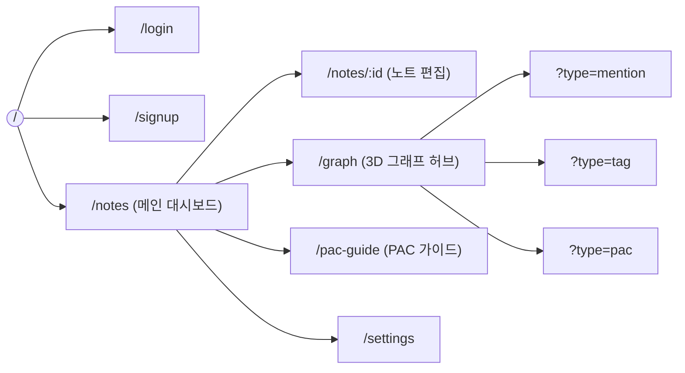
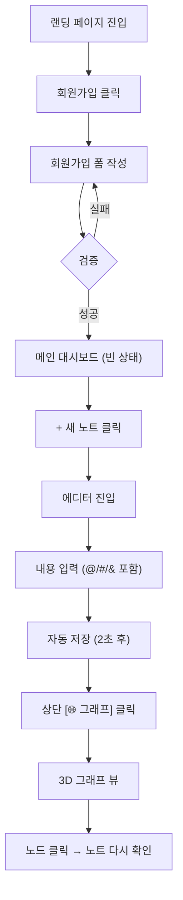
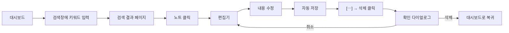

# 🎨 화면 설계서 (Wireframe & Flow)

> **대상 독자**: 프론트엔드 개발자 (FE1, FE2), 디자이너
> **선행 문서**: [`시스템_아키텍처.md`](./시스템_아키텍처.md), [`API_명세서.md`](./API_명세서.md)
> **버전**: v1.0 (2026-05-19)

---

## 1. 정보 구조 (IA, Information Architecture)



### 1.1 페이지 목록

| # | 경로 | 페이지명 | 인증 | 우선순위 | 담당 |
|---|---|---|:---:|:---:|:---:|
| 1 | `/` | 랜딩 (Hero + CTA) | ❌ | 🟡 | FE2 |
| 2 | `/login` | 로그인 | ❌ | 🔴 | FE2 |
| 3 | `/signup` | 회원가입 | ❌ | 🔴 | FE2 |
| 4 | `/notes` | 메인 대시보드 (노트 목록) | ✅ | 🔴 | FE1 |
| 5 | `/notes/:id` | 노트 편집기 | ✅ | 🔴 | FE1 |
| 6 | `/graph` | 3D 그래프 허브 | ✅ | 🔴 | FE1 |
| 7 | `/pac-guide` | PAC 가이드 (정적) | ✅ | 🟢 | FE2 |
| 8 | `/settings` | 설정 (프로필·테마) | ✅ | 🟡 | FE2 |
| 9 | `/404` | Not Found | — | 🟢 | FE2 |

---

## 2. 글로벌 레이아웃 (인증 후)

```
┌─────────────────────────────────────────────────────────────────────┐
│ [☰] Tri-Link    🔍 검색…              [📁 노트] [🌐 그래프] [👤 ▾]    │  ← Top Nav (h: 56px)
├──────────────┬──────────────────────────────────────────────────────┤
│              │                                                       │
│ 📁 일기 ▾    │                                                       │
│   ├ 2026 ▾  │                                                       │
│   │  └ 5월   │                                                       │
│ 📁 프로젝트  │              MAIN CONTENT AREA                        │
│              │                                                       │
│ + 새 폴더    │                                                       │
│ + 새 노트    │                                                       │
│              │                                                       │
│  Tags        │                                                       │
│  #감정조절(5) │                                                       │
│  #공부(12)   │                                                       │
│              │                                                       │
├──────────────┴──────────────────────────────────────────────────────┤
│ 강두현 | 다크모드 [○]                                v0.1.0           │  ← Footer
└─────────────────────────────────────────────────────────────────────┘
  ↑ Sidebar (w: 280px, collapsible)
```

**반응형**:
- ≥ 1024px: 사이드바 + 메인 (위 레이아웃)
- 768~1023px: 사이드바 토글 가능, 기본 닫힘
- < 768px (시연 외): 메인만, 사이드바는 햄버거 메뉴

---

## 3. 페이지별 와이어프레임

### 3.1 로그인 `/login`

```
┌────────────────────────────────────────────────────────────────────┐
│                                                                    │
│                          [ Tri-Link 로고 ]                          │
│                                                                    │
│                          ┌────────────────┐                         │
│                          │ 로그인          │                         │
│                          │                │                         │
│                          │ 이메일           │                         │
│                          │ ┌────────────┐ │                         │
│                          │ │            │ │                         │
│                          │ └────────────┘ │                         │
│                          │                │                         │
│                          │ 비밀번호         │                         │
│                          │ ┌────────────┐ │                         │
│                          │ │            │ │                         │
│                          │ └────────────┘ │                         │
│                          │                │                         │
│                          │ [    로그인    ] │                         │
│                          │                │                         │
│                          │ 계정이 없나요?   │                         │
│                          │ → 회원가입       │                         │
│                          └────────────────┘                         │
└────────────────────────────────────────────────────────────────────┘
```

**상호작용**:
- 이메일·비밀번호 입력 → 클라이언트 검증 (zod)
- [로그인] 클릭 → `POST /auth/login`
- 성공: 토큰을 `localStorage`에 저장 → `/notes`로 이동
- 실패: 폼 하단에 에러 메시지 ("이메일 또는 비밀번호가 올바르지 않습니다")

**컴포넌트**: `LoginForm`, `Input`, `Button`, `Logo`, `ErrorBanner`

---

### 3.2 회원가입 `/signup`

```
┌────────────────────────────────────────────────────────────────────┐
│                          [ Tri-Link 로고 ]                          │
│                                                                    │
│                          ┌────────────────┐                         │
│                          │ 회원가입         │                         │
│                          │                │                         │
│                          │ 이름            │                         │
│                          │ ┌────────────┐ │                         │
│                          │ │ 강두현      │ │                         │
│                          │ └────────────┘ │                         │
│                          │                │                         │
│                          │ 사용자명        │                         │
│                          │ ┌────────────┐ │                         │
│                          │ │ @ocean1229 │ │ ← 실시간 중복 체크      │
│                          │ └────────────┘ │   ✓ 사용 가능            │
│                          │                │                         │
│                          │ 이메일           │                         │
│                          │ ┌────────────┐ │                         │
│                          │ │            │ │                         │
│                          │ └────────────┘ │                         │
│                          │                │                         │
│                          │ 비밀번호         │                         │
│                          │ ┌────────────┐ │                         │
│                          │ │ ●●●●●●●●●  │ │                         │
│                          │ └────────────┘ │                         │
│                          │ ▓▓▓▓▓░░░ 보통   │ ← 강도 미터            │
│                          │                │                         │
│                          │ [   가입하기   ] │                         │
│                          └────────────────┘                         │
└────────────────────────────────────────────────────────────────────┘
```

**검증 규칙** (실시간):
- 사용자명: 3-20자, 영숫자·언더스코어
- 이메일: 형식 + 중복 체크 (debounce 500ms)
- 비밀번호: 8자 이상 + 강도 미터 표시

---

### 3.3 메인 대시보드 `/notes`

```
┌─────────────────────────────────────────────────────────────────────┐
│ [☰] Tri-Link   🔍 노트 검색…           [📁] [🌐] [👤▾]               │
├──────────────┬──────────────────────────────────────────────────────┤
│ 📁 일기 ▾    │  📁 일기 > 2026 > 5월                                  │
│   ├ 2026 ▾  │  ─────────────────────────────────────────────────    │
│   │  └ 5월   │  최근 노트 47개  [정렬: 최근수정 ▾]    [+ 새 노트]      │
│ 📁 프로젝트  │                                                       │
│              │  ┌─────────────────────────────────────────────┐    │
│ + 새 폴더    │  │ 2026-05-19 일기                              │    │
│ + 새 노트    │  │ 오늘 @엄마 와 통화함. 또 #감정조절 실패. ...  │    │
│              │  │ 🏷️ 3노드  📅 2시간 전           [⋯]          │    │
│              │  └─────────────────────────────────────────────┘    │
│  Tags        │                                                       │
│  #감정조절(5)│  ┌─────────────────────────────────────────────┐    │
│  #공부(12)   │  │ 2026-05-18 회의 정리                          │    │
│              │  │ @동료B 와 #프로젝트A 진행 상황 공유 ...      │    │
│              │  │ 🏷️ 5노드  📅 어제              [⋯]          │    │
│              │  └─────────────────────────────────────────────┘    │
│              │                                                       │
│              │  ┌─────────────────────────────────────────────┐    │
│              │  │ ...                                          │    │
│              │  └─────────────────────────────────────────────┘    │
│              │                                                       │
│              │           ← 1 / 3 →                                  │
└──────────────┴──────────────────────────────────────────────────────┘
```

**상호작용**:
- 노트 카드 클릭 → `/notes/:id` 이동
- [⋯] 메뉴: 이름 변경, 폴더 이동, 삭제, 공개 토글
- 사이드바에서 폴더 클릭 → 해당 폴더로 필터링
- 🔍 검색창 → 입력 후 Enter → `/notes/search?q=...` 결과
- [+ 새 노트] → `POST /notes` → 생성된 ID로 `/notes/:id` 이동

**API 호출**:
- `GET /folders` (사이드바 트리)
- `GET /notes?folder_id=...&page=...` (목록)

---

### 3.4 노트 편집기 `/notes/:id` — 핵심 페이지

```
┌─────────────────────────────────────────────────────────────────────┐
│ [☰] Tri-Link   🔍                       [📁] [🌐] [👤▾]               │
├──────────────┬──────────────────────────────────────────────────────┤
│ 📁 일기 ▾    │ < 노트 목록으로                       [공개○] [⋯]    │
│   ├ 2026 ▾  │ ┌──────────────────────────────────────────────────┐ │
│   │  └ 5월   │ │ 2026-05-19 일기                                  │ │ ← 제목
│ 📁 프로젝트  │ └──────────────────────────────────────────────────┘ │
│              │                                  ✓ 저장됨 · 방금 전   │
│              │ ┌────────────────────┬────────────────────────────┐ │
│              │ │ EDITOR (50%)       │ PREVIEW (50%)              │ │
│              │ │                    │                            │ │
│              │ │ # 오늘 일기         │ 오늘 일기                   │ │
│              │ │                    │ ─────────                   │ │
│              │ │ 오늘 @엄마 와       │ 오늘 [엄마] 와 통화함.       │ │
│              │ │ 통화함. 또          │ 또 [#감정조절] 실패.         │ │
│              │ │ #감정조절 실패.     │ [&Child] 모드로 반응함.      │ │
│              │ │ &Child 모드로       │                            │ │
│              │ │ 반응함.             │                            │ │
│              │ │                    │                            │ │
│              │ │ |                  │                            │ │
│              │ │  ╔═════════════╗   │                            │ │
│              │ │  ║ @엄마        ║   │ ← @ 입력 시 자동완성       │ │
│              │ │  ║ @엄빠        ║   │                            │ │
│              │ │  ║ @엄마친구    ║   │                            │ │
│              │ │  ╚═════════════╝   │                            │ │
│              │ │                    │                            │ │
│              │ └────────────────────┴────────────────────────────┘ │
│              │                                                       │
│              │ 이 노트의 링크                                         │
│              │ @ 1개  # 1개  & 1개                                  │
│              │ [엄마] [감정조절] [Child]                              │
└──────────────┴──────────────────────────────────────────────────────┘
```

**상호작용**:
- **자동저장**: content 변경 후 2초 debounce → `PUT /notes/:id`
- **저장 상태 표시**: "✏️ 저장 중..." → "✓ 저장됨 · 방금 전"
- **@/#/& 입력**: 드롭다운 자동완성
  - `@` → `GET /notes?...` 결과의 제목 + 기존 mention 목록
  - `#` → 기존 tag 목록 (자주 쓴 순)
  - `&` → `Parent` / `Adult` / `Child` 3개만
- **링크 렌더링**: 프리뷰에서 클릭 가능한 태그/배지로 표시
- **에디터 단축키**:
  - `Cmd/Ctrl + S` 수동 저장
  - `Cmd/Ctrl + B` Bold, `Cmd/Ctrl + I` Italic
  - `@` `#` `&` 자동 트리거

**컴포넌트**: `NoteHeader`, `MarkdownEditor`, `MarkdownPreview`, `AutocompleteDropdown`, `LinkSummary`

---

### 3.5 3D 그래프 허브 `/graph` — 차별화 페이지

```
┌─────────────────────────────────────────────────────────────────────┐
│ [☰] Tri-Link   🔍                       [📁] [🌐●] [👤▾]              │
├──────────────┬──────────────────────────────────────────────────────┤
│ 📁 일기 ▾    │  ┌───────────────────────────────────────────────┐  │
│              │  │ [@언급] [#해시태그] [&관계]            🔍 검색 │  │ ← 탭
│              │  ├───────────────────────────────────────────────┤  │
│              │  │                                                │  │
│              │  │         (3D 그래프 캔버스)                      │  │
│              │  │                                                │  │
│              │  │       ●─────────●                              │  │
│              │  │      / \       /                               │  │
│              │  │     ●   ●─────●                                │  │
│              │  │      \ /       \                               │  │
│              │  │       ●         ●                              │  │
│              │  │                                                │  │
│              │  │   ↻ 드래그: 회전   🔍 휠: 줌                  │  │
│              │  │                                                │  │
│              │  └───────────────────────────────────────────────┘  │
│              │                                                       │
│              │  필터:                                                │
│              │  [✓] @언급  [✓] #태그  [✓] &관계                   │
│              │  최소 등장 횟수: [▭▭▭▭○──] 1                        │
│              │                                                       │
│              │  범례:                                                │
│              │  ● 파란 = @ 언급                                     │
│              │  ● 초록 = # 해시태그                                 │
│              │  ● 빨강 = & PAC 관계                                 │
│              │                                                       │
│              │  통계:                                                │
│              │  총 노드 47 · 총 연결 89                            │
│              │  가장 많이 등장: @엄마 (7회)                         │
└──────────────┴──────────────────────────────────────────────────────┘
```

**상호작용**:
- **탭 클릭**: `@언급` / `#해시태그` / `&관계` → `GET /graph?type=...` 호출 → 데이터 재로드 + 부드러운 전환 애니메이션
- **마우스 드래그**: 그래프 회전
- **마우스 휠**: 줌 인/아웃
- **노드 클릭**: 미리보기 팝업
  ```
  ┌──────────────────────────┐
  │ @엄마                     │
  │ ─────────────────────    │
  │ 5개 노트에서 등장          │
  │ 가장 최근: 2026-05-19    │
  │                          │
  │ • 2026-05-19 일기  →     │
  │ • 2026-05-15 회상  →     │
  │ • ...                    │
  │                          │
  │ [관련 노드 보기]          │
  └──────────────────────────┘
  ```
- **노드 더블 클릭**: 해당 노트로 이동
- **검색 입력**: 노드 라벨 매칭 → 매칭 노드 하이라이트 + 카메라 포커스
- **필터 토글**: 특정 링크 타입 숨기기
- **`&관계` 탭 특별 표시**:
  - "문제 PAC" (예: 한 인물에 대해 Child가 70% 이상) → 빨간 테두리

**컴포넌트**: `GraphTabs`, `ForceGraph3DCanvas`, `NodePreviewPopup`, `GraphFilters`, `Legend`, `GraphStats`

**기술 노트**: `react-force-graph-3d` 사용. 3D 좌표는 force 시뮬레이션이 자동 계산.

---

### 3.6 PAC 가이드 `/pac-guide`

```
┌─────────────────────────────────────────────────────────────────────┐
│                  PAC 관계란?                                          │
│  ────────────────────────────────────                                 │
│                                                                       │
│  교류분석(TA, Transactional Analysis) 이론에서 모든 사람은            │
│  세 가지 자아 상태를 갖습니다.                                          │
│                                                                       │
│  ┌──────────────┐  ┌──────────────┐  ┌──────────────┐               │
│  │   Parent     │  │    Adult     │  │    Child     │               │
│  │   (P)        │  │    (A)       │  │    (C)       │               │
│  │              │  │              │  │              │               │
│  │ "~해야 해"   │  │ "사실은…"   │  │ "신나!"      │               │
│  │ 규범·훈계    │  │ 이성·분석    │  │ 감정·충동    │               │
│  └──────────────┘  └──────────────┘  └──────────────┘               │
│                                                                       │
│  사용 예시:                                                           │
│  ──────                                                              │
│  > 오늘 @엄마 와 통화함. 또 잔소리에 &Child 모드로 반응함.            │
│                                                                       │
│  → 이 노트는 '엄마' 와 '&Child' 가 함께 등장합니다.                    │
│  → 그래프 뷰에서 두 노드가 연결되어 보입니다.                          │
│  → 시간이 지나면 패턴이 드러납니다.                                    │
│                                                                       │
│  [ 첫 노트 작성하러 가기 → ]                                          │
└─────────────────────────────────────────────────────────────────────┘
```

---

### 3.7 설정 `/settings`

```
┌─────────────────────────────────────────────────────────────────────┐
│ 설정                                                                  │
│ ───────────                                                          │
│                                                                       │
│ 프로필                                                                │
│   이름        [ 강두현              ]                                 │
│   이메일      kang@example.com (변경 불가)                            │
│   비밀번호    [ 변경하기 ]                                            │
│                                                                       │
│ 화면                                                                  │
│   테마        ( ) 라이트  (●) 다크  ( ) 시스템 자동                  │
│                                                                       │
│ 그래프                                                                │
│   기본 탭     [@언급 ▾]                                              │
│   노드 수 제한 [200 ▾]                                                │
│                                                                       │
│ 위험 구역                                                             │
│   [ 모든 데이터 내보내기 (JSON) ]                                     │
│   [ 회원 탈퇴 ]   ← 빨간 버튼                                          │
└─────────────────────────────────────────────────────────────────────┘
```

---

## 4. 사용자 플로우 (User Flow)

### 4.1 신규 사용자 첫 노트 작성 → 그래프 확인



### 4.2 노트 검색 → 편집 → 삭제



---

## 5. 상태별 UI (State Pattern)

각 화면에서 다음 4가지 상태를 반드시 디자인합니다:

| 상태 | 처리 |
|---|---|
| **Loading** | 스켈레톤 UI 또는 스피너 |
| **Empty** | "아직 노트가 없어요. [첫 노트 만들기]" |
| **Error** | 에러 메시지 + [다시 시도] 버튼 |
| **Success** | 정상 데이터 표시 |

**예시 (노트 목록 Empty)**:
```
┌─────────────────────────────────┐
│                                 │
│        📝                       │
│                                 │
│    아직 노트가 없어요             │
│    첫 노트를 작성해보세요          │
│                                 │
│    [ + 첫 노트 만들기 ]          │
│                                 │
└─────────────────────────────────┘
```

---

## 6. 디자인 토큰 (Design Tokens)

### 6.1 색상

| 토큰 | Light | Dark |
|---|---|---|
| `--bg-primary` | `#FFFFFF` | `#0F172A` |
| `--bg-secondary` | `#F8FAFC` | `#1E293B` |
| `--text-primary` | `#0F172A` | `#F8FAFC` |
| `--text-secondary` | `#64748B` | `#94A3B8` |
| `--border` | `#E2E8F0` | `#334155` |
| `--accent` | `#3B82F6` | `#60A5FA` |
| `--mention` (`@`) | `#3B82F6` | |
| `--tag` (`#`) | `#10B981` | |
| `--pac` (`&`) | `#EF4444` | |
| `--error` | `#EF4444` | |
| `--success` | `#22C55E` | |
| `--warning` | `#F59E0B` | |

### 6.2 타이포

| 토큰 | 값 |
|---|---|
| `--font-sans` | `Pretendard, system-ui, -apple-system, sans-serif` |
| `--font-mono` | `'JetBrains Mono', monospace` |
| `--text-xs` | 12px / 16px |
| `--text-sm` | 14px / 20px |
| `--text-base` | 16px / 24px |
| `--text-lg` | 18px / 28px |
| `--text-xl` | 20px / 28px |
| `--text-2xl` | 24px / 32px |
| `--text-3xl` | 30px / 36px |

### 6.3 간격 / 그림자

| 토큰 | 값 |
|---|---|
| `--space-1` | 4px |
| `--space-2` | 8px |
| `--space-3` | 12px |
| `--space-4` | 16px |
| `--space-6` | 24px |
| `--space-8` | 32px |
| `--radius-sm` | 4px |
| `--radius-md` | 8px |
| `--radius-lg` | 12px |
| `--shadow-sm` | `0 1px 2px rgba(0,0,0,0.05)` |
| `--shadow-md` | `0 4px 6px rgba(0,0,0,0.07)` |
| `--shadow-lg` | `0 10px 15px rgba(0,0,0,0.10)` |

→ `Front/tailwind.config.ts` 에 그대로 매핑.

---

## 7. 접근성 (a11y) 체크리스트

- [ ] 모든 버튼은 키보드 Tab 이동 가능
- [ ] 폼 input에 `<label>` 연결
- [ ] 색상 대비 WCAG AA 이상 (4.5:1)
- [ ] 이미지에 `alt` 속성
- [ ] 모달 열림 시 포커스 trap, ESC로 닫기
- [ ] 그래프 뷰: 노드 라벨을 sr-only 텍스트로 제공 (스크린리더용)

---

## 8. Figma (선택 — 시간 남으면)

- FE2가 v1 와이어프레임 → Figma 시안화 (1주차 후반)
- Figma 파일 URL: `(작성 후 추가)`
- Storybook 도입 여부: 후순위

---

## 9. 산출물 체크리스트 (FE 팀)

- [ ] 위 9개 페이지 모두 라우팅 완성
- [ ] 디자인 토큰 Tailwind에 적용
- [ ] 4가지 상태(Loading/Empty/Error/Success) 모든 페이지에 적용
- [ ] 다크/라이트 테마 토글 작동
- [ ] 1280×720 / 1920×1080 두 해상도에서 깨짐 없음
- [ ] 접근성 체크리스트 90% 이상 달성

---

> 📌 **다음**: [컴포넌트 설계서](./컴포넌트_설계서.md) — 위 화면을 어떤 React 컴포넌트로 쪼갤지
