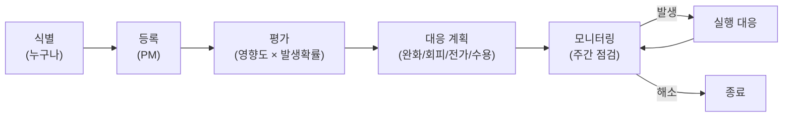

# ⚠️ 리스크 관리 대장 (Risk Log)

> **대상 독자**: PM + 팀 전원
> **갱신 주기**: 매주 금요일 회의에서 점검
> **버전**: v1.0 (2026-05-19)

---

## 1. 리스크 관리 프로세스



### 1.1 평가 매트릭스

|  | 영향도: 낮 | 영향도: 중 | 영향도: 높 |
|---|:---:|:---:|:---:|
| **확률: 높** | 🟡 모니터 | 🔴 즉시 대응 | 🔴 즉시 대응 |
| **확률: 중** | 🟢 수용 | 🟡 모니터 | 🔴 즉시 대응 |
| **확률: 낮** | 🟢 수용 | 🟢 수용 | 🟡 모니터 |

### 1.2 대응 전략 4가지

| 전략 | 설명 | 예시 |
|---|---|---|
| **회피 (Avoid)** | 리스크 원인 자체 제거 | 무리한 기능 컷 |
| **완화 (Mitigate)** | 확률·영향 줄이기 | 사전 PoC, 백업 |
| **전가 (Transfer)** | 외부에 위임 | 외부 라이브러리 사용 |
| **수용 (Accept)** | 의식적으로 받아들임 | 작은 UI 버그 무시 |

---

## 2. 현재 리스크 대장

> 📌 **상태 코드**: 🆕 신규 / 🔄 진행중 / ✅ 해소 / ❌ 발생함 / 🚫 종료

| ID | 리스크 | 영향 | 확률 | 평가 | 대응 전략 | 대응 행동 | 담당 | 상태 | 갱신일 |
|---|---|:---:|:---:|:---:|---|---|:---:|:---:|:---:|
| R01 | 3D 그래프 라이브러리 학습 시간 부족 | 🔴 | 🟡 | 🔴 | 완화 | W1에 react-force-graph-3d PoC 우선 진행, 2D fallback도 검토 | FE1 | 🔄 | 5/19 |
| R02 | 100+ 노드에서 그래프 성능 저하 | 🟡 | 🟡 | 🟡 | 완화 | 노드 수 제한 (`limit=200`) + LOD 적용 | FE1 | 🆕 | 5/19 |
| R03 | Markdown 파서와 @/#/& 커스텀 문법 충돌 | 🟡 | 🟡 | 🟡 | 완화 | `remark` 플러그인으로 토큰 단계에서 처리, 단위 테스트 10케이스 | BE2 | 🆕 | 5/19 |
| R04 | MongoDB 관계 모델링 미숙 → 그래프 쿼리 비효율 | 🟡 | 🔴 | 🔴 | 완화 | W1 1일 스파이크, BE1이 aggregation 학습 후 팀 공유 | BE1 | 🔄 | 5/19 |
| R05 | 4명 협업 충돌 (Git, 일정) | 🟡 | 🟡 | 🟡 | 완화 | Git 가이드 + 주 2회 회의 + PR 24h 룰 | PM | 🆕 | 5/19 |
| R06 | PAC 관계 개념 사용자 학습 곡선 | 🟢 | 🔴 | 🟡 | 완화 | 인앱 가이드 + 첫 사용 튜토리얼 + 기본 예시 노트 | FE2 | 🆕 | 5/19 |
| R07 | 시험 기간(6/3-6/5) 작업량 저하 | 🟡 | 🔴 | 🔴 | 수용+완화 | 해당 주간 작업량 -50% 가정, W2 마감 -1일로 버퍼 확보 | PM | 🆕 | 5/19 |
| R08 | 자동저장 debounce 동안 사용자 이탈 시 데이터 손실 | 🟡 | 🟡 | 🟡 | 완화 | `beforeunload` 이벤트 + 즉시 저장 호출 | FE1 | 🆕 | 5/19 |
| R09 | JWT 시크릿/환경변수 Git 노출 | 🔴 | 🟢 | 🟡 | 회피 | `.gitignore` + Husky pre-commit hook으로 `.env` 차단 | BE1 | 🆕 | 5/19 |
| R10 | MongoDB Atlas Free Tier (512MB) 용량 초과 | 🟡 | 🟢 | 🟢 | 수용 | 학기 시연 규모(사용자 10명·노트 100개) 충분, 초과 시 알림 설정 | BE1 | 🆕 | 5/19 |
| R11 | Vercel/Railway 배포 시 환경변수 누락 | 🟡 | 🟡 | 🟡 | 완화 | 배포 체크리스트 작성, W4 사전 1회 dry-run | BE1+FE2 | 🆕 | 5/19 |
| R12 | 팀원 장기 부재 (3일+) | 🔴 | 🟢 | 🟡 | 완화 | 작업 재할당 룰 명시 (RACI), 같은 트랙 백업 멤버 지정 | PM | 🆕 | 5/19 |
| R13 | 외부 테스터 모집 실패 (5명 미만) | 🟡 | 🟡 | 🟡 | 완화 | W3부터 모집 시작, 학과·동아리 채널 활용 | PM | 🆕 | 5/19 |
| R14 | 발표 당일 라이브 데모 실패 (네트워크/서버 장애) | 🔴 | 🟢 | 🟡 | 완화 | 시연 영상 사전 녹화 (백업), 로컬 환경도 준비 | PM+FE1 | 🆕 | 5/19 |
| R15 | 디자인 시스템 컨센서스 부재 → 컴포넌트 재작업 | 🟡 | 🟡 | 🟡 | 완화 | W1에 디자인 토큰 PM 컨펌, Tailwind config 고정 | FE2 | 🔄 | 5/19 |

---

## 3. 리스크 상세 (Top 5)

### R01. 3D 그래프 라이브러리 학습 시간 부족 🔴

**상세**:
- 3D 그래프 + 물리 엔진은 팀원 모두 처음 다룸
- 학습에 5일+ 걸릴 수 있는데 일정상 3일 안에 PoC 필요

**조기 경보 신호**:
- W1 종료 시점에 PoC 노드 10개 렌더링 못 함
- FE1이 라이브러리 문서 이해 못 함

**완화 행동**:
1. 5/20-5/22 (W1 초): FE1이 [`react-force-graph-3d`](https://github.com/vasturiano/react-force-graph) 공식 예제 따라 만들기
2. 5/22 회의 시 PoC 시연 (실패 시 R01-A 발동)

**비상 계획 (Plan B)** — R01-A:
- 3D 포기 → 2D (`react-force-graph-2d`) 전환
- 시각적 임팩트는 줄지만 핵심 기능(분리 그래프) 유지
- PM 승인 필요

---

### R04. MongoDB 관계 모델링 미숙 🔴

**상세**:
- 임베드 vs 참조 트레이드오프 익숙하지 않음
- aggregation pipeline 학습 곡선 큼
- 잘못된 모델링 시 그래프 쿼리가 N+1 또는 30초 소요

**완화 행동**:
1. 5/20 BE1 스파이크: Atlas Sample Dataset으로 aggregation 실습
2. 5/21 팀 공유: 30분 미니 세션
3. DB 설계서 ([`03_설계/DB_설계서.md`](../03_설계/DB_설계서.md)) 사전 컨펌

**비상 계획**:
- 그래프 데이터 캐싱 (`SWR` revalidate 1분)
- 비정규화 강화 (가능한 모든 집계 결과 캐시 컬렉션)

---

### R07. 시험 기간 작업량 저하 🔴

**상세**:
- 6/3 (화) ~ 6/5 (목) 가정 → W3 핵심 작업 주간과 겹침
- 모두가 동시에 못 움직임

**완화 행동**:
1. 6/2 (월) 까지 M2 무조건 완료 → 시험 동안 의존성 없는 작업만 진행
2. 6/3-6/5 작업량 50% 가정, 일정 반영
3. 6/6 (금) 회의에서 진척 재점검 후 6/8-6/9 집중 작업

**비상 계획**:
- M3 마감 6/9 → 6/11로 2일 연기 (W4 버퍼에서 차감)
- 그래프 3개 탭 중 1개라도 우선 완성 (`@언급` 그래프)

---

### R09. JWT 시크릿/환경변수 Git 노출 🔴

**상세**:
- 학생들이 자주 하는 실수
- 한 번 노출되면 GitHub crawler가 즉시 수집 (수 분 내)
- Atlas DB 직접 접속 가능 → 데이터 유출

**완화 행동**:
1. `.gitignore` 에 `.env*` 포함 (이미 적용)
2. `.env.example` 만 커밋 (값은 placeholder)
3. Husky pre-commit hook으로 `.env` 차단:
   ```bash
   # .husky/pre-commit
   if git diff --cached --name-only | grep -q '\.env$'; then
     echo "❌ .env 파일은 커밋할 수 없습니다."
     exit 1
   fi
   ```
4. JWT_SECRET은 32자 이상 랜덤 (`openssl rand -hex 32`)

**비상 계획 (이미 노출됐을 때)**:
1. 즉시 JWT_SECRET 교체 (모든 사용자 재로그인 필요)
2. Atlas DB 비밀번호 변경
3. GitHub 히스토리에서 `.env` 제거 (`git filter-repo`)
4. 모든 팀원 리포 재클론

---

### R14. 발표 당일 라이브 데모 실패 🔴

**상세**:
- Vercel 무료 티어 sleep, Railway 콜드 스타트, Wi-Fi 불안정 등
- 발표 평가에 직접 영향

**완화 행동**:
1. 발표 1주일 전 (6/9~) 사전 녹화 (3-5분 시연 영상)
2. 영상은 PPT 안에 임베드 가능하도록 mp4 / gif
3. 로컬 환경 동작 검증 (오프라인 백업)
4. 발표 30분 전 라이브 환경 health check

**Plan C — 최악의 경우**:
- 영상만 재생 → 코드 설명으로 전환
- 강두현이 시연 영상 + 발표 동시 진행

---

## 4. 종료된 리스크 (학습 자료로 보존)

| ID | 리스크 | 결과 | 학습 |
|---|---|---|---|
| (없음) | | | |

> 리스크 종료 시 위 테이블로 이동. "왜 발생했는지 / 어떻게 해결했는지" 기록.

---

## 5. 리스크 등록 양식

새 리스크 발견 시 누구나 PM에게 다음 양식으로 제출:

```markdown
**리스크 ID 요청**: Rxx
**제목**: 
**상세**: (어떤 일이 일어날 수 있는가?)
**영향**: 낮/중/높 — 일정·품질·범위 중 무엇에 얼마나?
**확률**: 낮/중/높 — 왜 그렇게 판단했는가?
**제안 대응**: (회피/완화/전가/수용 + 구체 행동)
**담당 후보**: 
```

PM이 평가 후 본 대장에 추가 + 다음 회의에서 합의.

---

## 6. 주간 점검 체크리스트 (매주 금요일 PM)

- [ ] 새로 등록된 리스크가 있는가?
- [ ] 진행 중(🔄) 리스크의 대응이 실행되고 있는가?
- [ ] 발생한(❌) 리스크가 있는가? 대응이 가동 중인가?
- [ ] 해소된(✅) 리스크가 있는가? 종료 처리.
- [ ] 다음 주 우선 모니터링 리스크 3개 선정.

---

## 7. 회의 안건 자동 생성

다음 리스크는 **이번 주 회의에서 반드시 다뤄야 함** (🔴 + 🔄 또는 ❌):

- **R01**: PoC 진척 — FE1 시연
- **R04**: aggregation 학습 결과 공유 — BE1
- **R07**: 시험 기간 작업량 조정 합의
- **R15**: 디자인 토큰 PM 컨펌

---

> 📌 **함께 보기**:
> - [회의록 템플릿](./회의록_템플릿.md) — 회의에서 리스크 점검
> - [개발 일정표](../02_일정/개발_일정표.md) — 비상 계획 발동 시 일정 조정
