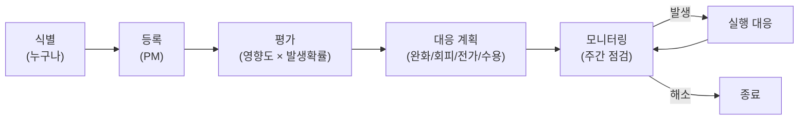

# ⚠️ 리스크 관리 대장 (Risk Log) — v2

> **대상 독자**: PM + 팀 전원
> **갱신 주기**: 매주 금요일 회의에서 점검
> **버전**: v2.0 (2026-05-23)
> **이전 버전과 차이**: 3D 그래프 리스크(R01) 해소, PAC 리스크 해소, Tiptap·하드 삭제 신규 리스크 추가

---

## 0. 1분 요약 (학생용)

> 리스크 관리가 왜 중요한가:
> - 학기 프로젝트라도 4명·4주는 충분히 일정 위험이 있음
> - "발생할 줄 모르고 당하는 것"보다 "예상하고 대응 계획 짜두는 것"이 평가에서도 좋음
> - 본 대장은 **17개 리스크** (진행 14 + 해소 3) 추적

---

## 1. 리스크 관리 프로세스



### 1.1 평가 매트릭스

|  | 영향도: 낮 | 영향도: 중 | 영향도: 높 |
|---|:---:|:---:|:---:|
| **확률: 높** | 🟡 모니터 | 🔴 즉시 대응 | 🔴 즉시 대응 |
| **확률: 중** | 🟢 수용 | 🟡 모니터 | 🔴 즉시 대응 |
| **확률: 낮** | 🟢 수용 | 🟢 수용 | 🟡 모니터 |

### 1.2 대응 전략 4가지

| 전략 | 설명 | 예시 |
|---|---|---|
| **회피 (Avoid)** | 리스크 원인 자체 제거 | 무리한 기능 컷 |
| **완화 (Mitigate)** | 확률·영향 줄이기 | 사전 PoC, 백업 |
| **전가 (Transfer)** | 외부에 위임 | 외부 라이브러리 사용 |
| **수용 (Accept)** | 의식적으로 받아들임 | 작은 UI 버그 무시 |

---

## 2. 현재 리스크 대장 (v2)

> 📌 **상태 코드**: 🆕 신규 / 🔄 진행중 / ✅ 해소 / ❌ 발생함 / 🚫 종료

### 2.1 진행 중 리스크

| ID | 리스크 | 영향 | 확률 | 평가 | 대응 전략 | 대응 행동 | 담당 | 상태 | 갱신일 |
|---|---|:---:|:---:|:---:|---|---|:---:|:---:|:---:|
| **R16** ⭐ | **Tiptap (ProseMirror) 학습 곡선** | 🔴 | 🟡 | 🔴 | 완화 | W1에 FE1 PoC 우선 (5/21-5/22), 실패 시 `react-md-editor` fallback | FE1 | 🆕 | 5/23 |
| R02 | 100+ 노드에서 그래프 성능 저하 | 🟢 | 🟢 | 🟢 | 수용 | 학기 데이터 100개 미만으로 한정. 시연 가능 | FE1 | 🟢 | 5/23 |
| R04 | MongoDB 관계 모델링 미숙 → 그래프 쿼리 비효율 | 🟡 | 🟡 | 🟡 | 완화 | BE1 1일 스파이크 + DB 설계서 사전 컨펌 | BE1 | 🔄 | 5/23 |
| R05 | 4명 협업 충돌 (Git, 일정, 신규 컴포넌트 많음) | 🟡 | 🟡 | 🟡 | 완화 | Git 가이드 + 주 2회 회의 + PR 24h 룰 + 컴포넌트 분리 | PM | 🔄 | 5/23 |
| R07 | 시험 기간(6/3-6/5) 작업량 저하 | 🟡 | 🔴 | 🔴 | 수용+완화 | 작업량 -50% 가정, W2 마감 -1일로 버퍼 확보 | PM | 🔄 | 5/23 |
| R08 | 자동저장 debounce 동안 사용자 이탈 시 데이터 손실 | 🟡 | 🟡 | 🟡 | 완화 | `beforeunload` flush + 탭 전환 시 즉시 flush + 모든 탭 실시간 저장 | FE1 | 🔄 | 5/23 |
| R09 | JWT 시크릿/.env Git 노출 | 🔴 | 🟢 | 🟡 | 회피 | `.gitignore` + Husky pre-commit hook | BE1 | 🆕 | 5/23 |
| R10 | MongoDB Atlas Free Tier (512MB) 초과 | 🟢 | 🟢 | 🟢 | 수용 | 학기 시연 규모 충분, 초과 시 알림 | BE1 | 🆕 | 5/23 |
| R11 | Vercel/Railway 배포 시 환경변수 누락 | 🟡 | 🟡 | 🟡 | 완화 | 배포 체크리스트, W4 사전 dry-run 1회 | BE1+FE2 | 🆕 | 5/23 |
| R12 | 팀원 장기 부재 (3일+) | 🔴 | 🟢 | 🟡 | 완화 | RACI 백업 멤버 지정 | PM | 🆕 | 5/23 |
| R13 | 외부 테스터 모집 실패 (5명 미만) | 🟡 | 🟡 | 🟡 | 완화 | W3부터 모집, 학과·동아리 채널 활용 | PM | 🆕 | 5/23 |
| R14 | 발표 당일 라이브 데모 실패 | 🔴 | 🟢 | 🟡 | 완화 | 시연 영상 사전 녹화 + 로컬 백업 | PM+FE1 | 🆕 | 5/23 |
| R15 | 디자인 시스템 컨센서스 부재 → 컴포넌트 재작업 | 🟡 | 🟡 | 🟡 | 완화 | W1 디자인 토큰 PM 컨펌 | FE2 | 🔄 | 5/23 |
| **R17** ⭐ | **하드 삭제 정책으로 사용자 실수 데이터 손실** | 🟡 | 🟡 | 🟡 | 완화 | `<ConfirmDialog/>` 필수 + 명확한 경고 메시지 ("복구 불가능") | FE1 | 🆕 | 5/23 |
| **R18** ⭐ | **4-pane 레이아웃 1280 미만 화면에서 깨짐** | 🟡 | 🟡 | 🟡 | 완화 | 1024-1279 우측바 햄버거 토글, < 1024는 PRD 범위 외 | FE2 | 🆕 | 5/23 |
| **R19** ⭐ | **멀티탭 상태 + localStorage 동기화 복잡도** | 🟡 | 🟡 | 🟡 | 완화 | `tabStore` 단위 테스트 + 동기화 로직 격리 | FE1 | 🆕 | 5/23 |
| **R20** ⭐ | **W3 신규 작업(우측바·캘린더·검색) 일정 압박** | 🟡 | 🟡 | 🟡 | 완화 | 우측바 컴포넌트 4개 독립 분리 (병렬 가능), API mock 우선 | FE2 + BE1 | 🆕 | 5/23 |

### 2.2 해소된 리스크 (v2 변경으로 자동 해소) ✅

| ID | 리스크 | 해소 이유 | 학습 |
|---|---|---|---|
| R01 | ~~3D 그래프 라이브러리 학습 시간 부족~~ | **2D 전환** (`react-force-graph-2d`)로 학습 곡선 -2일 | 학기 프로젝트는 차별성과 안정성 trade-off에서 안정성 우선이 옳음 |
| R03 | ~~Markdown 파서와 #@& 커스텀 문법 충돌~~ | **Tiptap inline node**로 우회 — 토큰 단계가 아니라 노드 단계 처리 | WYSIWYG 에디터가 마크다운 직접 파싱보다 우아한 해결책 |
| R06 | ~~PAC 관계 사용자 학습 곡선~~ | **PAC 폐기, 자유 형식 오브젝트**로 변경 | 학기 프로젝트의 차별점은 학습 부담 없는 것이 좋음 |

---

## 3. 리스크 상세 (Top 5)

### R16. Tiptap (ProseMirror) 학습 곡선 🔴 (신규)

**상세**:
- Tiptap은 ProseMirror 위에 만든 WYSIWYG 에디터 라이브러리. 강력하지만 학습 곡선 있음
- 표 GUI + 인라인 배지 + 자동완성 모두 직접 확장(extension) 작성 필요
- 학기 프로젝트에서 처음 다루는 사람에게 1-2주 학습 가능성

**조기 경보 신호**:
- W1 종료(5/26) 시점에 마크다운 입출력 PoC 미완
- FE1이 공식 문서 이해 못 함

**완화 행동**:
1. 5/21-5/22 (W1 초): FE1이 Tiptap 공식 예제 따라 만들기 (마크다운 + 표 + 자동완성)
2. 5/23 회의 시 PoC 시연 — 5/26까지 미완이면 R16-A 발동

**비상 계획 (Plan B)** — R16-A:
- Tiptap 포기 → `@uiw/react-md-editor` 로 회귀 (v1 계획)
- 표 GUI는 마크다운 raw 입력으로 다운그레이드
- `#@&` 배지는 미리보기 영역에서만 표시
- PM 승인 필요

---

### R04. MongoDB 관계 모델링 미숙 🔴 (유지)

**상세**:
- 임베드 vs 참조 트레이드오프 익숙하지 않음
- aggregation pipeline 학습 곡선 큼
- 잘못된 모델링 시 그래프 쿼리가 N+1 또는 30초 소요

**완화 행동**:
1. 5/20 BE1 스파이크: Atlas Sample Dataset으로 aggregation 실습
2. 5/21 팀 공유: 30분 미니 세션
3. DB 설계서 ([`03_설계/DB_설계서.md`](../03_설계/DB_설계서.md)) 사전 컨펌

**비상 계획**:
- 그래프 데이터 캐싱 (SWR revalidate 1분)
- 비정규화 강화 (자주 쓴 태그도 별도 캐시 컬렉션)

---

### R07. 시험 기간 작업량 저하 🔴 (유지)

**상세**:
- 6/3-6/5 (가정) → W3 핵심 작업 주간과 겹침
- 모두 동시에 못 움직임

**완화 행동**:
1. 6/2 (월) 까지 M2 무조건 완료 → 시험 동안 의존성 없는 작업만 진행
2. 6/3-6/5 작업량 50% 가정, 일정 반영 완료
3. 6/6 (금) 회의에서 진척 재점검 → 6/8-6/9 집중 작업

**비상 계획**:
- M3 마감 6/9 → 6/11로 2일 연기 (W4 버퍼 차감)
- 그래프 토글 3개 중 1개라도 우선 완성 (`#주제` 권장)
- 우측바 3개 위젯 중 1개라도 완성 (검색만이라도)

---

### R09. JWT 시크릿 / .env Git 노출 🔴 (유지)

**상세**:
- 학생들이 자주 하는 실수
- 한 번 노출되면 GitHub crawler가 즉시 수집 (수 분 내)
- Atlas DB 직접 접속 가능 → 데이터 유출

**완화 행동**:
1. `.gitignore`에 `.env*` 포함 (이미 적용)
2. `.env.example`만 커밋 (값은 placeholder)
3. Husky pre-commit hook:
   ```bash
   # .husky/pre-commit
   if git diff --cached --name-only | grep -q '\.env$'; then
     echo "❌ .env 파일은 커밋할 수 없습니다."
     exit 1
   fi
   ```
4. JWT_SECRET은 32자 이상 랜덤: `openssl rand -hex 32`

**비상 계획 (이미 노출됐을 때)**:
1. 즉시 JWT_SECRET 교체 (모든 사용자 재로그인 필요)
2. Atlas DB 비밀번호 변경
3. `git filter-repo`로 히스토리 정리
4. 모든 팀원 리포 재클론

---

### R14. 발표 당일 라이브 데모 실패 🔴 (유지)

**상세**:
- Vercel 무료 티어 sleep, Railway 콜드 스타트, Wi-Fi 불안정
- 발표 평가에 직접 영향

**완화 행동**:
1. 발표 1주일 전 (6/9~) 사전 녹화 (3-5분 시연 영상)
2. 영상은 PPT 안에 mp4/gif로 임베드
3. 로컬 환경 동작 검증 (오프라인 백업)
4. 발표 30분 전 라이브 환경 health check

**Plan C — 최악의 경우**:
- 영상만 재생 → 코드 설명으로 전환
- 강두현이 시연 영상 + 발표 동시 진행

---

## 4. 종료된 리스크 (학습 자료로 보존)

| ID | 리스크 | 결과 | 학습 |
|---|---|---|---|
| R01 | 3D 그래프 학습 부족 | v2 기획 시 2D로 변경 → 자동 해소 | "차별성보다 안정성" — 학기 일정에 맞는 선택 |
| R03 | 마크다운+커스텀 토큰 충돌 | Tiptap inline node로 우회 | 라이브러리 선택이 문제를 사라지게 할 수 있음 |
| R06 | PAC 학습 곡선 | v2 기획 시 자유 형식으로 일반화 | 사용자 학습 곡선 = 채택률 저하 |

---

## 5. 리스크 등록 양식

새 리스크 발견 시 누구나 PM에게 다음 양식 제출:

```markdown
**리스크 ID 요청**: Rxx
**제목**: 
**상세**: (어떤 일이 일어날 수 있는가?)
**영향**: 낮/중/높 — 일정·품질·범위 중 무엇에 얼마나?
**확률**: 낮/중/높 — 왜 그렇게 판단했는가?
**제안 대응**: (회피/완화/전가/수용 + 구체 행동)
**담당 후보**: 
```

PM이 평가 후 본 대장에 추가 + 다음 회의에서 합의.

---

## 6. 주간 점검 체크리스트 (매주 금요일 PM)

- [ ] 새로 등록된 리스크가 있는가?
- [ ] 진행 중(🔄) 리스크의 대응이 실행되고 있는가?
- [ ] 발생한(❌) 리스크가 있는가? 대응이 가동 중인가?
- [ ] 해소된(✅) 리스크가 있는가? 종료 처리.
- [ ] 다음 주 우선 모니터링 리스크 3개 선정.

---

## 7. v1 → v2 변경 요약

| 변경 | v1 | v2 |
|---|---|---|
| 총 리스크 수 | 15개 | **17개** (R16, R17 신규 + R18, R19, R20 신규 = 18 진행 + 3 해소) |
| ✅ 해소 | 0 | **3개** (R01, R03, R06) |
| 🆕 신규 | — | R16 Tiptap / R17 하드 삭제 / R18 반응형 / R19 멀티탭 / R20 W3 일정 |

> 📌 v2에서 신규 리스크가 추가됐지만, 해소된 리스크 3개의 영향도(🔴 둘 + 🟡 하나)가 더 컸음. **전체 리스크 노출도는 감소**.

---

> 📌 **함께 보기**:
> - [회의록 템플릿](./회의록_템플릿.md) — 회의에서 리스크 점검
> - [개발 일정표](../02_일정/개발_일정표.md) — 비상 계획 발동 시 일정 조정
